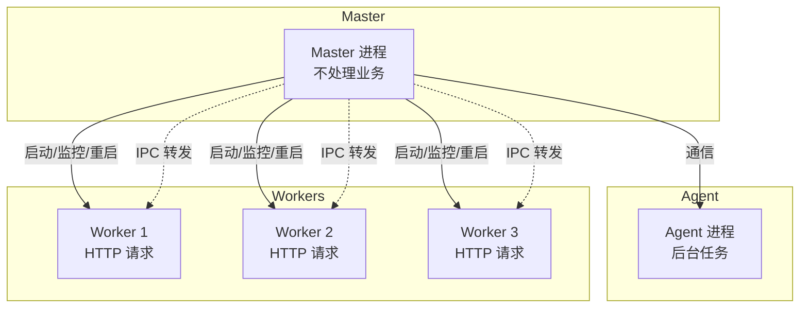

# Egg.js 入门

Egg.js 是阿里开源的企业级 Node.js 框架，基于 Koa（Egg 1.x 基于 Koa 1，2.x/3.x 基于 Koa 2），提供约定优于配置的开发体验。注意 Koa 本身已进入**维护模式**（功能冻结，只修安全与 bug，不再加新特性）——但 Egg 在这之上持续迭代，中间件与 Koa 完全兼容，底座停滞不影响 Egg 使用。

## 核心特点

| 特点 | 说明 |
|------|------|
| **约定优于配置** | 目录结构即路由，减少配置 |
| **插件机制** | 丰富的官方插件生态 |
| **多进程模型** | Master-Agent-Worker 架构 |
| **渐进增强** | 基于 Koa，可平滑迁移 |

## 快速开始

### 安装

```bash
npm init egg --type=simple   # simple 是最小骨架（一个 controller + router）
                             # 其他模板：sequelize（带 ORM+MySQL）、ts（TypeScript）、
                             # mongoose（MongoDB）、microservice（微服务）、plugin/framework
cd my-egg-app
npm install
npm run dev
```

### 项目结构

```
my-egg-app/
├── app/
│   ├── controller/      # 控制器（处理请求）
│   │   └── home.js
│   ├── service/         # 服务层（业务逻辑）
│   │   └── user.js
│   ├── middleware/      # 中间件
│   ├── router.js        # 路由配置
│   └── extend/          # 框架扩展
├── config/
│   ├── config.default.js  # 默认配置
│   ├── config.prod.js     # 生产环境配置
│   └── plugin.js          # 插件配置
├── test/
├── package.json
└── app.js               # 应用入口
```

## 路由与控制器

### 路由配置

```javascript
// app/router.js
module.exports = app => {
  const { router, controller } = app;

  router.get('/', controller.home.index);
  router.get('/users', controller.user.list);
  router.get('/users/:id', controller.user.show);
  router.post('/users', controller.user.create);
  router.put('/users/:id', controller.user.update);
  router.delete('/users/:id', controller.user.destroy);
};
```

### 控制器

```javascript
// app/controller/user.js
const Controller = require('egg').Controller;

class UserController extends Controller {
  // GET /users
  async list() {
    const { ctx } = this;
    const users = await ctx.service.user.findAll();
    ctx.body = { success: true, data: users };
  }

  // GET /users/:id
  async show() {
    const { ctx } = this;
    const { id } = ctx.params;
    const user = await ctx.service.user.findById(id);
    
    if (!user) {
      ctx.throw(404, 'User not found');
    }
    
    ctx.body = { success: true, data: user };
  }

  // POST /users
  async create() {
    const { ctx } = this;
    const { name, email } = ctx.request.body;
    
    // 参数校验
    if (!name || !email) {
      ctx.throw(400, 'Name and email are required');
    }
    
    const user = await ctx.service.user.create({ name, email });
    ctx.status = 201;
    ctx.body = { success: true, data: user };
  }
}

module.exports = UserController;
```

## Service 层

Service 层封装业务逻辑，可被 Controller 和其他 Service 调用。下面是假数据演示（真实项目在这里查数据库，用法见下文「数据库」章节）：

```javascript
// app/service/user.js
const Service = require('egg').Service;

class UserService extends Service {
  async findAll() {
    // 实际项目中这里查询数据库（见「数据库」章节）
    return [
      { id: 1, name: 'Alice', email: 'alice@example.com' },
      { id: 2, name: 'Bob', email: 'bob@example.com' }
    ];
  }

  async findById(id) {
    const users = await this.findAll();
    return users.find(u => u.id === Number(id));
  }

  async create(data) {
    // 实际项目中这里插入数据库（见「数据库」章节）
    return { id: Date.now(), ...data };
  }
}

module.exports = UserService;
```

## 数据库（egg-mysql）

Egg 官方推荐数据库方案是插件 `egg-mysql`（阿里基于 mysql 库封装）。**启用和连接配置见上文插件机制章节**（`plugin.js` 里 `mysql: { enable: true }` + `config.default.js` 里 `config.mysql` 连接信息），配好后直接在 Service 里通过 `this.app.mysql` 使用。

### CRUD

| Service 方法 | 对应的 SQL |
|---|---|
| `this.app.mysql.get('users', { id })` | `SELECT * FROM users WHERE id = ? LIMIT 1`（查不到返回 null） |
| `this.app.mysql.select('users', { where, orders, limit, offset })` | `SELECT * FROM users WHERE ... ORDER BY ... LIMIT ...` |
| `this.app.mysql.insert('users', data)` | `INSERT INTO users ...` |
| `this.app.mysql.update('users', data, { where })` | `UPDATE users SET ... WHERE ...` |
| `this.app.mysql.delete('users', { id })` | `DELETE FROM users WHERE id = ?` |

```javascript
// app/service/user.js —— 真实 CRUD
class UserService extends Service {
  // 查列表
  async findAll() {
    return this.app.mysql.select('users');   // SELECT * FROM users
  }

  // 查单条
  async findById(id) {
    return this.app.mysql.get('users', { id });   // WHERE id = ?
  }

  // 条件查询 + 分页排序
  async findByAge(age, page = 0) {
    return this.app.mysql.select('users', {
      where: { age },            // WHERE age = ?
      orders: [['id', 'desc']],  // ORDER BY id DESC
      limit: 10,
      offset: page * 10,
    });
  }

  // 新增
  async create(data) {
    const result = await this.app.mysql.insert('users', data);
    return { id: result.insertId, ...data };   // insertId 是自增主键
  }

  // 更新
  async update(id, data) {
    const result = await this.app.mysql.update('users', data, { where: { id } });
    return result.affectedRows > 0;   // 是否真的有行被改
  }

  // 删除
  async destroy(id) {
    const result = await this.app.mysql.delete('users', { id });
    return result.affectedRows > 0;
  }
}
```

### 防注入

复杂 SQL 用 `query()` + `?` 占位符，**严禁字符串拼接**：

```javascript
async search(keyword) {
  // ✅ 参数化：值由框架转义
  return this.app.mysql.query('SELECT * FROM users WHERE name LIKE ?', [`%${keyword}%`]);
  // ❌ 不要：`SELECT * FROM users WHERE name LIKE '%${keyword}%'` 会被注入
}
```

### 事务

多个操作要么全成功要么全失败：

```javascript
async transfer(fromId, toId, amount) {
  const conn = await this.app.mysql.beginTransaction();
  try {
    await conn.query('UPDATE accounts SET balance = balance - ? WHERE id = ?', [amount, fromId]);
    await conn.query('UPDATE accounts SET balance = balance + ? WHERE id = ?', [amount, toId]);
    await conn.commit();       // 全部成功才提交
  } catch (err) {
    await conn.rollback();     // 任何一步失败，全部回滚
    throw err;
  }
}
```

### egg-sequelize（ORM 方式）

`egg-mysql` 是"半 ORM"：方法封装 SQL，但表结构自己管。想用模型化实体（类似 Nest + TypeORM 的体验），用 `egg-sequelize` 插件：

```javascript
// config/plugin.js
sequelize: { enable: true, package: 'egg-sequelize' }

// app/model/user.js —— 模型定义（对应一张表）
module.exports = app => {
  const { STRING, INTEGER } = app.Sequelize;
  const User = app.model.define('users', {
    id: { type: INTEGER, primaryKey: true, autoIncrement: true },
    name: STRING(50),
    age: INTEGER,
  });
  return User;
};

// service 里使用
const { Op } = this.app.Sequelize;
const users = await this.ctx.model.User.findAll({ where: { age: { [Op.gt]: 18 } } });
```

**选型**：项目简单、SQL 直观 → `egg-mysql`；项目大、表多、要模型约束 → `egg-sequelize`（和 Nest 用 TypeORM 是同一套思路）。

## 中间件

### 自定义中间件

```javascript
// app/middleware/errorHandler.js
module.exports = () => {
  return async function errorHandler(ctx, next) {
    try {
      await next();
    } catch (err) {
      ctx.status = err.status || 500;
      ctx.body = {
        success: false,
        message: err.message
      };
      
      // 生产环境不返回堆栈
      if (ctx.app.config.env !== 'prod') {
        ctx.body.stack = err.stack;
      }
    }
  };
};
```

### 注册中间件

```javascript
// config/config.default.js
module.exports = appInfo => {
  const config = {};

  config.middleware = ['errorHandler'];

  return config;
};
```

## 配置管理

### 多环境配置

```javascript
// config/config.default.js（所有环境共享）
module.exports = appInfo => {
  const config = {};

  config.keys = appInfo.name + '_secret_key';
  
  config.security = {
    csrf: {
      enable: false  // 开发环境关闭 CSRF
    }
  };

  return config;
};

// config/config.prod.js（生产环境覆盖）
module.exports = () => {
  const config = {};

  config.security = {
    csrf: {
      enable: true
    }
  };

  config.logger = {
    level: 'WARN'
  };

  return config;
};
```

### 使用配置

```javascript
// 在 Controller/Service 中
const { ctx } = this;
const appName = ctx.app.config.name;
const isProd = ctx.app.config.env === 'prod';
```

## 插件机制

### 启用插件

```javascript
// config/plugin.js
module.exports = {
  // 启用静态文件服务
  static: {
    enable: true,
    package: 'egg-static'
  },
  
  // 启用 CORS
  cors: {
    enable: true,
    package: 'egg-cors'
  },
  
  // 启用 MySQL
  mysql: {
    enable: true,
    package: 'egg-mysql'
  }
};
```

### 配置插件

```javascript
// config/config.default.js
module.exports = () => {
  const config = {};

  // CORS 配置
  config.cors = {
    origin: '*',
    allowMethods: 'GET,HEAD,PUT,POST,DELETE,PATCH'
  };

  // MySQL 配置
  config.mysql = {
    client: {
      host: 'localhost',
      port: '3306',
      user: 'root',
      password: 'password',
      database: 'myapp'
    }
  };

  return config;
};
```

## 定时任务

```javascript
// app/schedule/cleanup.js
module.exports = {
  schedule: {
    interval: '1d',  // 每天执行一次
    type: 'worker'   // 只在 worker 进程执行
  },
  
  async task(ctx) {
    await ctx.service.user.cleanupExpired();
  }
};
```

## 多进程模型

### 为什么要多进程

Node 单线程只能用**一个 CPU 核**——服务器 8 核就浪费 7 核。Egg 用 cluster（集群）模式：**一个 Master 启动多个 Worker 进程**，每个 Worker 是独立的事件循环，**共享同一个端口**，请求由操作系统/Node 集群层分发到不同 Worker，多核资源就都用上了。

### 原理：三层进程



| 进程 | 数量 | 职责 |
|------|------|------|
| **Master** | 1 | 不处理业务：启动 Worker、监控、崩溃自动重启 |
| **Agent** | 1 | 后台任务：定时任务、公共连接（数据库连接池） |
| **Worker** | 默认 = CPU 核数 | 处理 HTTP 请求（业务代码跑在这里） |

**三个关键机制**：

1. **端口共享**：多个 Worker 监听同一端口，请求被分发到空闲的 Worker——你的业务代码写在 Worker 里，天然并行处理
2. **IPC 通信**：Worker 之间**不能直接对话**（不同进程内存隔离），必须通过 Master 转发（`app.messenger`）
3. **崩溃恢复**：Worker 挂了 Master 立刻拉一个新的；Master 挂了由部署层（PM2/容器）重启整个应用

### 怎么玩

**1. 控制进程数量与端口**：

```javascript
// config/config.default.js
config.cluster = {
  listen: { port: 7001, hostname: '0.0.0.0' },
  // 不配 worker 数则默认 = CPU 核数；也可用环境变量 EGG_WORKER_COUNT=4 指定
};
```

**2. 进程间通信（`app.messenger`）**——例如配置更新后通知所有 Worker 重新加载：

```javascript
// Agent 或 Master 里广播
app.messenger.broadcast('config:reload', { version: 2 });

// Worker 里监听（业务代码）
app.messenger.on('config:reload', data => {
  // 重新加载配置...
});
```

**3. 定时任务类型**（接上文定时任务章节）：

```javascript
schedule: {
  interval: '1d',
  type: 'worker'   // 只在其中一个 Worker 执行（避免所有 Worker 重复执行）
                   // 'all' = 所有 Worker 都执行；'agent' = 在 Agent 进程执行
}
```

**4. 查看当前进程**：

```javascript
// 业务代码任意位置
console.log('worker id:', process.env.NODE_APP_INSTANCE, 'pid:', process.pid);
```

### 多进程的坑

| 坑 | 现象 | 解法 |
|----|------|------|
| **内存状态不共享** | session/缓存存在进程内存里，请求被分发到另一个 Worker 就丢了 | 存 Redis / 数据库 |
| **定时任务重复执行** | 每个 Worker 各跑一遍定时任务 | `type: 'worker'`（只一个执行） |
| **日志分散** | 每个进程各打各的 | Egg 内置 logger 自动带 pid，统一收集到同一文件 |

## 与 Koa 对比

| 维度 | Egg.js | Koa |
|------|--------|-----|
| **定位** | 企业级框架 | 轻量级框架 |
| **配置** | 约定优于配置 | 自由配置 |
| **目录结构** | 强制规范 | 自由组织 |
| **插件** | 丰富生态 | 需自行组合 |
| **学习曲线** | 中 | 低 |
| **适用场景** | 中大型项目 | 小型项目/微服务 |

**选择建议：**
- 团队协作、中大型项目 → Egg.js
- 个人项目、微服务 → Koa
- 需要 TypeScript → NestJS（Egg 也有官方 TS 支持，但属于"后补"——约定式动态加载（`ctx.service.xxx`）依赖 egg-ts-helper 生成类型声明，体验不如 Nest 原生 TS）
