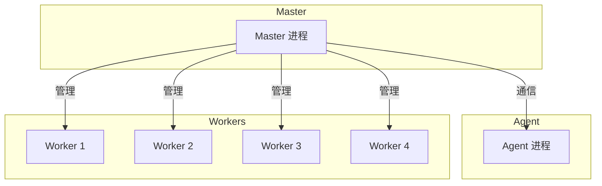

# Egg.js 入门

Egg.js 是阿里开源的企业级 Node.js 框架，基于 Koa，提供约定优于配置的开发体验。

## 核心特点

| 特点 | 说明 |
|------|------|
| **约定优于配置** | 目录结构即路由，减少配置 |
| **插件机制** | 丰富的官方插件生态 |
| **多进程模型** | Master-Agent-Worker 架构 |
| **渐进增强** | 基于 Koa，可平滑迁移 |

## 快速开始

### 安装

```bash
npm init egg --type=simple
cd my-egg-app
npm install
npm run dev
```

### 项目结构

```
my-egg-app/
├── app/
│   ├── controller/      # 控制器（处理请求）
│   │   └── home.js
│   ├── service/         # 服务层（业务逻辑）
│   │   └── user.js
│   ├── middleware/      # 中间件
│   ├── router.js        # 路由配置
│   └── extend/          # 框架扩展
├── config/
│   ├── config.default.js  # 默认配置
│   ├── config.prod.js     # 生产环境配置
│   └── plugin.js          # 插件配置
├── test/
├── package.json
└── app.js               # 应用入口
```

## 路由与控制器

### 路由配置

```javascript
// app/router.js
module.exports = app => {
  const { router, controller } = app;

  router.get('/', controller.home.index);
  router.get('/users', controller.user.list);
  router.get('/users/:id', controller.user.show);
  router.post('/users', controller.user.create);
  router.put('/users/:id', controller.user.update);
  router.delete('/users/:id', controller.user.destroy);
};
```

### 控制器

```javascript
// app/controller/user.js
const Controller = require('egg').Controller;

class UserController extends Controller {
  // GET /users
  async list() {
    const { ctx } = this;
    const users = await ctx.service.user.findAll();
    ctx.body = { success: true, data: users };
  }

  // GET /users/:id
  async show() {
    const { ctx } = this;
    const { id } = ctx.params;
    const user = await ctx.service.user.findById(id);
    
    if (!user) {
      ctx.throw(404, 'User not found');
    }
    
    ctx.body = { success: true, data: user };
  }

  // POST /users
  async create() {
    const { ctx } = this;
    const { name, email } = ctx.request.body;
    
    // 参数校验
    if (!name || !email) {
      ctx.throw(400, 'Name and email are required');
    }
    
    const user = await ctx.service.user.create({ name, email });
    ctx.status = 201;
    ctx.body = { success: true, data: user };
  }
}

module.exports = UserController;
```

## Service 层

Service 层封装业务逻辑，可被 Controller 和其他 Service 调用。

```javascript
// app/service/user.js
const Service = require('egg').Service;

class UserService extends Service {
  async findAll() {
    // 实际项目中这里查询数据库
    return [
      { id: 1, name: 'Alice', email: 'alice@example.com' },
      { id: 2, name: 'Bob', email: 'bob@example.com' }
    ];
  }

  async findById(id) {
    const users = await this.findAll();
    return users.find(u => u.id === Number(id));
  }

  async create(data) {
    // 实际项目中这里插入数据库
    return { id: Date.now(), ...data };
  }
}

module.exports = UserService;
```

## 中间件

### 自定义中间件

```javascript
// app/middleware/errorHandler.js
module.exports = () => {
  return async function errorHandler(ctx, next) {
    try {
      await next();
    } catch (err) {
      ctx.status = err.status || 500;
      ctx.body = {
        success: false,
        message: err.message
      };
      
      // 生产环境不返回堆栈
      if (ctx.app.config.env !== 'prod') {
        ctx.body.stack = err.stack;
      }
    }
  };
};
```

### 注册中间件

```javascript
// config/config.default.js
module.exports = appInfo => {
  const config = {};

  config.middleware = ['errorHandler'];

  return config;
};
```

## 配置管理

### 多环境配置

```javascript
// config/config.default.js（所有环境共享）
module.exports = appInfo => {
  const config = {};

  config.keys = appInfo.name + '_secret_key';
  
  config.security = {
    csrf: {
      enable: false  // 开发环境关闭 CSRF
    }
  };

  return config;
};

// config/config.prod.js（生产环境覆盖）
module.exports = () => {
  const config = {};

  config.security = {
    csrf: {
      enable: true
    }
  };

  config.logger = {
    level: 'WARN'
  };

  return config;
};
```

### 使用配置

```javascript
// 在 Controller/Service 中
const { ctx } = this;
const appName = ctx.app.config.name;
const isProd = ctx.app.config.env === 'prod';
```

## 插件机制

### 启用插件

```javascript
// config/plugin.js
module.exports = {
  // 启用静态文件服务
  static: {
    enable: true,
    package: 'egg-static'
  },
  
  // 启用 CORS
  cors: {
    enable: true,
    package: 'egg-cors'
  },
  
  // 启用 MySQL
  mysql: {
    enable: true,
    package: 'egg-mysql'
  }
};
```

### 配置插件

```javascript
// config/config.default.js
module.exports = () => {
  const config = {};

  // CORS 配置
  config.cors = {
    origin: '*',
    allowMethods: 'GET,HEAD,PUT,POST,DELETE,PATCH'
  };

  // MySQL 配置
  config.mysql = {
    client: {
      host: 'localhost',
      port: '3306',
      user: 'root',
      password: 'password',
      database: 'myapp'
    }
  };

  return config;
};
```

## 定时任务

```javascript
// app/schedule/cleanup.js
module.exports = {
  schedule: {
    interval: '1d',  // 每天执行一次
    type: 'worker'   // 只在 worker 进程执行
  },
  
  async task(ctx) {
    await ctx.service.user.cleanupExpired();
  }
};
```

## 多进程模型



| 进程 | 职责 |
|------|------|
| **Master** | 进程管理、重启、升级 |
| **Agent** | 后台任务、定时任务 |
| **Worker** | 处理 HTTP 请求（默认 CPU 核数个） |

## 与 Koa 对比

| 维度 | Egg.js | Koa |
|------|--------|-----|
| **定位** | 企业级框架 | 轻量级框架 |
| **配置** | 约定优于配置 | 自由配置 |
| **目录结构** | 强制规范 | 自由组织 |
| **插件** | 丰富生态 | 需自行组合 |
| **学习曲线** | 中 | 低 |
| **适用场景** | 中大型项目 | 小型项目/微服务 |

**选择建议：**
- 团队协作、中大型项目 → Egg.js
- 个人项目、微服务 → Koa
- 需要 TypeScript → NestJS
