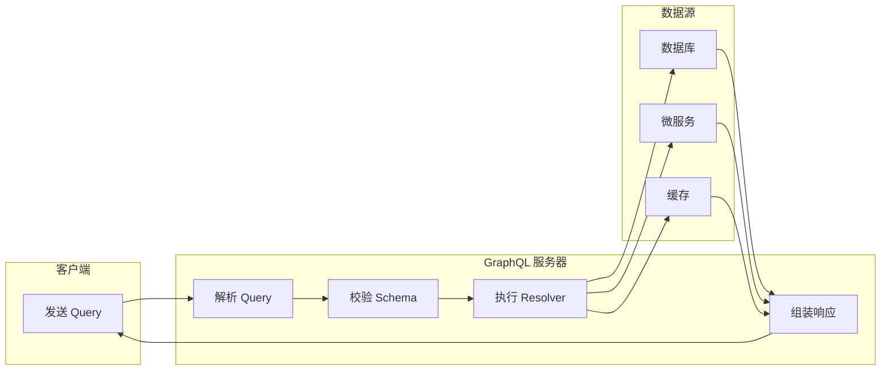

# GraphQL 入门

GraphQL 是 Facebook 开发的 API 查询语言，让前端可以按需获取数据，解决 REST API 的过度获取和不足获取问题。

## 工作原理



**核心流程：**
1. **客户端**发送 GraphQL 查询（声明需要哪些字段）
2. **服务器**解析查询，校验是否符合 Schema 定义
3. **Resolver** 函数被调用，从数据源获取数据
4. **服务器**按查询结构组装响应，只返回请求的字段

**关键特点：**
- **单一端点**：所有请求发到 `/graphql`，不像 REST 有多个 URL
- **强类型**：Schema 定义所有类型和字段，前后端有契约
- **按需获取**：客户端决定返回什么字段，服务器不多给也不少给

## 使用场景

| 场景 | 说明 | 示例 |
|------|------|------|
| **复杂数据关系** | 一次请求获取多层嵌套数据 | 用户 + 订单 + 商品详情 |
| **多端适配** | 不同端需要不同字段 | Web 要完整数据，App 要精简数据 |
| **快速迭代** | 前端自主决定数据结构 | 无需后端改接口 |
| **聚合多个数据源** | 一个接口聚合多个服务 | BFF 层 |
| **实时数据** | 订阅数据变化 | 聊天消息、股票价格 |

**不适合的场景：**
- 简单 CRUD（REST 更简单）
- 文件上传（需额外处理）
- 缓存要求极高（REST 的 HTTP 缓存更成熟）

## 核心概念

| 概念 | 说明 |
|------|------|
| **Schema** | 定义 API 的数据结构和能力 |
| **Query** | 查询数据（类似 GET） |
| **Mutation** | 修改数据（类似 POST/PUT/DELETE） |
| **Subscription** | 实时订阅数据变化 |
| **Resolver** | 解析字段的具体实现 |

## 与 REST 对比

### REST 的问题

```javascript
// 获取用户信息（过度获取）
GET /users/1
// 返回：{ id, name, email, phone, address, createdAt, updatedAt, ... }
// 前端只需要 name 和 email，但返回了所有字段

// 获取用户和订单（多次请求）
GET /users/1
GET /users/1/orders
// 需要两次请求才能获取关联数据
```

### GraphQL 的解决

```graphql
# 按需获取字段
query {
  user(id: 1) {
    name
    email
    orders {
      id
      total
    }
  }
}

# 一次请求获取所有需要的数据
# 返回：{ "user": { "name": "Alice", "email": "alice@example.com", "orders": [...] } }
```

## 快速开始

### 安装

```bash
npm install graphql express-graphql
```

### 基本示例

```javascript
const express = require('express');
const { graphqlHTTP } = require('express-graphql');
const { buildSchema } = require('graphql');

// 1. 定义 Schema
const schema = buildSchema(`
  type User {
    id: ID!
    name: String!
    email: String!
    orders: [Order!]!
  }

  type Order {
    id: ID!
    total: Float!
    createdAt: String!
  }

  type Query {
    user(id: ID!): User
    users: [User!]!
  }

  type Mutation {
    createUser(name: String!, email: String!): User!
  }
`);

// 2. 定义 Resolver
const root = {
  user: ({ id }) => {
    return {
      id,
      name: 'Alice',
      email: 'alice@example.com',
      orders: [
        { id: '1', total: 99.9, createdAt: '2024-01-01' }
      ]
    };
  },
  
  users: () => {
    return [
      { id: '1', name: 'Alice', email: 'alice@example.com', orders: [] },
      { id: '2', name: 'Bob', email: 'bob@example.com', orders: [] }
    ];
  },
  
  createUser: ({ name, email }) => {
    return { id: Date.now().toString(), name, email, orders: [] };
  }
};

// 3. 创建 GraphQL 服务
const app = express();
app.use('/graphql', graphqlHTTP({
  schema,
  rootValue: root,
  graphiql: true  // 启用 GraphiQL 调试界面
}));

app.listen(4000, () => {
  console.log('GraphQL server running on http://localhost:4000/graphql');
});
```

## Schema 定义

### 类型系统

```graphql
# 标量类型
type Product {
  id: ID!          # 唯一标识
  name: String!    # 非空字符串
  price: Float!    # 非空浮点数
  inStock: Boolean! # 非空布尔值
  tags: [String!]! # 非空字符串数组（元素也非空）
}

# 枚举类型
enum OrderStatus {
  PENDING
  PAID
  SHIPPED
  COMPLETED
  CANCELLED
}

# 输入类型（用于 Mutation 参数）
input CreateUserInput {
  name: String!
  email: String!
  age: Int
}

# 接口（多态）
interface Node {
  id: ID!
}

type User implements Node {
  id: ID!
  name: String!
}

type Product implements Node {
  id: ID!
  title: String!
}
```

### Query 和 Mutation

```graphql
type Query {
  # 带参数的查询
  user(id: ID!): User
  users(limit: Int = 10, offset: Int = 0): [User!]!
  
  # 条件查询
  search(keyword: String!): [SearchResult!]!
}

type Mutation {
  # 创建
  createUser(input: CreateUserInput!): User!
  
  # 更新
  updateUser(id: ID!, input: UpdateUserInput!): User!
  
  # 删除
  deleteUser(id: ID!): Boolean!
}
```

## Resolver 详解

**先澄清一个误区：GraphQL 不直接查数据库。** GraphQL 只是"查询语言 + 执行引擎"，数据从哪来完全由 resolver 决定——每个字段背后都有一个 resolver 函数，查数据库的代码写在 resolver 里：

```
客户端 Query → GraphQL(解析/校验) → 调用 resolver → resolver 内部取数
                                              ├─ 查数据库(SQL/ORM)
                                              ├─ 调 HTTP 微服务
                                              ├─ 读缓存
                                              └─ 甚至直接返回硬编码数据
```

类比：GraphQL 是菜单，resolver 是后厨——菜单只规定"有什么菜、什么格式"（Schema），后厨决定菜从哪来。所以 resolver 可以聚合任意数据源（先查 DB 再调微服务拼一起），性能和 GraphQL 无关、只和 resolver 写法有关（N+1、慢查询都是 resolver 里的查询代码导致的），GraphQL 也不生成 SQL——它不是 ORM，数据层的优化是你的活。反过来，resolver 里全写假数据，GraphQL 服务不连任何数据库也能跑——这就是 GraphQL 与数据源解耦的最好证明。

**resolver 都要自己写吗？** 分情况——**顶层字段**（`Query.user`）必须写，不写 GraphQL 不知道数据从哪来；**关联字段**（`User.orders`）必须写，要自己查；**计算字段**（`fullName`）必须写，要自己拼。**可以不写的**是"默认 resolver"：字段名和返回对象里的属性名一致时，GraphQL 自动取属性。本质认知：resolver 的"自己写逻辑"和 REST 的 handler 写业务逻辑是一回事，只是粒度从"接口级"细到"字段级"——GraphQL 只做**分发**（哪个字段调哪个函数）和**组装**（按查询结构拼响应），取数、关联、计算、鉴权全是你的代码。真正"自动生成"的是 ORM（TypeORM/Prisma），它们在 resolver 里被调用，生成 SQL 的是它们，不是 GraphQL。

```javascript
const resolvers = {
  Query: {
    // 参数：parent, args, context, info
    user: async (parent, { id }, context, info) => {
      // parent: 父级解析结果（顶层查询时为 undefined）
      // args: 查询参数 { id: '1' }
      // context: 上下文（如用户登录态）
      // info: 查询信息（如请求的字段）
      
      return await db.users.findById(id);
    }
  },
  
  User: {
    // 字段级 Resolver
    orders: async (user, args, context) => {
      // user: 当前用户对象
      return await db.orders.findByUserId(user.id);
    },
    
    // 计算字段
    fullName: (user) => {
      return `${user.firstName} ${user.lastName}`;
    }
  }
};
```

## 前端集成

**先搞清 uri 哪来的**：`uri` 是 **GraphQL 后端服务的地址**——就是上面"快速开始"里自己搭的那个服务（`app.listen(4000)` + `app.use('/graphql')`，两者完全对应）。可以是自己团队维护的 GraphQL 服务（Apollo Server / express-graphql），也可以是第三方开放的（如 GitHub、Shopify 的公共 GraphQL API）。类比 REST：uri 相当于 `axios` 的 baseURL——都是后端服务地址，区别只是 GraphQL 所有请求打同一个 `/graphql` 端点（单一端点），REST 是每个资源一个 URL。注意 Apollo 有两个产品：**Apollo Client**（前端发请求的库，就是这段代码）和 **Apollo Server**（后端搭服务的库），uri 是客户端连服务器的地址。

### Apollo Client

```bash
npm install @apollo/client graphql
```

```javascript
import { ApolloClient, InMemoryCache, gql } from '@apollo/client';

const client = new ApolloClient({
  uri: 'http://localhost:4000/graphql',
  cache: new InMemoryCache()
});

// 查询
const GET_USER = gql`
  query GetUser($id: ID!) {
    user(id: $id) {
      name
      email
      orders {
        id
        total
      }
    }
  }
`;

const { data, loading, error } = await client.query({
  query: GET_USER,
  variables: { id: '1' }
});

// Mutation
const CREATE_USER = gql`
  mutation CreateUser($name: String!, $email: String!) {
    createUser(name: $name, email: $email) {
      id
      name
    }
  }
`;

await client.mutate({
  mutation: CREATE_USER,
  variables: { name: 'Alice', email: 'alice@example.com' }
});
```

### React Hook

```jsx
import { useQuery, useMutation, gql } from '@apollo/client';

const GET_USERS = gql`
  query GetUsers {
    users {
      id
      name
      email
    }
  }
`;

function UserList() {
  const { loading, error, data } = useQuery(GET_USERS);

  if (loading) return <p>Loading...</p>;
  if (error) return <p>Error: {error.message}</p>;

  return (
    <ul>
      {data.users.map(user => (
        <li key={user.id}>{user.name} - {user.email}</li>
      ))}
    </ul>
  );
}
```

## 最佳实践

### 1. 避免 N+1 问题

```javascript
// ❌ N+1 问题：每个用户都查询一次订单
const resolvers = {
  User: {
    orders: async (user) => {
      return await db.orders.findByUserId(user.id);  // 每个用户一次查询
    }
  }
};

// ✅ 使用 DataLoader 批量加载
const DataLoader = require('dataloader');

const orderLoader = new DataLoader(async (userIds) => {
  const orders = await db.orders.findByUserIds(userIds);
  return userIds.map(id => orders.filter(o => o.userId === id));
});

const resolvers = {
  User: {
    orders: async (user) => {
      return orderLoader.load(user.id);  // 批量查询
    }
  }
};
```

### 2. 分页

```graphql
type Query {
  users(first: Int, after: String): UserConnection!
}

type UserConnection {
  edges: [UserEdge!]!
  pageInfo: PageInfo!
  totalCount: Int!
}

type UserEdge {
  node: User!
  cursor: String!
}

type PageInfo {
  hasNextPage: Boolean!
  endCursor: String
}
```

### 3. 错误处理

```javascript
const { ApolloError } = require('apollo-server');

const resolvers = {
  Mutation: {
    createUser: async (parent, { input }) => {
      const existing = await db.users.findByEmail(input.email);
      if (existing) {
        throw new ApolloError('Email already exists', 'EMAIL_EXISTS');
      }
      return await db.users.create(input);
    }
  }
};
```

**总结：** GraphQL 不是 REST 的替代品，而是补充。复杂数据关系用 GraphQL，简单接口用 REST。
