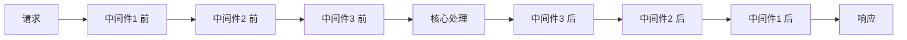

# Koa 入门

Koa 是由 Express 原班人马打造的下一代 Web 框架，基于 async/await，更轻量、更现代。

## 核心特点

| 特点 | 说明 |
|------|------|
| **轻量** | 核心只有 ~2000 行代码 |
| **中间件** | 洋葱模型，async/await 原生支持 |
| **无回调** | 彻底告别 callback hell |
| **上下文** | 统一的 Context 对象 |

## 快速开始

### 安装

```bash
npm init -y
npm install koa
```

### Hello World

```javascript
const Koa = require('koa');
const app = new Koa();

app.use(async (ctx) => {
  ctx.body = 'Hello Koa';
});

app.listen(3000, () => {
  console.log('Server running on http://localhost:3000');
});
```

## 中间件机制

Koa 的核心是**洋葱模型**：请求从外到内，响应从内到外。



### 示例

```javascript
const Koa = require('koa');
const app = new Koa();

// 中间件 1：记录请求时间
app.use(async (ctx, next) => {
  const start = Date.now();
  await next();  // 执行下一个中间件
  const ms = Date.now() - start;
  console.log(`${ctx.method} ${ctx.url} - ${ms}ms`);
});

// 中间件 2：设置响应头
app.use(async (ctx, next) => {
  ctx.set('X-Powered-By', 'Koa');
  await next();
});

// 中间件 3：处理请求
app.use(async (ctx) => {
  ctx.body = { message: 'Hello Koa' };
});

app.listen(3000);
```

### 执行顺序

```
请求进入
  → 中间件1 前（记录开始时间）
    → 中间件2 前（设置响应头）
      → 中间件3（处理请求，设置 body）
    ← 中间件2 后（无）
  ← 中间件1 后（记录耗时）
响应返回
```

### 实现原理：compose 串起 Promise 链

洋葱模型不是魔法，Koa 内部用 `koa-compose` 把中间件数组串成一条**嵌套的 Promise 链**：每个中间件都被包装成 `(ctx, next) => Promise`，`next` 就是"调用下一个中间件"的函数，`await next()` 等待的正是内层中间件返回的 Promise。

```javascript
// koa-compose 的简化实现（核心逻辑）
function compose(middlewares) {
  return function (ctx) {
    let index = -1;
    function dispatch(i) {
      if (i <= index) {  // 防止同一个中间件里多次调用 next()
        return Promise.reject(new Error('next() called multiple times'));
      }
      index = i;
      const fn = middlewares[i];
      if (!fn) return Promise.resolve();  // 走到最内层，Promise 开始逐层 resolve
      try {
        // 关键：把 dispatch(i + 1) 作为 next 传入
        // 返回的 Promise 就是下一层中间件的执行结果
        return Promise.resolve(fn(ctx, () => dispatch(i + 1)));
      } catch (err) {
        return Promise.reject(err);  // 同步异常也变成 rejected Promise
      }
    }
    return dispatch(0);
  };
}
```

展开后等价于手动嵌套：

```javascript
const chain = () =>
  mw1(ctx, () =>          // next 1
    mw2(ctx, () =>        // next 2
      mw3(ctx, () => Promise.resolve())  // next 3
    )
  );
```

- **"回程"的本质**：中间件的后半段代码挂在 `await next()` 上，内层 Promise resolve 后逐层返回，所以执行顺序是 外 → 内 → 外
- **忘记 `await next()`**：Promise 链在这里断开，后续中间件（包括生成响应的路由）**永远不会执行**，请求会一直挂起直到超时——这是 bug，不是"安全的跳过"
- **错误处理放最外层**：最外层的 `try { await next() } catch` 包住整条链，能接住所有内层中间件的同步异常和 rejected Promise；如果放中间，它外层中间件抛的错误就漏掉了

## Context 对象

`ctx` 是 Koa 的核心，封装了 request 和 response。

### 常用属性

```javascript
app.use(async (ctx) => {
  // 请求相关
  ctx.method        // 请求方法：GET/POST
  ctx.url           // 完整 URL
  ctx.path          // 路径部分
  ctx.query         // 查询参数对象 { id: '1' }
  ctx.querystring   // 查询字符串 'id=1'
  ctx.params        // 路由参数（需配合路由库）
  ctx.headers       // 请求头
  ctx.request.body  // 请求体（需 bodyparser 中间件）

  // 响应相关
  ctx.body = 'Hello';           // 设置响应体
  ctx.status = 200;             // 设置状态码
  ctx.set('Header', 'value');   // 设置响应头
  ctx.type = 'application/json'; // 设置 Content-Type

  // 其他
  ctx.state         // 中间件间共享数据
  ctx.throw(404, 'Not Found');  // 抛出错误
});
```

### 示例：获取查询参数

```javascript
// 请求：GET /user?id=1&name=test
app.use(async (ctx) => {
  const { id, name } = ctx.query;
  ctx.body = { id, name };
  // 响应：{ "id": "1", "name": "test" }
});
```

## 路由

Koa 核心不包含路由，需要使用 `koa-router`。

### 安装

```bash
npm install koa-router
```

### 基本用法

```javascript
const Koa = require('koa');
const Router = require('koa-router');

const app = new Koa();
const router = new Router();

// GET 请求
router.get('/users', async (ctx) => {
  ctx.body = [{ id: 1, name: 'Alice' }];
});

// 带参数
router.get('/users/:id', async (ctx) => {
  const { id } = ctx.params;
  ctx.body = { id, name: 'Alice' };
});

// POST 请求
router.post('/users', async (ctx) => {
  const { name } = ctx.request.body;
  ctx.body = { message: `Created user: ${name}` };
});

app.use(router.routes());
app.use(router.allowedMethods());

app.listen(3000);
```

## 请求体解析

Koa 不内置 body parser，需要 `koa-bodyparser`。

```bash
npm install koa-bodyparser
```

```javascript
const Koa = require('koa');
const bodyParser = require('koa-bodyparser');

const app = new Koa();

app.use(bodyParser());

app.use(async (ctx) => {
  if (ctx.method === 'POST') {
    const { username, password } = ctx.request.body;
    ctx.body = { username, password };
  }
});

app.listen(3000);
```

## 错误处理

```javascript
// 全局错误处理中间件（放在最前面）
app.use(async (ctx, next) => {
  try {
    await next();
  } catch (err) {
    ctx.status = err.status || 500;
    ctx.body = {
      error: err.message
    };
    // 触发应用级错误事件
    ctx.app.emit('error', err, ctx);
  }
});

// 业务错误
app.use(async (ctx) => {
  if (!ctx.query.id) {
    ctx.throw(400, 'Missing id parameter');
  }
  ctx.body = { id: ctx.query.id };
});

// 监听错误
app.on('error', (err, ctx) => {
  console.error('Server error:', err);
});
```

## 常用中间件

| 中间件 | 用途 |
|--------|------|
| **koa-router** | 路由 |
| **koa-bodyparser** | 解析请求体 |
| **koa-static** | 静态文件服务 |
| **koa-cors** | 跨域支持 |
| **koa-logger** | 请求日志 |
| **koa-session** | Session 管理 |
| **koa-jwt** | JWT 认证 |

### 示例：组合使用

```javascript
const Koa = require('koa');
const Router = require('koa-router');
const bodyParser = require('koa-bodyparser');
const cors = require('@koa/cors');
const logger = require('koa-logger');

const app = new Koa();
const router = new Router();

// 中间件顺序很重要
app.use(logger());        // 1. 日志
app.use(cors());          // 2. 跨域
app.use(bodyParser());    // 3. 解析请求体

router.get('/api/users', async (ctx) => {
  ctx.body = [{ id: 1, name: 'Alice' }];
});

app.use(router.routes());
app.use(router.allowedMethods());

app.listen(3000);
```

## 与 Express 对比

| 维度 | Koa | Express |
|------|-----|---------|
| **异步** | async/await | callback |
| **中间件** | 洋葱模型 | 线性模型 |
| **体积** | ~2000 行 | ~5000 行 |
| **内置路由** | 无 | 有 |
| **错误处理** | try/catch | 错误中间件 |
| **学习曲线** | 低 | 低 |

**选择建议：**
- 新项目 → Koa（更现代）
- 老项目维护 → Express（生态成熟）
- 需要企业级方案 → Egg.js / NestJS
