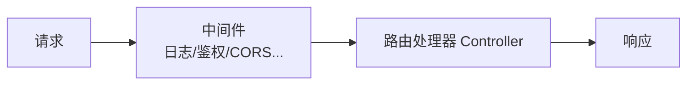
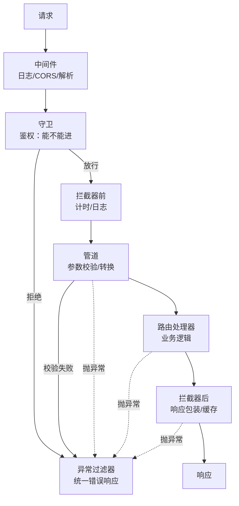

# NestJS 从入门到放弃

NestJS 是一个用于构建高效、可扩展的 Node.js 服务器端应用的框架，基于 TypeScript，使用装饰器和依赖注入。

## 核心特点

| 特点 | 说明 |
|------|------|
| **TypeScript 优先** | 原生 TypeScript 支持 |
| **装饰器** | 类似 Spring 的注解风格 |
| **依赖注入** | 内置 DI 容器 |
| **模块化** | 强制模块化架构 |
| **底层可选** | 默认 Express，可切换 Fastify |

## 快速开始

### 安装

```bash
npm install -g @nestjs/cli
nest new my-nest-app
cd my-nest-app
npm run start:dev
```

### 项目结构

```
my-nest-app/
├── src/
│   ├── app.module.ts        # 根模块
│   ├── app.controller.ts    # 根控制器
│   ├── app.service.ts       # 根服务
│   ├── main.ts              # 入口文件
│   └── users/               # 用户模块
│       ├── users.module.ts
│       ├── users.controller.ts
│       ├── users.service.ts
│       └── dto/
│           └── create-user.dto.ts
├── test/
├── nest-cli.json
├── tsconfig.json
└── package.json
```

## 核心概念

### 模块（Module）

模块是组织代码的基本单位，也是 **DI 容器的分区**——每个模块有一小块"容器"，往里登记自己的员工（providers），通过 `imports` 组合、`exports` 开放。

| 字段 | 写什么 | 类比 |
|------|--------|------|
| `imports` | 依赖的其他模块（要用对方的东西就得 import） | 引入的部门 |
| `controllers` | 该模块的路由入口（控制器） | 前台/门面 |
| `providers` | 该模块的可注入类（服务/守卫/管道，进容器） | 后台员工 |
| `exports` | 对外开放的 providers（别的模块 import 本模块后才能用） | 可借调给其他部门的员工 |

**模块间协作三步**：OrdersModule 想用 UsersService → ① UsersModule 的 `exports` 导出 UsersService → ② OrdersModule 的 `imports` 导入 UsersModule → ③ OrdersService 构造函数注入 UsersService。不 exports 的 providers 是模块私有的，其他模块拿不到。

**组织原则**：一个业务域一个模块（UsersModule、OrdersModule），内部高内聚，模块之间只通过 exports 暴露最小接口。

```typescript
// users.module.ts
@Module({
  imports: [DatabaseModule],    // 依赖的模块
  controllers: [UsersController],  // 路由入口
  providers: [UsersService],    // 进本模块容器
  exports: [UsersService]       // 开放给其他模块
})
export class UsersModule {}

// orders.module.ts
@Module({
  imports: [UsersModule],       // 要用 UsersService，导入 UsersModule
  controllers: [OrdersController],
  providers: [OrdersService],   // OrdersService 里可以注入 UsersService
})
export class OrdersModule {}
```

**模块类的类体通常是空的**：配置全在 `@Module()` 装饰器里，类只是装饰器的"挂载点"——和 `@Injectable()` 一样，靠装饰器挂元数据、Nest 启动时扫描读取，类本身不需要任何逻辑。

**唯一的例外——动态模块**：类里放**静态方法**，根据参数动态生成模块配置（不用 `new`，直接 `Module.forRoot()` 调用）：

```typescript
// database.module.ts
@Module({})
export class DatabaseModule {
  static forRoot(options: TypeOrmModuleOptions): DynamicModule {
    return {
      module: DatabaseModule,
      providers: [{ provide: 'DB_CONFIG', useValue: options }],
      exports: ['DB_CONFIG'],
    };
  }
}

// 使用
@Module({
  imports: [DatabaseModule.forRoot({ host: 'localhost', port: 3306 })],
})
export class AppModule {}
```

`TypeOrmModule.forRoot()`、`ConfigModule.forRoot()` 都是这个模式——传入配置，返回带好 providers 的模块。

### 控制器（Controller）

处理 HTTP 请求。

```typescript
// users.controller.ts
import { Controller, Get, Post, Body, Param } from '@nestjs/common';
import { UsersService } from './users.service';
import { CreateUserDto } from './dto/create-user.dto';

@Controller('users')  // 路由前缀
export class UsersController {
  constructor(private readonly usersService: UsersService) {}

  // GET /users
  @Get()
  findAll() {
    return this.usersService.findAll();
  }

  // GET /users/1
  @Get(':id')
  findOne(@Param('id') id: string) {
    return this.usersService.findOne(+id);
  }

  // POST /users
  @Post()
  create(@Body() createUserDto: CreateUserDto) {
    return this.usersService.create(createUserDto);
  }
}
```

### 服务（Service）

封装业务逻辑。

```typescript
// users.service.ts
import { Injectable } from '@nestjs/common';
import { CreateUserDto } from './dto/create-user.dto';

@Injectable()  // 标记为可注入
export class UsersService {
  private users = [
    { id: 1, name: 'Alice', email: 'alice@example.com' }
  ];

  findAll() {
    return this.users;
  }

  findOne(id: number) {
    return this.users.find(u => u.id === id);
  }

  create(createUserDto: CreateUserDto) {
    const newUser = {
      id: this.users.length + 1,
      ...createUserDto
    };
    this.users.push(newUser);
    return newUser;
  }
}
```

### DTO（数据传输对象）

定义请求/响应数据结构。

```typescript
// dto/create-user.dto.ts
import { IsString, IsEmail, IsNotEmpty } from 'class-validator';

export class CreateUserDto {
  @IsString()
  @IsNotEmpty()
  name: string;

  @IsEmail()
  email: string;
}
```

## 依赖注入

NestJS 内置 DI 容器，自动管理服务实例。

**`@Injectable()` 是什么意思**：给类贴一张"仓库入库单"——标记"这个类交给 DI 容器管理"。启动时 Nest 扫描所有带该装饰器的类，注册进容器（默认**单例**，整个应用一份实例），然后看哪个类的构造函数声明了依赖，就自动从容器里取出实例塞进去。开发者不需要手动 `new`、传参，只声明"我要什么"，容器负责"给什么"——这就是**控制反转（IoC）**。没贴 `@Injectable()` 的类容器不管理，注入会直接报错。

```typescript
// 服务自动注入到控制器
@Controller('users')
export class UsersController {
  // NestJS 自动创建 UsersService 实例并注入
  constructor(private readonly usersService: UsersService) {}
}

// 服务间也可以互相注入
@Injectable()
export class OrdersService {
  constructor(
    private readonly usersService: UsersService,
    private readonly emailService: EmailService
  ) {}
}
```

> 原理：装饰器本质是给类挂**元数据**（记录每个类构造函数的依赖），Nest 启动时扫描元数据构建**依赖图**，按拓扑序实例化——从没有依赖的类开始，逐层往上（谁被依赖谁先创建，与书写顺序无关）；出现循环依赖（A 依赖 B、B 依赖 A）会启动报错，需 `forwardRef()` 打破。

## 常用装饰器

### 路由装饰器

| 装饰器 | HTTP 方法 |
|--------|----------|
| `@Get()` | GET |
| `@Post()` | POST |
| `@Put()` | PUT |
| `@Delete()` | DELETE |
| `@Patch()` | PATCH |
| `@Options()` | OPTIONS |

### 参数装饰器

```typescript
@Get(':id')
findOne(
  @Param('id') id: string,      // 路由参数
  @Query('page') page: number,  // 查询参数
  @Headers('authorization') auth: string,  // 请求头
  @Body() body: CreateUserDto,  // 请求体
  @Req() req: Request           // 完整请求对象
) {}
```

## 中间件

**在请求进入路由处理器之前执行的函数**——和 Koa/Express 中间件是同一个概念：Nest 默认底层就是 Express，`use(req, res, next)` 签名一致，也是**线性中间件链**（`next()` 传给下一个，单向；注意这不是 Koa 那种"响应原路返回"的洋葱模型，那是 `await next()` 才有的进入/退出两段）。

**典型用途**：日志记录、身份鉴权、CORS 跨域、请求体解析、响应压缩。



**和守卫（Guard）的区别**：中间件在更外层、先执行，偏"通用基础设施"（日志、CORS）；守卫更接近业务（"这个接口谁能调"）。能在中间件里做的（如鉴权）通常也能用守卫做，但守卫有 DI 和反射能力，是 Nest 更推荐的做法。

```typescript
// logger.middleware.ts
import { Injectable, NestMiddleware } from '@nestjs/common';
import { Request, Response, NextFunction } from 'express';

@Injectable()
export class LoggerMiddleware implements NestMiddleware {
  use(req: Request, res: Response, next: NextFunction) {
    console.log(`${req.method} ${req.url}`);
    next();  // 不放行就卡在这，请求不会到达路由
  }
}

// app.module.ts
export class AppModule implements NestModule {
  configure(consumer: MiddlewareConsumer) {
    consumer
      .apply(LoggerMiddleware)
      .forRoutes('*');  // 所有路由
  }
}
```

## 管道（Pipe）

**在路由处理器执行前对参数做转换和验证**。典型场景是校验请求体：验证规则（`@IsString` 等）挂在 DTO 类的属性装饰器上，而请求体到达时只是普通 JSON 对象（原型链上没有规则），所以管道要**先转换、再验证**：

1. `plainToInstance(metatype, value)`：把请求体普通对象转换成 DTO 类实例，让实例"带上"装饰器规则（不转换直接 `validate` 是空转，验不出任何东西）
2. `validate(object)`：class-validator 按实例上挂的规则逐条检查，返回错误数组，非空则抛 400
3. `metatype` 是路由参数的类型（DTO 类本身），不是"定义规则的地方"，而是**携带规则的类**；原生类型没有规则，`if (!metatype) return value` 直接放行。注意：**metatype 来自控制器参数的类型标注**（`@Body() createUserDto: CreateUserDto`，依赖 `emitDecoratorMetadata` 生成的元数据）——只定义 DTO 类但参数没标注类型，metatype 就是 undefined，校验静默失效（不报错，脏数据直接通过）

```typescript
// validation.pipe.ts
import { PipeTransform, Injectable, BadRequestException } from '@nestjs/common';
import { validate } from 'class-validator';
import { plainToInstance } from 'class-transformer';

@Injectable()
export class ValidationPipe implements PipeTransform {
  async transform(value: any, { metatype }) {
    if (!metatype) return value;
    
    const object = plainToInstance(metatype, value);
    const errors = await validate(object);
    
    if (errors.length > 0) {
      throw new BadRequestException('Validation failed');
    }
    
    return object;
  }
}

// 全局使用
// main.ts
app.useGlobalPipes(new ValidationPipe());
```

**管道有四种作用域**（比守卫/拦截器多一个参数级）：

| 作用域 | 写法 | 生效范围 |
|--------|------|---------|
| 全局 | `app.useGlobalPipes(new ValidationPipe())` | 所有路由 |
| 控制器级 | `@UsePipes(ValidationPipe)` 放在类上 | 该控制器所有路由 |
| 方法级 | `@UsePipes(ValidationPipe)` 放在方法上 | 仅该方法 |
| 参数级 | `@Param('id', ParseIntPipe)` | 仅该参数 |

执行顺序：全局 → 控制器 → 方法 → 参数（参数级最后执行，最贴近处理器）。

> 注意：`app.useGlobalPipes(new Xxx())` 是手动 `new`，**没有 DI 能力**。全局管道要注入服务，用 `APP_PIPE` 注册：`providers: [{ provide: APP_PIPE, useClass: ValidationPipe }]`（守卫/拦截器对应 `APP_GUARD` / `APP_INTERCEPTOR`）。

## 守卫（Guard）

用于权限控制。

```typescript
// auth.guard.ts
import { Injectable, CanActivate, ExecutionContext } from '@nestjs/common';

@Injectable()
export class AuthGuard implements CanActivate {
  canActivate(context: ExecutionContext): boolean {
    const request = context.switchToHttp().getRequest();
    const token = request.headers['authorization'];
    
    // 验证 token
    return !!token;
  }
}

// 使用
@UseGuards(AuthGuard)
@Get('profile')
getProfile() {
  return { user: 'Alice' };
}
```

## 拦截器（Interceptor）

**最灵活的组件：能同时看到请求和响应**。`next.handle()` 之前是请求阶段（前处理），之后是响应阶段（后处理）——它拿到的是处理器返回的 RxJS Observable（响应流），等数据生成后还能加工。

**与中间件、守卫的区别**：

| 维度 | 中间件 | 守卫 | 拦截器 |
|------|--------|------|--------|
| 位置 | 最外层 | 处理器前 | 处理器**前后都有** |
| 职责 | 通用基础设施（日志/CORS/解析） | 鉴权授权（能不能进） | 业务增强（计时/缓存/响应转换） |
| 能否看到响应 | 否（单向链） | 否（只回答 yes/no） | **能**（`handle()` 之后） |
| 机制 | Express 函数 | 返回 boolean | RxJS Observable |

**为什么只有拦截器能看到响应**：中间件在管线最前面、没有拿到处理器结果的约定；守卫只回答"能不能进"；而拦截器持有 `next.handle()` 返回的响应流，可以等它 emit 完数据再加工。日志计时是最直观的例子——中间件只能记"请求进来了"，拦截器能记"处理器花了多久"。

典型用途：日志计时、缓存、把响应统一包装成 `{ code, data }`、超时控制。

```typescript
// logging.interceptor.ts
import { Injectable, NestInterceptor, ExecutionContext, CallHandler } from '@nestjs/common';
import { Observable } from 'rxjs';
import { tap } from 'rxjs/operators';

@Injectable()
export class LoggingInterceptor implements NestInterceptor {
  intercept(context: ExecutionContext, next: CallHandler): Observable<any> {
    const now = Date.now();          // 前处理：请求进拦截器，记时间
    return next
      .handle()                      // 执行路由处理器，拿到响应数据流
      .pipe(
        tap(() => console.log(`耗时: ${Date.now() - now}ms`))
        // tap = "偷看"：数据流过时不改数据，只做副作用（日志/调试）
        // 对比 map（会转换数据），tap 原样放行
      );
  }
}

// 全局使用
app.useGlobalInterceptors(new LoggingInterceptor());
```

## 异常过滤器

**整个管线的"兜底网"**：守卫拒绝、管道校验失败、处理器内部报错、拦截器出错——任何一层抛出的异常最终都落在这里，统一转成响应。它不是链路上"跑一遍"的步骤，而是**链路的出口**（哪一环炸了，异常沿调用栈冒泡到这里）。

**为什么要自定义**：Nest 内置默认过滤器会返回官方格式，但接口要对前端友好时，需要统一成自己的格式（固定的 `{ statusCode, message, timestamp }`，前端解析简单）。

**@Catch 指定捕获范围**：`@Catch(HttpException)` 只捕获 HTTP 异常（4xx/5xx）；`@Catch()` 捕获所有异常（含数据库错误）；也可多个：`@Catch(A, B)`。

```typescript
// http-exception.filter.ts
import { ExceptionFilter, Catch, ArgumentsHost, HttpException } from '@nestjs/common';
import { Response } from 'express';

@Catch(HttpException)   // 只捕获 HTTP 异常
export class HttpExceptionFilter implements ExceptionFilter {
  catch(exception: HttpException, host: ArgumentsHost) {
    const ctx = host.switchToHttp();            // 拿到当前请求上下文
    const response = ctx.getResponse<Response>();
    const status = exception.getStatus();       // 4xx/5xx 状态码

    response
      .status(status)
      .json({
        statusCode: status,
        message: exception.message,
        timestamp: new Date().toISOString()     // 统一错误格式
      });
  }
}

// 全局使用
app.useGlobalFilters(new HttpExceptionFilter());
```

## 五大组件关系总结



| 组件 | 时机 | 职责 | 能看到响应？ | 声明 |
|------|------|------|------------|------|
| **中间件** | 最外层 | 通用基础设施（日志/CORS/解析） | 否 | `forRoutes` |
| **守卫** | 处理器前 | 鉴权授权（能不能进） | 否 | `@UseGuards` |
| **管道** | 处理器前 | 参数校验/转换 | 否 | `@UsePipes` / `@Param('id', XxxPipe)` |
| **拦截器** | 处理器**前后** | 计时/缓存/响应包装 | **能** | `@UseInterceptors` |
| **异常过滤器** | 任一层抛异常后 | 统一错误响应 | 只处理错误 | `@UseFilters` |

**记忆口诀（安检流程）**：中间件=门口登记，守卫=验票，管道=行李安检，拦截器=全程跟单（出餐还能包装），过滤器=出问题找客服。**正常流程自上而下走一遍，任何环节抛异常都被过滤器兜住**。

## 数据库集成

Nest 官方推荐 TypeORM，集成三步：

1. `TypeOrmModule.forRoot({...})` 注册数据库连接
2. 业务模块里 `TypeOrmModule.forFeature([User])` 注册实体的 Repository
3. 服务里 `@InjectRepository(User)` 注入，直接调用 `find` / `save` / `delete`（方法由 TypeORM 内置生成，无需自己写）

```typescript
// app.module.ts
import { TypeOrmModule } from '@nestjs/typeorm';

@Module({
  imports: [
    TypeOrmModule.forRoot({
      type: 'mysql',
      host: 'localhost',
      port: 3306,
      username: 'root',
      password: 'password',
      database: 'myapp',
      entities: [User],
      synchronize: true  // 开发环境自动同步表结构（生产关掉，用迁移）
    }),
    UsersModule
  ]
})
export class AppModule {}

// users.service.ts
import { InjectRepository } from '@nestjs/typeorm';
import { Repository } from 'typeorm';

@Injectable()
export class UsersService {
  constructor(
    @InjectRepository(User)   // 告诉 DI 容器：注入 User 实体对应的仓库实例
    private usersRepository: Repository<User>  // Repository 是 TypeORM 内置泛型类，方法自动生成
  ) {}

  findAll() {
    return this.usersRepository.find();   // SELECT * FROM users
  }
}
```

**实体定义、条件查询、关联、事务、QueryBuilder、软删除、迁移等完整用法见 [TypeORM 用法](/service/typeorm)。**

## 依赖注入进阶

前面讲的 `providers: [UsersService]` 是简写——完整写法是"**Token → 提供方式**"的对象。三种自定义 Provider：

```typescript
@Module({
  providers: [
    // useValue:直接给一个现成值(常量、配置对象、第三方实例)
    { provide: 'APP_NAME', useValue: 'my-app' },

    // useClass:指定另一个类实现(换实现不改调用方)
    { provide: CacheService, useClass: RedisCacheService },

    // useFactory:函数动态创建,可注入其他依赖(根据配置分支)
    {
      provide: 'DB_CONNECTION',
      useFactory: (config: ConfigService) => createConnection(config.get('db')),
      inject: [ConfigService],   // 工厂函数要的参数,容器从这注入
    },
  ],
})
```

```typescript
// 注入自定义 Token:构造函数参数用 @Inject 标明要哪个
constructor(
  @Inject('APP_NAME') private appName: string,
  @Inject('DB_CONNECTION') private conn: Connection,
) {}
```

| Provider 写法 | 用在哪 |
|---------------|--------|
| `useValue` | 常量/配置/第三方对象 |
| `useClass` | 换实现（测试 Mock、多环境不同实现） |
| `useFactory` | 需要依赖其他服务才能创建、按配置分支 |

**其他 DI 关键词**：

- **`@Optional()`**：`@Optional() @Inject('XXX') xxx` —— 容器里没有也不报错，注入 `undefined`（比如本地开发时没有的第三方服务）
- **`@Global()`**：模块加 `@Global()` 后 exports 对全应用可见，不用每个模块都 import（适合公共模块：Config、Logger、DB）
- **Provider 作用域**：默认**单例**（整个应用一份）；`@Injectable({ scope: Scope.REQUEST })` 每次请求新建（能拿到请求数据，但性能差、不能注入到单例里）；`Scope.TRANSIENT` 每次注入新建。**99% 的情况用默认单例**，作用域是"需要请求上下文"时的特殊手段

## 生命周期钩子

Nest 提供**应用生命周期钩子**接口，实现后自动在对应时机被调用：

| 钩子 | 时机 | 典型用途 |
|------|------|---------|
| `OnModuleInit` | 该模块依赖解析完成后 | 连数据库、加载配置、预热缓存 |
| `OnApplicationBootstrap` | 所有模块初始化完成后 | 初始化种子数据、启动队列消费者 |
| `OnModuleDestroy` | 应用开始关闭时 | 断开连接、清理定时器 |
| `OnApplicationShutdown` | 收到关闭信号时 | 保存现场、通知其他服务 |

```typescript
@Injectable()
export class AppService implements OnModuleInit, OnModuleDestroy {
  async onModuleInit() {
    // 启动:在这里连接数据库,失败可以直接抛错阻止启动
    await this.redis.connect();
  }

  async onModuleDestroy() {
    // 关闭:释放连接,避免进程退出时资源没清
    await this.redis.disconnect();
  }
}
```

```typescript
// main.ts:启用关闭钩子,收到 SIGTERM/SIGINT 时走上面的销毁流程
app.enableShutdownHooks();
```

## 自定义装饰器与元数据

Nest 的装饰器本质是**往类/方法上挂元数据**（键值对），运行时由守卫、拦截器等读取。学会自定义装饰器 = 学会 Nest 的"声明式编程"。

### 权限装饰器 + 守卫（声明式鉴权）

这是权限设计文章里"接口权限"的 Nest 正宗写法：**装饰器贴标签，守卫查标签**：

```typescript
// roles.decorator.ts:封装 @SetMetadata,把角色列表挂到方法上
export const Roles = (...roles: string[]) => SetMetadata('roles', roles);

// roles.guard.ts:守卫里用 Reflector 读出标签,再对比当前用户
@Injectable()
export class RolesGuard implements CanActivate {
  constructor(private reflector: Reflector) {}

  canActivate(context: ExecutionContext): boolean {
    const roles = this.reflector.get<string[]>('roles', context.getHandler());
    if (!roles || roles.length === 0) return true;   // 没贴 @Roles = 不限制
    const { user } = context.switchToHttp().getRequest();
    return roles.includes(user.role);                // 用户角色在允许列表里才放行
  }
}

// 使用:一行声明"这个接口只有 admin 能调"
@UseGuards(RolesGuard)
@Roles('admin')
@Delete(':id')
remove(@Param('id') id: string) { ... }
```

> 为什么比 `if (user.role !== 'admin')` 好：权限声明和路由定义**放在一起**（读代码就知道谁能调），校验逻辑收敛在守卫里（改规则只改一处）——这就是"声明 vs 编排"的体现。

### 参数装饰器

`createParamDecorator` 可以自定义参数提取逻辑（最常见的是取当前登录用户）：

```typescript
// current-user.decorator.ts:从请求里取 user,不用每个方法写 req.user
export const CurrentUser = createParamDecorator(
  (data: unknown, ctx: ExecutionContext) => ctx.switchToHttp().getRequest().user,
);

// 使用
@Get('profile')
profile(@CurrentUser() user: User) {   // 直接拿到登录用户
  return user;
}
```

## 配置管理

官方方案 `@nestjs/config`（基于 dotenv）：

```typescript
// app.module.ts:读取 .env,isGlobal 让 ConfigService 全局可注入
imports: [
  ConfigModule.forRoot({ isGlobal: true }),
]

// 任何服务里注入使用
constructor(private config: ConfigService) {}

const port = this.config.get<number>('PORT');       // .env 里的 PORT
const dbHost = this.config.get('DB_HOST', 'localhost');  // 第二个参数是默认值
```

**多环境**：`.env.development` / `.env.production`，启动时用 `NODE_ENV` 区分；敏感配置（密码、密钥）只放服务器环境变量，**不提交到 git**。

## 认证实战：JWT + 守卫

结合 auth.md 的 JWT 原理，Nest 里的完整闭环是"**签发 + 守卫验证**"：

```typescript
// app.module.ts
imports: [
  JwtModule.register({
    secret: process.env.JWT_SECRET,       // 生产用环境变量,别硬编码
    signOptions: { expiresIn: '7d' },
  }),
]

// auth.service.ts:登录成功 → 签发 token
async login(dto: LoginDto) {
  const user = await this.usersService.validate(dto.username, dto.password);
  if (!user) throw new UnauthorizedException('用户名或密码错误');
  return {
    token: await this.jwtService.signAsync({ userId: user.id, role: user.role }),
  };
}

// jwt-auth.guard.ts:守卫验证 token → 挂到 req.user
@Injectable()
export class JwtAuthGuard implements CanActivate {
  constructor(private jwtService: JwtService) {}

  canActivate(context: ExecutionContext): boolean {
    const req = context.switchToHttp().getRequest();
    const token = req.headers.authorization?.slice(7);   // 去掉 "Bearer "
    try {
      req.user = this.jwtService.verify(token);          // 验签 + 查过期(一次完成)
      return true;
    } catch {
      throw new UnauthorizedException('token 无效或过期');
    }
  }
}

// 使用:认证(你是谁) + 授权(你能做什么) 两守卫叠加
@UseGuards(JwtAuthGuard, RolesGuard)
@Roles('admin')
@Delete(':id')
remove(@Param('id') id: string) { ... }
```

**JwtAuthGuard（认证）+ RolesGuard（授权）叠加 = 权限设计文章的完整实现**。全局要校验的路由多，可以把 `JwtAuthGuard` 注册成全局守卫（`APP_GUARD`），个别公开接口用 `@Public()` 装饰器豁免（反射器判断有没有标 Public）。

## 文件上传

Nest 底层是 Express，文件上传直接封装 multer：

```typescript
@Post('upload')
@UseInterceptors(FileInterceptor('file', {
  limits: { fileSize: 2 * 1024 * 1024 },   // 2MB 限制
}))
upload(@UploadedFile() file: Express.Multer.File) {
  // file: { originalname, size, mimetype, buffer | path }
  return { name: file.originalname, size: file.size };
}
```

- 单文件 `FileInterceptor` / 多文件 `FilesInterceptor('files', 5)` / 多字段 `FileFieldsInterceptor`
- 内存模式（默认）用 `file.buffer`；磁盘模式要配 `diskStorage`（`file.path`）
- 上传的**文件类型、大小校验必须后端做**，前端限制只是体验

## 定时任务

`@nestjs/schedule` 基于 cron：

```typescript
@Injectable()
export class TasksService {
  @Cron('0 0 * * *')        // 每天 0 点:秒 分 时 日 月 周
  handleDailyCleanup() { /* 清理过期数据 */ }

  @Interval(60000)          // 每 60 秒
  handleEveryMinute() { /* 心跳 */ }
}
```

## 测试

### 单元测试：Test 模块 + Mock

```typescript
// users.service.spec.ts
const moduleRef = await Test.createTestingModule({
  providers: [UsersService],
})
  .overrideProvider(UsersRepository)          // 把真实 Repository 换掉
  .useValue({ find: () => [{ id: 1, name: 'Alice' }] })  // Mock
  .compile();

const service = moduleRef.get(UsersService);
expect(await service.findAll()).toHaveLength(1);
```

### e2e 测试：打真实 HTTP

```typescript
// app.e2e-spec.ts
const app = await createTestingApp();
const res = await request(app.getHttpServer()).get('/users').expect(200);
expect(res.body).toHaveLength(1);
```

## 部署与性能优化

```typescript
// main.ts 生产加固清单
app.enableCors({ origin: CORS_WHITELIST });       // 白名单,别用 *
app.use(helmet());                                 // 安全响应头
app.useGlobalPipes(new ValidationPipe({
  whitelist: true,        // 剥离 DTO 之外的字段,防多余字段注入
  transform: true,        // 自动把字符串转成类型(number/boolean)
}));
app.enableShutdownHooks();                         // 优雅关闭
app.listen(3000);
```

| 点 | 做法 |
|----|------|
| **构建** | `nest build` → `dist/main.js`，生产直接跑它（跳过 ts-node） |
| **压缩** | `compression` 中间件开启 gzip |
| **限流** | `@nestjs/throttler` 或 rate-limiter（原理见 BFF 可靠性章节） |
| **多进程** | PM2 cluster 模式（`pm2 start dist/main.js -i max`），吃满多核 |
| **日志** | 生产用结构化日志（JSON）+ 集中采集，别 console.log 裸奔 |
| **Swagger** | `@nestjs/swagger` 自动生成 API 文档，前后端联调神器 |

## 进阶功能速览

以下功能都是"同一个模式套用"（@Module 注册 → 装饰器挂配置 → 组件插管线），遇到时查文档即可上手，这里给个认知地图：

### WebSocket：实时双向通信

解决"服务器主动推"——聊天、在线通知、协同编辑。

```typescript
@WebSocketGateway()
export class ChatGateway {
  @SubscribeMessage('message')           // 监听客户端事件
  handleMessage(client, payload) {
    client.emit('reply', `收到: ${payload}`);  // 回推
  }
}
```

### SSE：服务器单向推送（AI 应用必学）

解决"服务器往浏览器**单向**流式推"——**LLM 流式输出、实时日志、进度条**。走普通 HTTP，自动重连，够用时优先于 WebSocket。

```typescript
@Get('chat-stream')
@Sse()
chat(@Query('q') q: string) {
  // 把 LLM 的 token 流包成 Observable,前端用 EventSource 逐段接收
  return streamLLM(q).pipe(map(token => ({ data: token })));
}
```

**对比 WebSocket**：WS 双向、全双工，适合聊天/游戏；SSE 单向、基于 HTTP（穿透代理简单）、自动重连，适合"服务器单方向推送文本流"。AI 对话场景 SSE 是主流（OpenAI 官方就是 SSE）。

### 微服务：服务间通信

解决多个独立部署的服务互相调用（分布式）。用 transporter（TCP/Redis/Kafka/RabbitMQ）传消息，业务代码和 HTTP 解耦：

```typescript
// 提供方:订阅消息,返回结果
@MessagePattern('user.get')
getUser(data: { id: number }) { return this.usersService.findOne(data.id); }

// 调用方:ClientProxy 发消息并等结果
const user = await this.client.send('user.get', { id: 1 }).toPromise();
```

何时用：服务拆到独立部署、跨语言协作时才需要；单体阶段别碰。

### 队列：后台任务削峰

解决耗时任务"不阻塞请求"——发邮件、生成报表、图片处理。基于 Redis：Producer 加任务，Worker 异步消费，还能重试、延迟执行。

```typescript
// 加任务(请求里只花几毫秒)
@InjectQueue('email') private emailQueue: Queue;
await this.emailQueue.add('send', { to: 'a@b.com', subject: '验证码' });

// 消费(后台慢慢干)
@Processor('email')
export class EmailProcessor {
  @Process('send')
  async send(job) { await sendEmail(job.data); }
}
```

### 缓存：热点数据不进数据库

`@nestjs/cache-manager`（默认内存，可换 Redis）：一行装饰器开缓存，读多写少的接口直接收益：

```typescript
@UseInterceptors(CacheInterceptor)   // 自动缓存响应,TTL 默认 5 秒
@Get('products')
list() { return this.productsService.findAll(); }
```

### GraphQL 集成

`@nestjs/graphql` 支持 Code First——用装饰器定义类型，自动生成 Schema（原理见 [GraphQL 入门](/service/graphql)）：

```typescript
@ObjectType()
export class User {
  @Field() id: number;
  @Field() name: string;
}

@Resolver(() => User)
export class UserResolver {
  @Query(() => [User])
  users() { return this.usersService.findAll(); }   // resolver 写法和普通服务一样
}
```

### 速览总结

| 功能 | 解决什么 | 什么时候用 |
|------|---------|-----------|
| **WebSocket** | 实时**双向**通信 | 聊天、通知、协同编辑 |
| **SSE** | 服务器**单向**流式推 | **AI 流式输出**、日志、进度 |
| **微服务** | 服务间通信 | 独立部署/跨语言时才需要 |
| **队列** | 耗时任务后台化 | 发邮件、报表、图片处理 |
| **缓存** | 热点数据不进 DB | 读多写少接口 |
| **GraphQL** | 前端按需查询 | 灵活查询需求时（看 graphql.md） |

## 与 Koa/Egg 对比

| 维度 | NestJS | Koa | Egg.js |
|------|--------|-----|--------|
| **语言** | TypeScript | JavaScript | JavaScript |
| **架构** | 模块化 + DI | 中间件 | 约定优于配置 |
| **学习曲线** | 高 | 低 | 中 |
| **生态** | 成长中 | 成熟 | 成熟 |
| **适用场景** | 大型企业级 | 微服务 | 中大型项目 |

**选择建议：**
- 团队有 Java/Spring 背景 → NestJS
- 需要 TypeScript → NestJS
- 快速原型 → Koa
- 阿里系项目 → Egg.js
