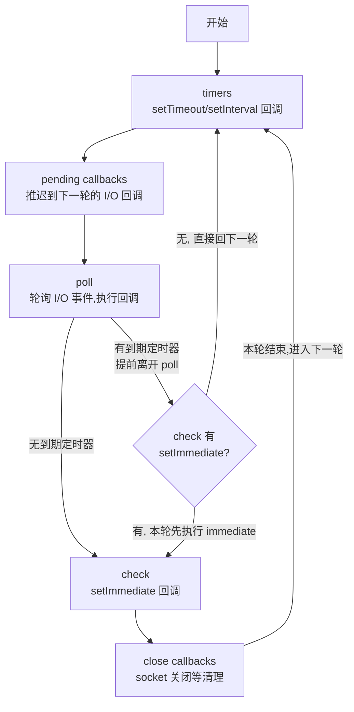

# Node.js 入门

Node.js 是运行在服务端的 JavaScript 运行时，基于 Chrome V8 引擎，采用**事件驱动、非阻塞 I/O** 模型。本文从零开始，由浅入深介绍 Node.js 的常用模块与核心概念。

## Node.js 是什么

Node.js 的出现让 JavaScript 第一次真正走出浏览器：

| 特性 | 说明 |
|------|------|
| **运行时** | 基于 V8 引擎（Chrome 同款），执行 JS 代码 |
| **非阻塞 I/O** | 网络、文件等操作不阻塞主线程，事件驱动 |
| **npm 生态** | 全球最大的包管理器，百万级第三方包 |
| **前后端同语言** | 前端工程师可以无缝写后端 |

### 适用场景

- **BFF 层**：为前端聚合、裁剪数据（见 [BFF 架构设计](./bff)）
- **Web API**：Koa、Express、NestJS 等框架构建后端服务
- **命令行工具**：Webpack、Vite、eslint 等都是 Node 写的
- **构建工具链**：打包、编译、代码检查
- **爬虫/脚本**：快速处理文本、抓取数据

### 与浏览器环境的差异

| 维度 | 浏览器 | Node.js |
|------|--------|---------|
| **全局对象** | `window` | `global` |
| **DOM/BOM** | 有 | 无 |
| **文件系统** | 受限（File API） | 完整访问（`fs`） |
| **网络** | 只能发 HTTP 请求 | 可创建 TCP/HTTP 服务器 |
| **模块系统** | ES Modules | CommonJS + ES Modules |
| **进程控制** | 有限 | 完整（`process`） |

## 快速开始

### 运行 JS 文件

```bash
# 安装 Node 后（推荐用 nvm 管理版本）
node -v            # 查看版本
node app.js        # 运行文件
node               # 进入 REPL 交互模式
```

### 使用 npm 管理依赖

```bash
npm init -y                    # 初始化项目，生成 package.json
npm install koa                # 安装依赖
npm install -D typescript      # 开发依赖（-D 等价 --save-dev）
npm run dev                    # 运行 package.json 中 scripts 定义的命令
```

`package.json` 的 `scripts` 字段是 Node 项目的"命令入口"：

```json
{
  "scripts": {
    "dev": "node app.js",
    "start": "node app.js"
  }
}
```

## 模块系统：CommonJS vs ES Modules

Node.js 同时支持两种模块系统。

### CommonJS（Node.js 传统方式）

```javascript
// 导出
module.exports = { foo: 1, bar: 2 }

// 导入
const { foo, bar } = require('./module')
```

### ES Modules（现代方式）

启用方式（二选一）：
- `package.json` 中设置 `"type": "module"`（对该包下所有 `.js` 文件生效）
- 使用 `.mjs` 扩展名（单个文件强制 ESM，优先级最高）

```javascript
// 导出
export const foo = 1
export default function bar() {}

// 导入
import bar, { foo } from './module.js'
```

### 关键差异

| 特性 | CommonJS | ES Modules |
|------|----------|------------|
| **加载时机** | 运行时同步加载 | 编译时异步加载 |
| **this 指向** | 指向 `module.exports` | `undefined` |
| **动态导入** | `require()` 可在任何位置调用 | `import()` 返回 Promise |
| **缓存** | 首次加载后缓存 | 类似，但有细微差异 |
| **文件扩展名** | 可省略 `.js` | 必须写 `.js` |

**建议：** 新项目优先使用 ES Modules（配合 TypeScript），老项目维护用 CommonJS。

## 全局对象

不需要 `require` 就能直接使用的对象，相当于浏览器的 `window`。

| 全局 | 说明 |
|------|------|
| `global` | 全局对象本身（浏览器对应 `window`） |
| `process` | 当前进程信息与控制 |
| `Buffer` | 二进制数据处理 |
| `console` | 控制台输出（同浏览器） |
| `setTimeout` / `setInterval` | 定时器（返回 Timeout 对象，可用 `clearTimeout` 取消） |
| `setImmediate` | 在当前事件循环的 check 阶段执行（比 setTimeout 更可控） |
| `__dirname` | 当前文件所在目录的绝对路径 |
| `__filename` | 当前文件的绝对路径 |
| `queueMicrotask` | 把回调排入微任务队列 |

```javascript
console.log(__dirname)     // /Users/me/project/src
console.log(__filename)    // /Users/me/project/src/app.js
```

> `__dirname` 和 `__filename` 只在 CommonJS 下可用；ES Modules 中需要用 `import.meta.url` 自行解析。

## 异步模型：事件循环与单线程

Node.js 是**单线程**的：JS 代码只有一个主线程在跑，但靠**事件循环**（libuv 实现）高效处理大量并发 I/O。

### 事件循环的阶段

事件循环从**主脚本同步代码执行完之后**才开始：V8 先加载并跑完整个模块（顶层同步代码不在任何阶段里），主脚本这个"回调"结束后清空 `nextTick` / 微任务队列，然后才进入事件循环的 timers 阶段。事件循环里跑的**全是回调**——定时器回调、I/O 回调、`setImmediate` 回调，每个回调内部的同步代码属于该回调的执行体。

```
┌─────────────┐
│   timers    │  ← setTimeout / setInterval 回调
├─────────────┤
│   poll      │  ← I/O 回调（读文件、网络请求等）
├─────────────┤
│   check     │  ← setImmediate 回调
├─────────────┤
│ close       │  ← 关闭回调（socket 关闭等）
└─────────────┘
```

**微任务（Promise.then、queueMicrotask、process.nextTick）在每个回调执行完之后执行**——不是"每个阶段之间"：同一阶段内每执行完一个回调，就清空一次微任务队列，再执行下一个回调。其中 `nextTick` 优先级最高——它在微任务之前执行。

微任务实际是**两个队列**：

| 队列 | 成员 | 优先级 |
|------|------|--------|
| nextTick 队列 | `process.nextTick` | 最高，先清空 |
| 微任务队列（V8 维护） | `Promise.then`、`queueMicrotask`、async/await 续体 | 次之，按注册顺序 FIFO |

`queueMicrotask(fn)` 和 `Promise.resolve().then(fn)` 执行时机完全相同，区别只是前者是全局函数、不产生 Promise、不能链式。浏览器也有 `queueMicrotask`（HTML 规范 API），但**没有** `process.nextTick`——优先级问题只在 Node 存在。

### 回调 → Promise → async/await

```javascript
// 回调地狱：层层嵌套
fs.readFile('a.txt', 'utf8', (err, a) => {
  fs.readFile('b.txt', 'utf8', (err, b) => {
    console.log(a, b)
  })
})

// Promise 链：拍平一层
fs.promises.readFile('a.txt', 'utf8')
  .then(a => fs.promises.readFile('b.txt', 'utf8').then(b => [a, b]))
  .then(([a, b]) => console.log(a, b))

// async/await：像同步代码一样写异步
async function readAll() {
  const [a, b] = await Promise.all([
    fs.promises.readFile('a.txt', 'utf8'),
    fs.promises.readFile('b.txt', 'utf8')
  ])
  console.log(a, b)
}
```

### 为什么单线程能扛高并发？

因为 Node 的 I/O 是**非阻塞**的：发起读取后主线程立刻去做别的事，I/O 完成时事件循环再回调。等待网络/磁盘的时间不占 CPU（I/O 密集），一个线程就能处理成千上万个并发连接。

**单线程的软肋是 CPU 密集任务**（压缩、加解密、复杂计算）：它们会长时间占住唯一的主线程，期间所有请求排队。解法见文末"多线程与多进程"章节。

#### 为什么 CPU 密集任务不能"异步"？

一句话：**异步省的是"等待时间"，不是"计算时间"**。

- **I/O 是"内部员工，闲着也是闲着"**：等磁盘/网络时，真正干活的是内核和硬件（数据搬运），CPU 是**空闲**的。这些资源本来就在"工资单"上——干活也得花、不干活也得花，让闲置的自己人接手 = 不额外花钱
- **CPU 计算是"干活才发工资"**：压缩、加解密每一毫秒都在烧 CPU，没有"外部设备替你算"的阶段。想"发起计算然后去干别的"？没有人在后台替你算——算的指令必须由你的代码在 CPU 上跑，一分钟都摸不了鱼

所以：I/O 用的是**自己的闲置资源**（内部员工，工资照发，用不用都在），CPU 要么亲力亲为（卡主线程）、要么**额外雇人**（`worker_threads` 占用稀缺的 CPU 核 + 通信开销）。**雇人贵是因为核是稀缺资源，不是活复杂。**

## process 模块

`process` 提供了当前 Node.js 进程的信息和控制能力，无需 `require` 即可直接使用。

### 常用属性

```javascript
process.argv          // 命令行参数数组 ['node', 'script.js', 'arg1']
process.env           // 环境变量对象
process.cwd()         // 当前工作目录
process.pid           // 进程 ID
process.platform      // 操作系统：'darwin' | 'linux' | 'win32'
process.version       // Node.js 版本
process.memoryUsage() // 内存使用情况
```

### 常用方法

```javascript
process.exit(0)       // 退出进程，0 表示正常
process.nextTick(fn)  // 在当前事件循环末尾执行（比 setTimeout 更快）
process.on('SIGINT', () => {
  console.log('收到 Ctrl+C，优雅退出')
  process.exit(0)
})
```

### 常用事件

```javascript
// 进程即将退出（只能做同步清理，异步操作不会等）
process.on('exit', (code) => {
  console.log(`进程退出，code=${code}`)
})

// 未捕获异常：兜底记录日志，避免进程静默挂掉
process.on('uncaughtException', (err) => {
  console.error('未捕获异常:', err)
})

// 未处理的 Promise rejection
process.on('unhandledRejection', (reason) => {
  console.error('未处理 rejection:', reason)
})
```

### 环境变量实践

`process.env` 中的变量**不会自动从 `.env` 文件加载**，来源有以下几种：

```bash
# 方式 1：命令行传入（启动时注入）
PORT=3000 NODE_ENV=production node app.js

# 方式 2：操作系统已有环境变量（shell 中 export 的变量会自动传入）
export DB_HOST=localhost
node app.js
```

```javascript
// 方式 3：用 dotenv 库从 .env 文件加载（最常用）
// 先安装：npm install dotenv
require('dotenv').config()  // 读取项目根目录的 .env 文件，赋值到 process.env

// 方式 4：代码中直接赋值
process.env.MY_VAR = 'hello'
```

```javascript
// .env 文件示例（不要提交到 git，通过 .gitignore 排除）
// PORT=3000
// NODE_ENV=production
// DB_HOST=localhost

// 加载后使用
const port = process.env.PORT || 3000
const isProd = process.env.NODE_ENV === 'production'
```

## path 模块

处理文件路径的跨平台工具，避免手动拼接路径导致的兼容问题。

```javascript
const path = require('path')

path.join('/foo', 'bar', 'baz/')    // '/foo/bar/baz/'
path.resolve('www', 'html')         // 从 cwd 解析为绝对路径
path.dirname('/foo/bar/baz.js')     // '/foo/bar'
path.basename('/foo/bar/baz.js')    // 'baz.js'
path.extname('/foo/bar/baz.js')     // '.js'
path.parse('/foo/bar/baz.js')
// { root: '/', dir: '/foo/bar', base: 'baz.js', ext: '.js', name: 'baz' }
```

**`join` vs `resolve`：**
- `join` 只是拼接路径字符串
- `resolve` 会解析为绝对路径，类似 `cd` 的效果

**安全提醒：** 处理用户传入的路径时，务必用 `path.resolve` + `startsWith` 校验前缀，防止**路径穿越攻击**（`../` 越权读取文件），实战章节有完整示例。

## fs 模块

文件系统操作，后端开发最常用的模块之一。

### 回调风格（旧）

```javascript
const fs = require('fs')

fs.readFile('./data.txt', 'utf8', (err, data) => {
  if (err) throw err
  console.log(data)
})
```

### Promise 风格（推荐）

```javascript
const fs = require('fs/promises')

async function main() {
  // 读取文件
  const data = await fs.readFile('./data.txt', 'utf8')

  // 写入文件（覆盖）
  await fs.writeFile('./output.txt', 'Hello World')

  // 追加内容
  await fs.appendFile('./log.txt', 'new line\n')

  // 创建目录
  await fs.mkdir('./uploads', { recursive: true })

  // 删除文件
  await fs.unlink('./temp.txt')

  // 读取目录
  const files = await fs.readdir('./src')

  // 检查文件是否存在
  try {
    await fs.access('./config.json')
    console.log('文件存在')
  } catch {
    console.log('文件不存在')
  }

  // 获取文件信息
  const stat = await fs.stat('./data.txt')
  console.log(stat.size)      // 文件大小（字节）
  console.log(stat.isFile())  // true
  console.log(stat.isDirectory()) // false
}
```

**同步版本（`fs.readFileSync` 等）**：只在启动阶段读取配置文件等一次性场景使用，请求处理中严禁用——会阻塞事件循环。

### 流式读写（大文件）

`fs.readFile` 会把整个文件一次性加载到内存。文件比内存大时直接崩溃。流式读写**分块处理**，每次只加载一小块（默认 64KB），内存占用恒定。

```
普通读写：1GB 文件 → 占用 1GB+ 内存 → 大文件直接 OOM
流式读写：1GB 文件 → 内存始终 ~64KB → 文件大小无上限
```

**选择建议：** 几 KB 到几 MB 用 `readFile` 就够了；几百 MB 以上或文件大小不确定时，用流。

```javascript
const fs = require('fs')

// 读取流
const readStream = fs.createReadStream('./big-file.txt', {
  encoding: 'utf8',
  highWaterMark: 64 * 1024  // 每次读 64KB
})

readStream.on('data', (chunk) => {
  console.log('收到数据块:', chunk.length)
})

readStream.on('end', () => {
  console.log('读取完成')
})

// 管道：读取 → 压缩 → 写入
const zlib = require('zlib')
fs.createReadStream('./big-file.txt')
  .pipe(zlib.createGzip())
  .pipe(fs.createWriteStream('./big-file.txt.gz'))
```

## Buffer 模块

Node.js 处理二进制数据的核心类型。浏览器中的 `Uint8Array` 在 Node.js 中对应 `Buffer`。

```javascript
// 从字符串创建
const buf1 = Buffer.from('Hello', 'utf8')
console.log(buf1)           // <Buffer 48 65 6c 6c 6f>
console.log(buf1.toString()) // 'Hello'

// 分配指定大小的 Buffer
const buf2 = Buffer.alloc(10)  // 10 字节，全部填 0

// 从数组创建
const buf3 = Buffer.from([72, 101, 108, 108, 111])
console.log(buf3.toString())   // 'Hello'

// Base64 编解码
const base64 = Buffer.from('Hello').toString('base64')  // 'SGVsbG8='
const decoded = Buffer.from(base64, 'base64').toString() // 'Hello'

// 图片等二进制文件
const fs = require('fs/promises')
const imageBuffer = await fs.readFile('./logo.png')
// imageBuffer 就是 Buffer 类型，可以直接传给 HTTP 响应
```

**常见场景：**
- 读取图片、PDF 等二进制文件
- 处理文件上传
- Base64 编解码
- 加密/解密操作

## events 模块

Node.js 的事件驱动架构基石，本质是**发布订阅模式**的实现。很多核心模块（如 `http`、`fs`、`stream`）都继承了 `EventEmitter`。

> 发布订阅模式：发布者（`emit`）和订阅者（`on`）不直接通信，通过事件中心（`EventEmitter`）解耦。前端常见的 `addEventListener`、Vue 的 `$emit/$on`、Redux 的 store 订阅都是同一模式。

```javascript
const EventEmitter = require('events')

class MyEmitter extends EventEmitter {}

const emitter = new MyEmitter()

// 监听事件
emitter.on('data', (msg) => {
  console.log('收到数据:', msg)
})

// 只监听一次
emitter.once('connect', () => {
  console.log('首次连接')
})

// 触发事件
emitter.emit('data', 'Hello')
emitter.emit('data', 'World')
emitter.emit('connect')
```

### 错误事件

`error` 是特殊事件，如果没有监听器会直接抛出异常导致进程退出。

```javascript
emitter.on('error', (err) => {
  console.error('出错了:', err.message)
})

emitter.emit('error', new Error('something went wrong'))
```

## stream 模块

流是 Node.js 处理连续数据的核心抽象。数据像水流一样分块处理，不需要全部加载到内存。

### 四种流类型

| 类型 | 说明 | 示例 |
|------|------|------|
| **Readable** | 可读流 | `fs.createReadStream`、HTTP 请求体 |
| **Writable** | 可写流 | `fs.createWriteStream`、HTTP 响应体 |
| **Duplex** | 双工流（既可读又可写） | `net.Socket` |
| **Transform** | 转换流（读写时转换数据） | `zlib.createGzip` |

### 实际案例：文件上传

```javascript
const http = require('http')
const fs = require('fs')

const server = http.createServer((req, res) => {
  if (req.method === 'POST' && req.url === '/upload') {
    const writeStream = fs.createWriteStream('./uploaded-file.bin')
    req.pipe(writeStream)  // 请求体直接管道写入文件

    writeStream.on('finish', () => {
      res.writeHead(200)
      res.end('Upload complete')
    })

    writeStream.on('error', (err) => {
      res.writeHead(500)
      res.end('Upload failed')
    })
  }
})

server.listen(3000)
```

> **背压（backpressure）**：当消费者处理速度跟不上生产者时，流会自动暂停读取（`readableFlowing` 变为 false），避免内存被撑爆。`pipe` 自动处理背压，手写 `data` 事件则要自己调用 `pause()`/`resume()`。

## zlib 模块

压缩与解压，常用于 HTTP 响应压缩（gzip/br）和文件压缩。

```javascript
const zlib = require('zlib')
const fs = require('fs')

// 压缩文件（完整版，pipe 链）
fs.createReadStream('data.txt')
  .pipe(zlib.createGzip())
  .pipe(fs.createWriteStream('data.txt.gz'))

// 压缩字符串
const compressed = zlib.gzipSync('hello world')
const decompressed = zlib.gunzipSync(compressed).toString()
console.log(decompressed)  // 'hello world'
```

## http 模块

Node.js 可以原生创建 HTTP 服务器，所有 Web 框架（Koa/Express/NestJS）都基于此。

```javascript
const http = require('http')

const server = http.createServer((req, res) => {
  // req 是 Readable 流
  console.log(req.method, req.url)
  console.log(req.headers)

  // res 是 Writable 流
  res.writeHead(200, { 'Content-Type': 'application/json' })
  res.end(JSON.stringify({ message: 'Hello from raw http' }))
})

server.listen(3000, () => {
  console.log('Server running on http://localhost:3000')
})
```

**理解这一点很重要：** Koa 的 `ctx`、Express 的 `req/res`，底层都是对 `http.IncomingMessage` 和 `http.ServerResponse` 的封装。

### 发起 HTTP 请求

```javascript
// 简单 GET 请求
http.get('http://localhost:3000/api/users', (res) => {
  let data = ''
  res.on('data', (chunk) => (data += chunk))
  res.on('end', () => console.log(JSON.parse(data)))
})

// 复杂请求（POST、自定义头）：实际项目推荐用 axios 等库
const req = http.request(
  { hostname: 'localhost', port: 3000, path: '/api/users', method: 'POST' },
  (res) => {
    res.on('data', (chunk) => console.log(chunk.toString()))
  }
)
req.write(JSON.stringify({ name: 'Alice' }))
req.end()
```

## url 和 querystring 模块

解析 URL 和查询参数。`URL` 是全局对象（和浏览器一样），无需 `require`。`querystring` 是内置模块，需要引入。

```javascript
const querystring = require('querystring')

// 解析 URL（URL 是全局对象，无需 require）
const parsed = new URL('http://localhost:3000/api/users?id=1&name=test')
console.log(parsed.pathname)  // '/api/users'
console.log(parsed.searchParams.get('id'))  // '1'

// 查询字符串
const qs = querystring.parse('id=1&name=test')
// { id: '1', name: 'test' }

const str = querystring.stringify({ id: 1, name: 'test' })
// 'id=1&name=test'

// 现代方式：URLSearchParams 也支持遍历
const params = new URLSearchParams('id=1&name=test')
params.get('id')           // '1'
params.set('page', '2')    // 追加
params.toString()          // 'id=1&name=test&page=2'
```

## crypto 模块

提供加密、哈希、签名等安全功能。

```javascript
const crypto = require('crypto')

// MD5 哈希（不推荐用于安全场景：已被证明存在碰撞漏洞，
//   即不同的输入可能产生相同的哈希值，可被暴力破解）
const md5 = crypto.createHash('md5').update('hello').digest('hex')

// SHA256 哈希（推荐）
const sha256 = crypto.createHash('sha256').update('hello').digest('hex')

// HMAC 签名
const hmac = crypto
  .createHmac('sha256', 'secret-key')
  .update('data')
  .digest('hex')

// 生成随机 token
const token = crypto.randomBytes(32).toString('hex')

// UUID v4
const uuid = crypto.randomUUID()
```

> 密码存储的正确姿势：不要直接存明文或单纯哈希，用 `crypto.scrypt`（或 bcrypt）做**加盐慢哈希**。注意 `crypto.scrypt` 是 CPU 密集操作，Node 会自动把它放到线程池执行，不阻塞事件循环。

### 常用加密算法与选型

| 算法 | 类型 | 特点 | 性能 | 典型用途 | Node API |
|------|------|------|------|---------|---------|
| **MD5** | 哈希 | 快，但已存在碰撞漏洞 | 极快（纳秒级） | 文件指纹、缓存 key（**不能用于安全**） | `createHash('md5')` |
| **SHA-256** | 哈希 | 安全、不可逆、定长输出 | 快（微秒级） | 完整性校验、HMAC 底层 | `createHash('sha256')` |
| **HMAC-SHA256** | 带密钥哈希 | 能验证"来源可信 + 未被篡改" | 快（≈SHA-256） | API 签名、Webhook 校验、JWT（HS256） | `createHmac` |
| **scrypt / bcrypt** | 慢哈希 | 故意慢，抗暴力破解（GPU 无效） | **慢**（毫秒级，可调） | 密码存储（唯一正确姿势） | `scrypt` / bcryptjs |
| **AES-256** | 对称加密 | 快，加密解密用同一密钥 | 很快（硬件加速，GB/s 级） | 数据加密存储、TLS 内容加密 | `createCipheriv` / `createDecipheriv` |
| **RSA / ECC** | 非对称加密 | 公钥/私钥，慢，只能处理小数据 | 慢（毫秒级，ECC 快于 RSA） | TLS 握手交换密钥、数字签名、JWT（RS256/ES256） | `generateKeyPairSync` |

**选型速记：**

- 存密码 → `scrypt` / bcrypt（慢哈希）
- 检测文件损坏/内容一致（**非对抗**） → SHA-256
- 防篡改/防伪造（**对抗**） → HMAC（双方共享密钥，点对点）或 RSA/ECC 数字签名（私钥签名、公钥验证，一对多）
- 加密一段数据（如登录态） → AES 对称加密（快）
- HTTPS 的底层是**混合加密**：RSA/ECC 协商出临时对称密钥，后续内容全用 AES 加密——对称快 + 非对称安全分发密钥，各取所长

**AES 对称加密最小闭环**（注意：`createCipheriv` 需要随机 IV，解密时用同一 IV）：

```javascript
const key = crypto.randomBytes(32)  // 32 字节 = AES-256
const iv = crypto.randomBytes(12)   // GCM 模式要求 12 字节 IV

// 加密
const cipher = crypto.createCipheriv('aes-256-gcm', key, iv)
let enc = cipher.update('机密数据', 'utf8', 'hex')
enc += cipher.final('hex')

// 解密（用同一个 key 和 iv）
const decipher = crypto.createDecipheriv('aes-256-gcm', key, iv)
let dec = decipher.update(enc, 'hex', 'utf8')
dec += decipher.final('utf8')
console.log(dec)  // 机密数据
```

> 对称加密的密钥分发是难题（双方怎么安全地拿到同一把钥匙？），非对称加密正好解决分发——这就是 HTTPS 用混合加密的原因。

## os 模块

获取操作系统信息，常用于集群部署、资源监控。

```javascript
const os = require('os')

os.platform()        // 'darwin' | 'linux' | 'win32'
os.arch()            // 'arm64' | 'x64'
os.cpus()            // CPU 信息数组（含每个核的型号/速度）
os.cpus().length     // CPU 核心数（cluster 部署时用）
os.totalmem()        // 总内存（字节）
os.freemem()         // 空闲内存（字节）
os.hostname()        // 主机名
os.networkInterfaces()  // 网络接口信息
os.EOL               // 换行符（Windows 是 '\r\n'，其他是 '\n'）
```

```javascript
// 常见用法：格式化内存为 GB
const memGB = (os.totalmem() / 1024 ** 3).toFixed(1)
console.log(`总内存: ${memGB}GB`)
```

## util 模块

工具函数集合，最常用的是 `promisify` 和 `format`。

```javascript
const util = require('util')

// promisify：把回调风格的函数转成 Promise
const fs = require('fs')
const readFile = util.promisify(fs.readFile)

async function main() {
  const data = await readFile('./data.txt', 'utf8')
  console.log(data)
}

// format：格式化字符串（类似 C 的 printf）
console.log(util.format('%s 今年 %d 岁', 'Alice', 25))
// 'Alice 今年 25 岁'
```

> Node 8+ 大部分核心模块已自带 Promise 版本（如 `fs/promises`），`promisify` 主要用于第三方回调库。

## 进阶：单线程的局限

前面提到 Node 单线程擅长 I/O 密集任务，但遇到 **CPU 密集任务**（图片压缩、加解密、斐波那契类重计算）时，主线程会被占住几十毫秒甚至更久，期间所有请求都排队：

```javascript
// 这段代码会阻塞事件循环，服务器"假死"
function heavyTask() {
  let sum = 0
  for (let i = 0; i < 1e9; i++) sum += i
  return sum
}

http.createServer((req, res) => {
  heavyTask()  // 阻塞！其他请求全部等待
  res.end('done')
})
```

解法有三种：**worker_threads**（线程）、**child_process**（子进程）、**cluster**（多进程集群）。

## worker_threads：多线程

`worker_threads` 是 Node 的**多线程**方案：worker 线程与主线程**共享进程内存**，适合把 CPU 密集任务拆出去。

```javascript
// main.js：主线程
const { Worker } = require('worker_threads')

const worker = new Worker('./cpu-task.js', {
  workerData: { n: 40 }  // 向 worker 传数据
})

worker.on('message', (result) => {
  console.log('计算结果:', result)  // 计算结果: 102334155
})
worker.on('error', (err) => console.error('Worker 错误:', err))
```

```javascript
// cpu-task.js：worker 线程文件
const { parentPort, workerData } = require('worker_threads')

function fib(n) {
  return n <= 1 ? n : fib(n - 1) + fib(n - 2)
}

const result = fib(workerData.n)
parentPort.postMessage(result)  // 结果传回主线程
```

**要点：**
- worker 之间**共享内存**，可通过 `SharedArrayBuffer` 高效传递大数据，无需复制
- 通信用 `postMessage` + `message` 事件（类似 `window.postMessage`）
- 适合：CPU 密集计算、图像/音视频处理、复杂序列化
- 不适合：I/O 密集任务（主线程事件循环已足够，多开线程反而增加调度开销）

## child_process：子进程

`child_process` 用于**创建独立进程**：执行系统命令、跑其他脚本，进程间完全隔离。

```javascript
const { exec, spawn } = require('child_process')

// exec：执行命令，缓存全部输出（适合命令短、输出少的场景）
exec('ls -la', (err, stdout, stderr) => {
  if (err) return console.error('执行失败:', err)
  console.log(stdout)
})

// spawn：流式输出（适合输出量大、长时间运行的命令）
const child = spawn('ls', ['-la'])
child.stdout.on('data', (chunk) => {
  console.log(chunk.toString())
})
child.on('close', (code) => {
  console.log('子进程退出，code=', code)
})
```

**`exec` vs `spawn`：**

| 维度 | exec | spawn |
|------|------|-------|
| **输出方式** | 一次性缓存到内存（上限 1MB） | 流式输出，无大小限制 |
| **适用场景** | 简单命令、拿全部输出 | 日志流、长任务、大输出 |
| **实现** | 内部也是 spawn + shell 包装 | 直接启动进程 |

> **安全提醒**：`exec` 会通过 shell 执行字符串，**永远不要**把用户输入拼进命令字符串（命令注入漏洞）。有参数需求用 `spawn` 传数组。

## cluster：多进程集群

`cluster` 让 Node 充分利用**多核 CPU**：一个主进程 fork 出多个 worker 进程，共享同一个端口，由主进程分发请求。

```javascript
const cluster = require('cluster')
const http = require('http')
const os = require('os')

if (cluster.isPrimary) {
  // 主进程：按 CPU 核心数创建 worker
  const cpus = os.cpus().length
  console.log(`主进程 ${process.pid}，启动 ${cpus} 个 worker`)

  for (let i = 0; i < cpus; i++) {
    cluster.fork()
  }

  // worker 崩溃自动重启
  cluster.on('exit', (worker) => {
    console.log(`worker ${worker.process.pid} 退出，重新拉起`)
    cluster.fork()
  })
} else {
  // worker 进程：各自处理请求，端口由主进程统一分发
  http.createServer((req, res) => {
    res.end(`Hello from worker ${process.pid}`)
  }).listen(3000)
}
```

**要点：**
- 多个 worker 监听同一端口，由主进程做**负载均衡**（默认轮询）
- 每个 worker 是独立进程，**内存不共享**（这点与 worker_threads 不同）
- 生产环境常用 PM2 管理集群：`pm2 start app.js -i max` 自动按核数启动
- 注意：Session 等进程内状态在多进程下不共享，需外置到 Redis

## 并发方案选型

| 方案 | 隔离级别 | 内存 | 适用场景 |
|------|---------|------|---------|
| **worker_threads** | 线程（同进程） | 共享 | CPU 密集计算，需要高效传数据 |
| **child_process** | 独立进程 | 完全隔离 | 执行系统命令、跑外部脚本 |
| **cluster** | 多进程（同端口） | 完全隔离 | HTTP 服务横向利用多核 |

**选型建议：** 写服务想用满多核 → `cluster`（或 PM2）；计算重 → `worker_threads`；要跑命令/脚本 → `child_process`。

## 进阶：内存管理

Node.js 的内存由 **V8 引擎管理**，理解堆的划分和限制，才能排查内存泄漏、合理调优。

### 内存分区：堆内 vs 堆外

| 区域 | 说明 | 例子 |
|------|------|------|
| **堆内内存**（V8 管理） | JS 对象、闭包、数组等 | 普通变量、对象 |
| **堆外内存**（系统分配） | 不经过 V8 GC 的二进制数据 | `Buffer`、`ArrayBuffer`、原生模块 |

> `Buffer` 是典型的堆外内存——大文件、图片数据尽量用流处理，避免长期持有大 Buffer。

### process.memoryUsage()：看懂各项指标

```javascript
const mem = process.memoryUsage()
console.log(mem)
// {
//   rss: 53280768,          // 常驻内存：进程占用的全部物理内存（堆内 + 堆外 + 代码段）
//   heapTotal: 43991040,    // V8 分配的堆总量
//   heapUsed: 22473984,     // 实际使用的堆（重点观察：只涨不跌 = 泄漏）
//   external: 1015802,      // 堆外内存（Buffer 等）
//   arrayBuffers: 221184    // ArrayBuffer 占用
// }
```

### V8 堆限制：为什么默认约 2GB

- 64 位系统默认堆上限约 **2GB**（不同版本在 1.5~4GB 间浮动），可用启动参数调整：

```bash
# 调大到 4GB（大内存机器上处理大数据集时）
node --max-old-space-size=4096 app.js
```

**为什么要有这个限制？**
1. **V8 分代 GC 的设计假设**：堆越大，Full GC（标记-清除）的停顿时间越长、越不可控；限制堆大小让 GC 频率和停顿保持在可接受范围
2. **防止单进程无限制吃内存**：一个进程吃光机器内存会导致系统 OOM，限制堆 = 进程级保险丝

### 分代 GC 简述

V8 把堆分为两代，用不同策略处理：

| 代 | 存什么 | GC 策略 | 特点 |
|----|--------|---------|------|
| **新生代** | 刚创建、存活短的对象 | Scavenge（半空间复制） | 频繁、快、暂停短 |
| **老生代** | 存活久的对象、大对象 | Mark-Sweep / Mark-Compact | 低频、慢、暂停长 |

**实践启示：** 大对象（如大数组、大 Buffer）和常驻引用会直接进老生代，频繁 Full GC 会造成卡顿——不要无谓地持有大对象，用完即释放。

### 内存泄漏排查

**泄漏的典型现象**：`heapUsed` 只涨不跌（或锯齿状但整体抬升）。

**排查工具链：**

```bash
# 1. 启动时开启调试端口，Chrome 打开 chrome://inspect
node --inspect app.js

# 2. 用 clinic.js 一键诊断（医生模式）
npx clinic doctor -- node app.js

# 3. 查看 GC 日志，看 GC 频率和堆增长
node --trace-gc app.js
```

**标准流程：**
1. `process.memoryUsage()` 定时采样，画出堆趋势曲线——确认是否只涨不跌
2. `--inspect` + Chrome DevTools：**操作前后各拍一张 heap snapshot**，对比找"应该被回收但没回收"的对象（保留引用链看是谁持有）
3. `clinic.js doctor` 自动生成诊断报告，定位热点

**常见泄漏源：**

```javascript
// 1. 全局缓存无上限：只加不删
const cache = new Map()
function getData(key) {
  if (!cache.has(key)) cache.set(key, fetchFromDb(key))  // 永远不清 → 泄漏
  return cache.get(key)
}
// 修复：设置容量上限 + 过期策略（LRU）

// 2. 事件监听器/定时器未清理
const emitter = new EventEmitter()
emitter.on('data', handler)   // 对象销毁后监听器还在 → 对象无法被回收
// 修复：不再使用时 removeListener / once；定时器 clearInterval

// 3. 闭包误引用大对象
function createHandler() {
  const bigData = loadBigData()  // 大对象被闭包长期引用
  return () => console.log('click')
}
```

### 实践：大量数据处理的内存策略

以 RAG 文档向量化为例（大量文档加载 + embedding），风险点是**全量加载进内存**。通用解法：

```javascript
// ✅ 分批处理：每批 N 篇，处理完释放
const BATCH_SIZE = 50

async function indexAll(docs) {
  for (let i = 0; i < docs.length; i += BATCH_SIZE) {
    const batch = docs.slice(i, i + BATCH_SIZE)
    const vectors = await embed(batch)   // 每批最多 50 篇在内存
    await saveToDb(vectors)              // 向量直接落库，不常驻内存
    // 本批变量离开循环即释放，内存稳定
  }
}
```

要点：**分批处理**（限制同时驻留的量）、**流式读取**文件、**限制并发数**（信号量）、**结果直接落库**（不进内存）。

## 进阶：事件循环深入

基础篇讲了事件循环的简化模型，面试会考得更细：完整阶段、`nextTick` vs `setImmediate`、输出顺序手写题。

### 完整阶段图



**循环关键**：事件循环不是走一遍就完，而是 `timers → ... → close callbacks → 回到 timers` 无限循环。其中 **poll 是唯一会"提前离场"的阶段**——它阻塞多久由"最近的定时器"和"check 队列"共同决定：

| poll 进入时的状态 | poll 的行为 |
|---|---|
| 有 `setImmediate` 排队 | 不阻塞，立即离开，先走 check 执行 immediate |
| 无 immediate，但有定时器到期 | 不阻塞，立即离开，check 无事可做，相当于直接回下一轮 timers |
| 无 immediate，定时器未到期 | 阻塞到最近的定时器到期 |
| 两者都没有 | 无限阻塞，等 I/O 事件到来 |

关键点：**`setImmediate` 会在同一轮插队**——即使定时器已经到期，也要等 immediate 执行完、到**下一轮** timers 才轮到定时器回调（这就是 I/O 回调里 `setTimeout` 稳定晚于 `setImmediate` 的原因）。

**微任务（Promise.then / queueMicrotask / process.nextTick）在每个回调执行完之后执行**（而不是"每两个阶段之间"：同一阶段内每执行完一个回调就清空一次微任务队列），其中 `nextTick` 又在微任务之前——它优先级最高。

### 各阶段作用

| 阶段 | 作用 |
|------|------|
| **timers** | 执行到期的 `setTimeout` / `setInterval` 回调 |
| **pending callbacks** | 执行上轮推迟的 I/O 回调，主要是**系统错误**（如 TCP connect 收到 ECONNREFUSED，某些 *nix 系统会延迟报告）；平时几乎为空，直接跳过 |
| **poll** | 最重要的阶段：轮询等待 I/O 事件；阻塞时间由最近的定时器和 `setImmediate` 队列共同决定（有 `setImmediate` 或定时器到期则不阻塞，提前离开） |
| **check** | 执行 `setImmediate` 回调（poll 之后立即执行） |
| **close callbacks** | 执行关闭事件回调（如 socket 关闭） |

### nextTick vs setImmediate

名字都很有迷惑性，是两个高频考点：

| 对比 | `process.nextTick` | `setImmediate` |
|------|-------------------|----------------|
| **名字的含义** | 有误导性：不是"下一轮"，而是**每个回调执行完之后立即** | 名字准确：在 check 阶段执行 |
| **执行时机** | 当前回调执行完、下一个回调执行前（每执行完一个回调就清空一次） | 事件循环的 check 阶段 |
| **优先级** | 最高（先于 Promise 微任务） | 低于微任务 |
| **滥用后果** | 递归 `nextTick` 会**饿死事件循环**（永远轮不到 I/O） | 相对安全 |

#### 微任务会饿死定时器吗

**正常代码不会**：微任务只在单个回调结束后**一次性**清空，清空完立即回到宏任务调度，定时器回调（timers 阶段）总会轮到自己的轮次，微任务不会插队抢占。

**但微任务无限递归会饿死**（Node 实测）：`Promise.resolve().then(f)` 里继续 `.then(f)` 无限递归时，微任务队列永远清不完，事件循环推进不到下一轮 timers，`setInterval` 一条回调都打不出；`process.nextTick` 无限递归同样如此。Node 的 `nextTick` 内部虽有 tickDepth 保护（超过 1000 层后把回调挪到 immediate 队列，防 nextTick 队列无限占内存），但**防不了饿死**——递归挪到 check 阶段后仍在阶段内继续。

**让出事件循环的正确姿势：用 `setImmediate` 分批**——每轮 check 阶段只执行队列里已有的回调，执行完就推进下一轮，timers/poll 有机会运行：

```javascript
let count = 0
function loop() {
  count++
  if (count < 1e6) setImmediate(loop)   // 分批跑，定时器照常执行
}
loop()
```

### 经典输出顺序题

```javascript
setTimeout(() => console.log('timeout'), 0);
setImmediate(() => console.log('immediate'));
process.nextTick(() => console.log('nextTick'));
Promise.resolve().then(() => console.log('promise'));
console.log('sync');
```

**输出：** `sync` → `nextTick` → `promise` → `timeout` / `immediate`（**后两者顺序不确定**）

**为什么？**
1. 同步代码最先执行：`sync`
2. **主脚本本身就是一个"回调"**——执行完的瞬间触发"回调结束后清空微任务队列"的规则，此时**还没进入事件循环**：`nextTick` 队列优先 → `nextTick`
3. 然后是 Promise 微任务 → `promise`
4. `timeout` 和 `immediate` 排在最后：它们是事件循环里的宏任务，而微任务清空发生在"回调结束 → 下一个宏任务开始"之间，主脚本结束正是第一个这样的边界。两者的顺序**不确定**：`setTimeout(..., 0)` 会被 libuv 钳制为最短约 1ms。主脚本执行完、进入第一轮事件循环时，第一个阶段就是 timers——但"注册后到现在是否已满 1ms"取决于启动开销：开销大（>1ms）则 timers 直接执行 `timeout`；开销小（<1ms）则 timers 检查时回调**还没到期**，跳过它继续走到 poll，而 check 队列里有 immediate 所以 poll 不阻塞，先执行 `immediate`。两个结果都可能出现

**但有一个确定的场景：** 在 **I/O 回调内部**，`setImmediate` **一定先于** `setTimeout`——因为 poll 阶段结束后必先走 check 阶段，下一轮才轮到 timers：

```javascript
const fs = require('fs')

fs.readFile('a.txt', () => {
  setTimeout(() => console.log('timeout'))   // 第二轮才执行
  setImmediate(() => console.log('immediate'))  // 本轮 poll → check，先执行
})
// 输出：immediate → timeout（顺序确定）
```

### libuv 线程池：单线程的另一面

"Node 单线程"指的是 **JS 主线程**，底层 I/O 并不都是主线程干的：

| I/O 类型 | 谁在干活 | 是否占用 JS 线程 |
|---------|---------|----------------|
| **网络 I/O**（TCP/UDP/HTTP） | 操作系统内核异步（epoll/kqueue） | 否，事件完成后回调 |
| **文件 I/O / DNS / 部分 crypto** | **libuv 线程池**（默认 4 个线程） | 否，完成后回调 |
| **JS 计算** | 主线程 | 是 |

线程池数量可调：

```bash
# 高并发文件操作场景可调大线程池
UV_THREADPOOL_SIZE=8 node app.js
```

> 这也解释了为什么 `crypto.scrypt`（哈希）和 `fs` 的大文件操作不会卡死事件循环——它们被 libuv 分发到线程池了。而纯 JS 的 CPU 密集计算没处可去，才需要 worker_threads。

但要注意，线程池里有两类"员工"，本质完全不同：

| 操作 | 本质 | 线程池员工在干嘛 |
|------|------|-----------------|
| `fs` 大文件读取 | **I/O 密集**（等磁盘） | 自家员工排队等通知：阻塞在系统调用上等内核搬数据，等待不占 CPU 计算量 |
| `crypto.scrypt` / `zlib` | **CPU 密集**（算哈希/压缩） | 额外雇人算东西：真正把烧 CPU 的活扔给别的线程 |

> 一句话：**fs 走线程池是"让自家员工排队等磁盘"，不是"额外雇人算东西"**。读大文件本身不卡主线程，卡的是读完之后对数据的处理（比如 `JSON.parse` 一个 1GB 字符串）——那部分纯 JS 计算没处可去，只能自己扛或 `worker_threads` 雇人。

## 实战：用核心模块写一个静态文件服务器

综合使用 `http`、`fs`、`path` 三个核心模块：

```javascript
const http = require('http')
const fs = require('fs/promises')
const path = require('path')

const PORT = 3000
const PUBLIC_DIR = path.resolve('./public')

const MIME_TYPES = {
  '.html': 'text/html',
  '.css': 'text/css',
  '.js': 'application/javascript',
  '.json': 'application/json',
  '.png': 'image/png',
  '.jpg': 'image/jpeg',
  '.svg': 'image/svg+xml',
}

const server = http.createServer(async (req, res) => {
  // 安全：防止路径穿越攻击
  const filePath = path.join(PUBLIC_DIR, req.url)
  if (!filePath.startsWith(PUBLIC_DIR)) {
    res.writeHead(403)
    res.end('Forbidden')
    return
  }

  try {
    const data = await fs.readFile(filePath)
    const ext = path.extname(filePath)
    const contentType = MIME_TYPES[ext] || 'application/octet-stream'

    res.writeHead(200, { 'Content-Type': contentType })
    res.end(data)
  } catch {
    res.writeHead(404)
    res.end('Not Found')
  }
})

server.listen(PORT, () => {
  console.log(`Static server running on http://localhost:${PORT}`)
})
```

这个例子综合使用了 `http`、`fs`、`path` 三个核心模块，是一个理解 Node.js 后端运作方式的好起点。

## 学习路径小结

| 阶段 | 掌握内容 |
|------|---------|
| **基础** | 运行 JS、npm、CommonJS/ESM、全局对象 |
| **异步** | 事件循环、Promise、async/await、nextTick |
| **常用模块** | process、path、fs、Buffer、events、stream、http |
| **进阶** | crypto、os、util、zlib、多线程与多进程 |
| **实战** | 静态服务器 → Koa 应用 → 接入数据库 → 部署（PM2/cluster） |
