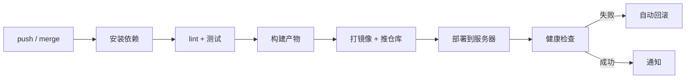

# Node.js 服务部署最佳实践

> **定位**：从"代码能跑"到"线上稳定运行"的完整流程。涵盖上线前准备、服务器环境、进程管理、反向代理、容器化、配置密钥、日志、监控、CI/CD、上线清单与回滚。
> 配套阅读：[PM2 进程管理](/service/pm2)、[Docker 入门](/service/docker)、[Node.js 入门](/service/node-core)。

## 部署全景

```
本地开发                  CI/CD                    线上服务器
┌──────────┐        ┌──────────────┐        ┌─────────────────────┐
│ 写代码    │  push  │ 测试 → 构建   │  部署   │ nginx (80/443)      │
│ 本地验证  │ ─────→ │ 打镜像/产物   │ ─────→ │  ├─ 静态资源(前端)   │
└──────────┘        └──────────────┘        │  └─ 反代 → Node:3000 │
                                            │      ↓              │
                                            │  PM2 / Docker       │
                                            │      ↓              │
                                            │  MySQL / Redis      │
                                            └─────────────────────┘
```

**要部署的东西**（别只想着"把 Node 跑起来"）：

| 部分 | 说明 |
|------|------|
| Node 服务 | 业务 API（本文重点） |
| 前端静态资源 | `npm run build` 产物，交给 nginx |
| 反向代理 | nginx：静态资源 + API 转发 + HTTPS |
| 中间件 | MySQL / Redis / MQ（容器或独立部署） |
| 进程管理 | PM2 / systemd / Docker（守护与集群） |

## 一、上线前准备

| 项 | 做法 | 为什么 |
|----|------|--------|
| **代码检查** | `npm run lint && npm run test && tsc --noEmit` | 把错误拦在上线前，而不是被用户发现 |
| **依赖锁定** | 用 `npm ci`（严格按 `package-lock.json`） | `npm install` 可能装到不兼容的新版本 |
| **Node 版本固定** | `.nvmrc` + `package.json` 的 `engines` | 避免"本地能跑、线上报错" |
| **环境变量分离** | 代码读 `process.env`，配置不进 Git | 同一份代码跑多环境 |
| **健康检查接口** | 暴露 `GET /health` 返回 `{status:'ok'}` | 供 nginx / K8s / 监控探活 |
| **优雅退出** | 监听 `SIGTERM`，停止接新请求 + 关连接池 | 容器滚动更新时不断正在处理的请求 |

```js
// 健康检查 + 优雅退出（生产必备）
app.get('/health', (ctx) => { ctx.body = { status: 'ok', uptime: process.uptime() } })

process.on('SIGTERM', async () => {
  server.close()          // 停止接收新连接,存量请求继续处理
  await closeDb()         // 关数据库连接池 / Redis
  process.exit(0)
})
```

> 原理详见 [Node.js 入门 · 优雅退出](/service/node-core)。

## 二、服务器与环境

**安装 Node**（三种方式，按场景选）：

```bash
# ① nvm(推荐用于单机,能自由切换版本)
curl -o- https://raw.githubusercontent.com/nvm-sh/nvm/v0.39.7/install.sh | bash
nvm install 20 && nvm use 20

# ② 系统包管理(NodeSource)
curl -fsSL https://deb.nodesource.com/setup_20.x | sudo -E bash -
sudo apt-get install -y nodejs

# ③ Docker(推荐用于生产,环境完全可控)
# 见下方"容器化部署"
```

**服务器规范**：

| 项 | 建议 |
|----|------|
| **运行用户** | 用专用普通用户（如 `deploy`），**别用 root 跑应用**（被攻破就是整机沦陷） |
| **目录规范** | 应用 `/opt/<app>`、日志 `/var/log/<app>`、数据 `/data/<app>` |
| **时区** | 统一 UTC 存储、展示时再转（容器默认 UTC，注意别混用） |
| **文件权限** | 应用目录属主是运行用户，日志目录可写 |
| **防火墙** | 只开放 80/443，数据库端口**不要暴露公网** |

## 三、进程管理：三种方式

| 方式 | 命令 | 适用 | 特点 |
|------|------|------|------|
| **PM2** | `pm2 start ecosystem.config.js` | 裸机 / 虚拟机 | 守护 + 集群 + 日志开箱即用（[详见](/service/pm2)） |
| **systemd** | `systemctl start my-api` | 裸机（不想引入 PM2） | 系统原生、日志走 journald；**不做集群** |
| **Docker** | `docker compose up -d` | 生产推荐 | 环境一致、易回滚；守护交给编排层 |

**systemd 示例**（不引入 PM2 时的最小方案）：

```ini
# /etc/systemd/system/my-api.service
[Unit]
Description=My Node API
After=network.target

[Service]
Type=simple
User=deploy
WorkingDirectory=/opt/my-api
Environment=NODE_ENV=production
EnvironmentFile=/opt/my-api/.env
ExecStart=/usr/bin/node /opt/my-api/dist/app.js
Restart=always              # 挂了自动拉起
RestartSec=3
StandardOutput=append:/var/log/my-api/out.log
StandardError=append:/var/log/my-api/err.log

[Install]
WantedBy=multi-user.target
```

```bash
systemctl daemon-reload && systemctl enable --now my-api
```

## 四、反向代理：nginx

Node 服务**不要直接暴露给公网**，前面挂一层 nginx：

```nginx
server {
    listen 80;
    server_name api.example.com;

    # ① 前端静态资源(构建产物)
    location / {
        root /opt/web/dist;
        try_files $uri $uri/ /index.html;      # SPA 路由回退
        expires 7d;                             # 静态资源缓存(带 hash 的文件可以更久)
    }

    # ② API 反代到 Node
    location /api/ {
        proxy_pass http://127.0.0.1:3000;
        proxy_http_version 1.1;
        proxy_set_header Host $host;
        proxy_set_header X-Real-IP $remote_addr;              # 让 Node 拿到真实 IP
        proxy_set_header X-Forwarded-For $proxy_add_x_forwarded_for;
        proxy_set_header X-Forwarded-Proto $scheme;
        proxy_read_timeout 60s;                               # 长请求(如 LLM 流式)要调大
    }

    gzip on;
    gzip_types text/css application/javascript application/json;
}
```

**要点**：

- `X-Real-IP` / `X-Forwarded-For` 必须传——否则 Node 里拿到的是 nginx 的 IP
- **SSE / 流式响应**（如 LLM 接口）要关掉缓冲：`proxy_buffering off;`
- HTTPS 用 certbot 一键签证书：`certbot --nginx -d api.example.com`

## 五、容器化部署（生产推荐）

**Node 的 Dockerfile（多阶段构建）**：

```dockerfile
# ---------- 构建阶段 ----------
FROM node:20-alpine AS builder
WORKDIR /app
COPY package*.json ./
RUN npm ci                              # 用 ci 保证和 lock 文件一致
COPY . .
RUN npm run build                       # 编译 TS / 打包前端

# ---------- 运行阶段 ----------
FROM node:20-alpine
WORKDIR /app
ENV NODE_ENV=production
COPY package*.json ./
RUN npm ci --omit=dev                   # 只装生产依赖
COPY --from=builder /app/dist ./dist
USER node                               # 不用 root 运行
EXPOSE 3000
CMD ["node", "dist/app.js"]
```

```bash
# .dockerignore(必加!否则 node_modules/.git 会被打进镜像)
node_modules
.git
dist
*.log
.env
```

**收益**：镜像只含运行必需（多阶段丢弃了构建工具和 devDependencies），体积可从 ~1GB 降到 ~150MB。

```yaml
# docker-compose.yml
services:
  api:
    image: my-registry/my-api:1.2.3          # 用明确版本号,便于回滚
    restart: always
    env_file: .env
    ports: ["3000:3000"]
    healthcheck:
      test: ["CMD", "wget", "-qO-", "http://localhost:3000/health"]
      interval: 30s
      timeout: 3s
      retries: 3
  redis:
    image: redis:7-alpine
    restart: always
```

> 容器内**一般不再用 PM2**（`restart: always` 已经负责守护），详见 [PM2 · 什么时候不需要它](/service/pm2)。
> Dockerfile / compose 细节见 [Docker 入门](/service/docker)。

## 六、配置与密钥

| 配置类型 | 放哪 | 注意 |
|---------|------|------|
| 非敏感配置（端口、日志级别） | 环境变量 / `.env` | `.env` 加进 `.gitignore` |
| 敏感配置（DB 密码、JWT Secret、API Key） | 密钥管理服务（Vault / KMS）/ CI 的 Secret | **绝不进 Git、不进镜像** |
| 多环境差异 | `NODE_ENV` + 配置层（如 `config/prod.js`） | 代码里不写 `if (env === 'prod')` 散落各处 |

```js
// 启动时校验必需的环境变量,缺了直接退出(fail-fast,比运行时才发现好)
const REQUIRED = ['DATABASE_URL', 'REDIS_URL', 'JWT_SECRET']
const missing = REQUIRED.filter(k => !process.env[k])
if (missing.length) {
  console.error('缺少环境变量:', missing.join(', '))
  process.exit(1)
}
```

## 七、日志

| 原则 | 做法 |
|------|------|
| **结构化** | 输出 JSON（`{level, time, msg, traceId}`），便于检索 |
| **输出到 stdout** | 容器规范：日志交给 Docker/K8s 收集，而不是自己写文件 |
| **分级** | debug / info / warn / error，生产默认 info |
| **切割** | 裸机用 `pm2-logrotate` 或 logrotate，别让日志写满磁盘 |
| **脱敏** | **不记密码、token、身份证、手机号**（脱敏后再打） |
| **链路追踪** | 每个请求带 `traceId`，跨服务串起来（排查慢请求的关键） |

```js
// 用 pino 输出结构化日志(生产比 console 强太多)
const logger = pino({ level: process.env.LOG_LEVEL || 'info' })
logger.info({ traceId, userId, path: ctx.path, ms: 42 }, 'request done')
```

## 八、监控与告警

**监控三层**：

| 层 | 指标 | 工具 |
|----|------|------|
| **进程** | CPU、内存、重启次数 | PM2 monit / `docker stats` |
| **应用** | QPS、P95/P99 耗时、错误率、事件循环延迟 | Prometheus + Grafana（`prom-client`） |
| **依赖** | DB 连接数、Redis 命中率、外部 API 耗时 | 各自的 exporter |

**告警要"及时且不打扰"**：

- **分级**：P0（服务不可用）打电话；P1（错误率飙升）企业微信；P2（磁盘 80%）邮件
- **基线对比**：按"同比昨天 / 上周"告警，而不是拍一个固定阈值
- **要有处置动作**：每条告警都写清"谁看、看什么、怎么办"

## 九、CI/CD 自动化



**关键实践**：

- 镜像 tag 用 **git commit sha 或版本号**（别用 `latest`，否则回滚时找不到旧版本）
- 部署后必须**自动验证**（调 `/health` + 关键接口冒烟），失败自动回滚
- 数据库变更（migration）要**向后兼容**（先加字段、再改代码、最后删旧字段），否则无法回滚

> 流水线细节见 [CI/CD](/engineering/cicd)。

## 十、上线检查清单与回滚

**上线前 checklist**：

- [ ] lint / 测试 / 类型检查全绿
- [ ] 环境变量已配置（尤其新增的）
- [ ] 数据库 migration 已执行且向后兼容
- [ ] 健康检查接口可用
- [ ] 日志级别、脱敏确认
- [ ] 关键接口冒烟通过
- [ ] **回滚方案就绪**（上一个可用版本的 tag 已知）

**回滚**（越简单越好）：

```bash
# Docker:改回上一个 tag 重启
docker compose up -d --no-deps api    # 配合 image: my-api:1.2.2

# PM2:切回上一个版本目录再 reload
ln -sfn /opt/my-api/releases/1.2.2 /opt/my-api/current && pm2 reload my-api
```

> 回滚的前提是**部署过程可重复、版本可追溯**——所以镜像 tag、配置文件都要版本化。

## 常见坑

| 坑 | 现象 | 解决 |
|----|------|------|
| `NODE_ENV` 没设 | 依赖库（Express/React 等）走开发分支，**性能差几倍** | 生产必须 `NODE_ENV=production` |
| 只监听 `localhost` | 容器外访问不到 | `app.listen(3000, '0.0.0.0')` |
| 内存超限被杀 | 容器 OOMKilled | 设 `--max-old-space-size`，容器内存限制留余量 |
| 时区错乱 | 日志 / 业务时间差 8 小时 | 容器设 `TZ=Asia/Shanghai`，或统一 UTC |
| 静态资源没缓存 | 每次刷新都重新下载 | 文件名带 hash + `expires` 长缓存，HTML 不缓存 |
| 依赖没锁版本 | 重新构建就报错 | `npm ci` + 提交 `package-lock.json` |
| 忘了优雅退出 | 滚动更新时用户请求 502 | 监听 SIGTERM（见第一章） |
| 数据库端口暴露公网 | 被扫库 / 勒索 | 防火墙只开 80/443，DB 走内网 |

## 相关

- [PM2 进程管理](/service/pm2) - 进程守护与 cluster 模式
- [Docker 入门](/service/docker) - Dockerfile / compose / 数据持久化
- [Node.js 入门](/service/node-core) - 事件循环、优雅退出、内存管理
- [CI/CD](/engineering/cicd) - 自动化流水线
- [Java 服务部署最佳实践](/service/java-deployment) - 对照另一套技术栈的部署方式
