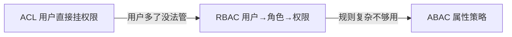
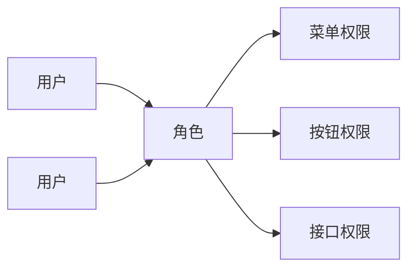
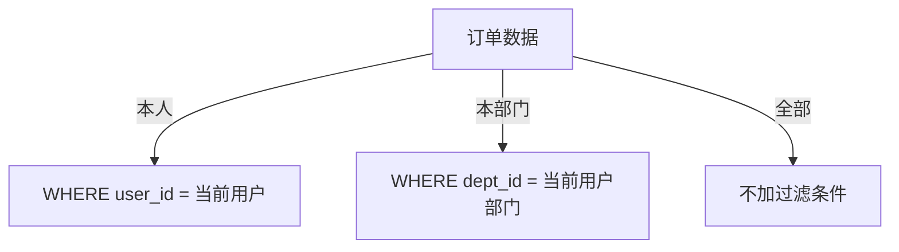

# 权限设计

认证（Authentication）解决"你是谁"，授权（Authorization）解决"你能做什么"——权限设计就是后者的完整方案。auth.md 讲了 RBAC 的基本实现（四张表 + 中间件），这篇展开权限设计的完整图谱：模型演进、接口鉴权、前端控制、数据权限。

## 权限模型演进：ACL → RBAC → ABAC

权限系统要回答的核心问题：**某个用户能不能做某件事**。三个模型是层层递进的解法：



| 模型 | 思路 | 优点 | 缺点 |
|------|------|------|------|
| **ACL** | 每个用户直接关联权限 | 最简单 | 用户一多，维护爆炸 |
| **RBAC** | 中间加一层"角色"：用户挂角色、角色挂权限 | 管理成本大降，业界主流 | 规则复杂（按部门/金额判断）时表达不了 |
| **ABAC** | 用属性（用户、资源、环境）写策略 | 最灵活 | 复杂、难排错、性能开销 |

**ACL** 适合超小系统（几十个用户直接指定）；**RBAC 是 90% 业务的正解**；**ABAC** 留给规则经常变的系统（财务审批、风控）。

## RBAC 详解

### 核心概念

角色是用户和权限之间的"中间人"：



**为什么不直接给用户挂权限**：假设 500 个用户、20 种权限，直接挂 = 管理 1 万条关系，改一次权限要动几百人；挂角色后 = 先定义 5 个角色，用户只选角色，改权限只改角色。**角色就是"权限分组"，让管理粒度从用户级提升到角色级**。

### 表结构

基础五张表（SQL 见 auth.md 的 RBAC 模型）：`users`、`roles`、`permissions` + 两张关联表 `user_roles`、`role_permissions`。

角色多了还可以扩展两种结构：

| 扩展 | 做法 | 场景 |
|------|------|------|
| **角色继承** | 角色挂角色（如"管理员"继承"编辑"） | 角色之间有天然层级 |
| **用户组** | 角色挂到部门/用户组，用户入组自动获得角色 | 按组织架构授权（入职自动有部门权限） |

### 权限粒度分层

| 层级 | 控制什么 | 例子 | 谁消费 |
|------|---------|------|--------|
| **菜单权限** | 侧边栏显示哪些菜单 | 只有管理员见"系统设置" | 前端 |
| **按钮权限** | 页面里哪些按钮可用 | 普通用户无"删除"按钮 | 前端 |
| **接口权限** | 能不能调某个 API | `DELETE /users/:id` | 后端 |
| **数据权限** | 能看哪些数据行 | 只看本部门的数据 | 后端 |

前两层只是**体验**（隐藏入口），后两层才是**安全**（拦截请求）——前端权限被绕过不影响安全，后端漏了才是漏洞。

## ABAC 简介

RBAC 表达不了"财务只能审批**金额小于 1 万**的报销单"——这跟角色无关，跟**单据的属性**有关。ABAC 把判断条件写成策略：

```
允许 财务角色 审批 报销单 WHERE 报销单.金额 < 10000
```

实现一般用策略引擎（Casbin、OPA），或把规则写进业务代码。代价：策略可读性差、每次请求都要评估、排错困难。**业务没到那个复杂度别上 ABAC**——先用 RBAC，规则真的复杂了再升级。

## 接口级权限实战

### 权限码约定

权限码统一格式 `资源:动作`（小写、冒号分隔），一个接口对应一个码：

| 权限码 | 含义 |
|--------|------|
| `users:read` | 查看用户 |
| `users:create` | 创建用户 |
| `users:delete` | 删除用户 |

### 鉴权中间件

在 auth.md 的 `requirePermission` 基础上，权限码由**路由声明**、中间件**按码校验**：

```javascript
function requirePermission(code) {
  return async (ctx, next) => {
    const user = ctx.state.user
    if (!user) return ctx.throw(401, '未登录')

    const codes = await getPermissionCodes(user.id)   // 查库 + Redis 缓存
    if (!codes.includes(code)) return ctx.throw(403, '没有权限')

    await next()
  }
}

// 使用:路由声明权限码,中间件校验
router.delete('/users/:id', authMiddleware, requirePermission('users:delete'), handler)
```

### 权限存 JWT 还是查库？

| 方案 | 优点 | 缺点 |
|------|------|------|
| 权限码塞进 JWT | 不查库，快 | 权限变更不实时（改完角色要等 token 过期） |
| 每次查库 | 实时 | 每次请求多一次查询 |
| **查库 + Redis 缓存**（推荐） | 实时 + 快 | 要维护缓存失效 |

实践中封号、降权通常要求立刻生效，所以**查库 + 缓存**是主流；权限码塞 JWT 只适合"权限几乎不变"的内部系统。

## 前端权限控制

前后端分离时，登录接口返回用户信息和权限码数组：

```javascript
// 登录返回
{ token, user: { id: 1, name: 'alice' }, permissions: ['users:read', 'posts:write'] }
```

### 路由级：动态路由

vue-router 把全部路由定义成"带权限码的 meta"，登录后按权限过滤再注册：

```javascript
const allRoutes = [
  { path: '/admin', meta: { permission: 'admin:manage' }, component: Admin },
  { path: '/posts', meta: { permission: 'posts:read' }, component: Posts },
]

// 登录后:过滤出有权限的路由,动态注册
const myRoutes = allRoutes.filter(r => permissions.includes(r.meta.permission))
myRoutes.forEach(r => router.addRoute(r))
```

### 按钮级：权限指令

```javascript
// 自定义指令:没有权限码就移除元素
app.directive('permission', {
  mounted(el, binding) {
    if (!permissions.includes(binding.value)) el.parentNode?.removeChild(el)
  }
})
```

```html
<button v-permission="'users:delete'">删除</button>
```

> 关键认知：前端控制菜单/按钮只是**用户体验**——隐藏了入口但接口照样能调。真正的安全边界在后端，前端权限可以被绕过，后端校验必须有。

## 数据权限（行级）

接口权限管"能不能调接口"，数据权限管"调了能看到哪些行"。同一个 `GET /orders`，销售看自己的、经理看部门的、老板看全部的：



实现：把"数据范围"作为用户属性存下来，查询时拼条件：

```javascript
// 用户数据范围:own(本人) / dept(本部门) / all(全部)
const scopeMap = {
  own:  { filter: { userId: user.id } },
  dept: { filter: { deptId: user.deptId } },
  all:  { filter: {} },
}

const { filter } = scopeMap[user.dataScope]
const orders = await orderRepo.find({ where: filter })
```

## 设计建议与常见坑

- **最小权限原则**：默认不给权限，按需授予；宁可少给再加，不要多给了再收
- **权限变更要实时**：封号/降权必须立刻生效——别把权限塞 JWT 后改角色不生效
- **别用"是不是管理员"代替权限系统**：`if (user.role === 'admin')` 只能处理"全有/全无"，一旦出现"普通用户也能做某件事"就得返工
- **权限码集中管理**：前后端共用一份权限码字典（常量文件），别在路由和中间件里各写各的字符串
- **接口要二次校验**：前端隐藏了删除按钮，接口依然要校验——攻击者可以直接 curl
- **权限系统是增长性需求**：小项目先别过度设计，等真的出现"角色差异"再上 RBAC

## 小结

- 权限模型三选一：**ACL（超小）→ RBAC（主流）→ ABAC（复杂规则）**
- 四层权限：菜单/按钮（前端，体验）→ 接口/数据（后端，安全）
- 接口鉴权推荐**权限码 + 查库缓存**；前端只做体验，后端必须兜底
