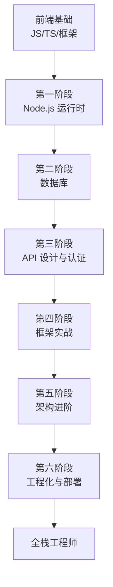

# 前端转全栈学习路线

面向有前端开发经验的开发者，以 Node.js 作为后端语言，系统性地补齐后端知识，逐步成长为全栈工程师。

## 学习路径总览

## 第一阶段：Node.js 运行时基础

> 前端开发者已经熟悉 JavaScript 语言，但 Node.js 的运行时环境与浏览器有本质区别。这一阶段的目标是理解 Node.js 能做什么、怎么做。

| 文章 | 核心内容 |
|------|----------|
| [Node.js 入门](./node-core) | `fs`、`path`、`stream`、`Buffer`、`events` 等内置模块 |

**关键认知转变：**
- 浏览器里操作 DOM，Node.js 里操作文件和进程
- 浏览器有 `window`，Node.js 有 `global` 和 `process`
- 没有浏览器安全沙箱，可以读写文件系统、发起系统调用

## 第二阶段：数据库

> 这是前端转全栈最大的知识缺口。后端的核心就是"接收请求 → 查数据库 → 返回结果"，不理解数据库就无法做后端。

| 文章 | 核心内容 |
|------|----------|
| [数据库基础](./database) | SQL 语法、表设计、索引、事务、MongoDB、Redis、ORM |

**学习要点：**
- 先学关系型数据库（MySQL/PostgreSQL），理解表、行、列、主键、外键
- 再学 NoSQL（MongoDB），理解文档模型的灵活性
- 最后学 Redis，理解缓存对性能的巨大提升
- ORM（Prisma/TypeORM）让你用 TypeScript 操作数据库，类型安全

## 第三阶段：API 设计与认证

> 前后端通过 API 通信，设计良好的 API 是全栈开发的基本功。

| 文章 | 核心内容 |
|------|----------|
| [RESTful API 设计](./restful-api) | 路由规划、HTTP 状态码、分页、错误处理、版本管理 |
| [认证与授权](./auth) | JWT、Session、OAuth 2.0、RBAC 权限模型 |

**学习要点：**
- RESTful 不是标准，是一组设计约定，理解其背后的思想比死记规则更重要
- 认证（Authentication）解决"你是谁"，授权（Authorization）解决"你能做什么"
- JWT 是无状态的，适合分布式系统；Session 是有状态的，实现简单

## 第四阶段：框架实战

> 有了前面的基础，现在可以系统学习 Node.js Web 框架了。按复杂度递增的顺序学习。

| 文章 | 核心内容 | 定位 |
|------|----------|------|
| [Koa 入门](./koa) | 洋葱模型中间件、Context 对象 | 轻量级，理解框架本质 |
| [Egg.js 入门](./egg) | 约定式开发、插件机制 | 企业级，阿里出品 |
| [NestJS 入门](./nest) | 装饰器、依赖注入、模块化 | 最接近 Spring 的体验 |

**学习建议：**
- Koa 帮你理解"框架到底做了什么"
- Egg.js 帮你理解"企业项目怎么组织"
- NestJS 帮你理解"大型后端应用的架构设计"

## 第五阶段：架构进阶

> 当你能用框架写出 CRUD 应用后，需要学习更高层次的架构设计。

| 文章 | 核心内容 |
|------|----------|
| [BFF 架构设计](./bff) | 为前端量身定制的后端服务层 |
| [GraphQL 入门](./graphql) | 按需查询，解决过度 fetch |
| [Serverless 入门](./serverless) | 函数即服务，无需管理服务器 |

**学习要点：**
- BFF 是前端开发者最自然的后端切入点——你本来就在做前后端对接
- GraphQL 适合数据关系复杂的场景，前端可以精确声明需要什么数据
- Serverless 适合流量波动大的场景，按需计费，自动扩缩容

## 第六阶段：工程化与部署

> 代码写好了，怎么让它稳定地跑在生产环境？这一阶段补齐工程化能力。

| 文章 | 核心内容 |
|------|----------|
| [Docker 入门](./docker) | 容器化、Dockerfile、docker-compose |
| [后端测试实践](./backend-testing) | Jest 单元测试、Supertest 接口测试 |

**学习要点：**
- Docker 解决"在我机器上能跑"的问题，保证环境一致性
- 后端测试比前端测试更重要——后端出错直接影响数据和用户
- 日志和监控是线上排障的生命线

## 学习建议

1. **不要跳阶段**：每个阶段都是下一阶段的基础，特别是数据库
2. **边学边做**：每学完一个阶段，用所学知识写一个小项目
3. **推荐项目演进路线**：
   - 阶段一后：写一个命令行文件管理工具
   - 阶段二后：写一个带数据库的 Todo API
   - 阶段三后：给 Todo API 加上用户认证
   - 阶段四后：用 Koa/NestJS 重构 Todo 应用
   - 阶段五后：给应用加上 BFF 层或 GraphQL
   - 阶段六后：Docker 容器化 + 自动化测试 + 部署
