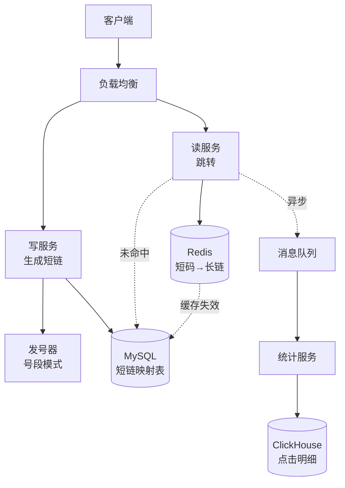
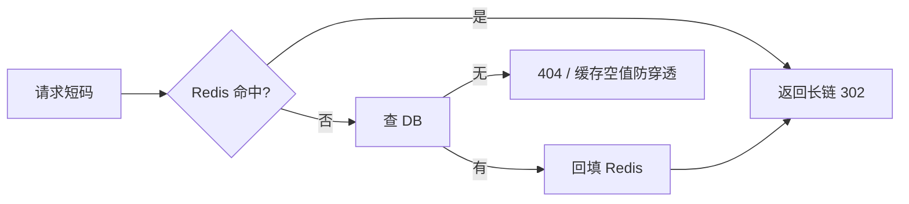
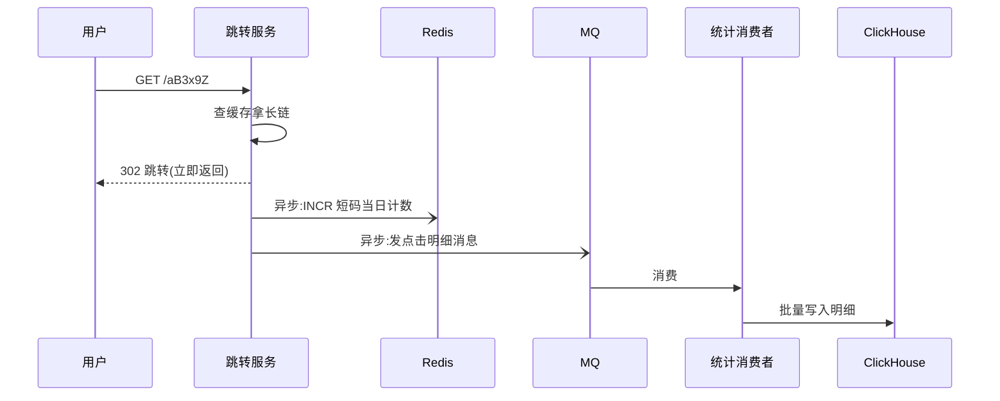

# 短链接服务设计

> **定位**：经典系统设计题，也是"ID 生成 + 缓存 + 高并发读 + 异步统计"的综合演练。面试里常考，工程里也真的会遇到（分享链接、短信链接、二维码、埋点短链）。
> 本文按"**澄清需求 → 核心难点 → 分层设计 → 面试答题框架**"的顺序展开。

## 一、需求分析（先问清，再设计）

系统设计题的第一分就在"**主动澄清需求**"，而不是上来就写表结构。

**功能需求**（先确认做到哪一步）：

| 功能 | 是否必需 |
|------|---------|
| 长链接 → 短链接（生成） | ✅ 核心 |
| 短链接 → 长链接（跳转） | ✅ 核心 |
| 自定义短码（如 `s.cn/promo`） | 可选 |
| 过期时间 | 可选 |
| 点击统计（PV/UV、地域、设备） | 可选（但产品几乎都要） |

**非功能需求**（决定架构）：

| 维度 | 估算 | 影响 |
|------|------|------|
| **读写比** | 读 : 写 ≈ **100 : 1**（生成一次、被点很多次） | 读路径要重点优化（缓存） |
| **写入量** | 假设 1000 万条/天 | 单条 ~500B → **5GB/天**，必须分库分表 |
| **QPS** | 写 ~120/s，读 ~12000/s | 读走缓存，写走号段批量分配 |
| **延迟** | 跳转 P99 < 100ms | 缓存命中率是生命线 |
| **可用性** | 跳转服务挂了 = 全站链接失效 | 无状态 + 多副本 + 降级 |

**短码长度怎么定？**

```
62 进制字符集：0-9a-zA-Z 共 62 个
6 位 → 62^6 = 568 亿     ← 按每天 1000 万条算,够用 1500 年
7 位 → 62^7 = 3.5 万亿
```

结论：**6 位足够**（这也是微博短链 `t.cn` 的选择）。

## 二、整体架构



**两条路径分离**（这是设计的第一个关键决策）：

- **写路径**（低频）：发号器取 ID → 转 62 进制 → 存 DB → 返回短链
- **读路径**（高频）：查 Redis → 命中直接 302 → 未命中查 DB 并回填缓存 → 异步发点击消息

> 为什么读写分离？因为**读是写的 100 倍**，读路径必须极致轻量（缓存 + 无状态），写路径可以稍慢但要保证 ID 不冲突。

## 三、短码生成（核心难点）

这是面试的重点。几种方案对比：

| 方案 | 做法 | 优点 | 缺点 |
|------|------|------|------|
| **UUID / 随机串** | 随机生成 6 位 | 简单、不可预测 | **冲突要重试**；随机 6 位空间虽大，但生日悖论下冲突率不可忽略 |
| **Hash 取前 N 位** | `md5(长链)` 取前 6 位 | 同一长链结果稳定（幂等） | 冲突必须处理（换盐重试）；无状态但**不可控** |
| **自增 ID 转 62 进制** ⭐ | 发号器取 ID → base62 | **无冲突**、短、有序（好分片） | ID 连续 → **可被遍历**（安全风险） |
| **雪花算法（Snowflake）** | 时间戳+机器+序列 | 分布式无冲突 | 64 位太长，转 62 进制还有 11 位 |
| **号段模式** ⭐ | 一次从 DB 取 1000 个 ID 到内存 | **大幅减少 DB 压力**、高可用 | 需处理号段浪费（重启丢一段） |

**推荐组合：号段模式 + 62 进制 + 打乱**。

```js
// 62 进制转换(核心就这几行)
const CHARS = '0123456789abcdefghijklmnopqrstuvwxyzABCDEFGHIJKLMNOPQRSTUVWXYZ'

function toBase62(num) {
  if (num === 0) return CHARS[0]
  let s = ''
  while (num > 0) {
    s = CHARS[num % 62] + s
    num = Math.floor(num / 62)
  }
  return s
}

// 补足 6 位(定长,便于按长度分片)
const encode = (num) => toBase62(num).padStart(6, '0')
```

**号段模式**（解决"每次生成都查 DB"的瓶颈）：

```sql
-- 号段表:每个业务一行,记录当前最大 ID
CREATE TABLE id_segment (
  biz_tag     VARCHAR(32) PRIMARY KEY,   -- 'short_url'
  max_id      BIGINT NOT NULL,           -- 当前已分配到的最大 ID
  step        INT NOT NULL DEFAULT 1000  -- 每次取多少个
);
```

```
服务启动 → 取一批 [1, 1000] 放进内存,DB 的 max_id 改成 1000
生成短码 → 直接从内存自增(不查库)
内存用完 → 再取下一段 [1001, 2000]
```

> **双 buffer 优化**：内存里留两段（当前段 + 预取段），当前段用到 10% 时异步预取下一段——这样取号几乎不会阻塞。这是美团 Leaf、百度 UidGenerator 的核心思路。

**防遍历怎么做？**

自增 ID 的短码是连续的（`000001`、`000002`…），别人可以顺序遍历拿到所有链接。三种缓解：

| 手段 | 做法 | 代价 |
|------|------|------|
| **打乱字符表** | 把 `CHARS` 换成自定义顺序 | 简单，但仍是双射，能被反推 |
| **加盐混淆** | `encode(id ^ SALT)` 或用可逆混淆函数 | 需要保证可逆 + 不冲突 |
| **限制访问** | 限流 + 异常访问告警（**最实用**） | 不改算法，靠风控兜住 |

> 面试可以这样答："自增 ID 有可遍历风险，但短码的核心诉求是短和稳定；实际项目里我们用限流 + 风控兜底，而不是把短码变长。"

## 四、跳转：301 还是 302？

**面试高频追问**，答错就丢分。

| | 301 Moved Permanently | 302 Found（临时） |
|---|---|---|
| 浏览器行为 | **永久缓存**，下次直接跳转，不再请求服务器 | 每次都回来问服务器 |
| 服务器压力 | 小（大部分请求不落到服务端） | 大（每次都要处理） |
| 能否统计点击 | ❌ 不能（请求都没到服务器） | ✅ 能 |
| 能否改目标 | ❌ 改不了（客户端缓存了） | ✅ 随时可改 |
| 能否设置过期 | ❌ | ✅ |

**结论：短链服务用 302**——因为：

1. 产品几乎都要**点击统计**（这是短链的核心价值之一）
2. 需要能**修改/禁用**短链（违规链接要能拦截）
3. 需要支持**过期时间**

> 唯一的例外：纯分享、不要统计、要极致省流量的场景，可以用 301。但面试里默认答 302，并说明原因。

## 五、存储设计

```sql
CREATE TABLE short_url (
  id           BIGINT PRIMARY KEY AUTO_INCREMENT,
  short_code   VARCHAR(10)  NOT NULL COMMENT '短码,如 0000aZ',
  original_url VARCHAR(2048) NOT NULL COMMENT '原始长链',
  user_id      BIGINT       NULL COMMENT '创建者(可空,匿名也能生成)',
  created_at   DATETIME     NOT NULL DEFAULT CURRENT_TIMESTAMP,
  expire_at    DATETIME     NULL COMMENT '过期时间,NULL 表示永不过期',
  status       TINYINT      NOT NULL DEFAULT 1 COMMENT '1正常 0禁用',
  UNIQUE KEY uk_short_code (short_code)     -- 跳转时的查询依据
);
```

**关键设计点**：

| 点 | 说明 |
|----|------|
| `uk_short_code` 唯一索引 | 跳转是"按短码查长链"，必须走索引；唯一约束也兜住"短码冲突" |
| 原始 URL 用 `VARCHAR(2048)` | 别用 `TEXT`（无法建索引、查询慢）；2048 够放绝大多数 URL |
| 幂等 | 同一长链重复生成，要么返回已有短码（省空间），要么允许多个（能分别统计）——**产品决定** |

**分库分表**：

```
数据量:5GB/天 → 一年 1.8TB → 必须分片
方案:按 short_code 哈希分 64 片(读路径直接定位,无需广播)
```

> 分片键要跟**查询方式**一致——跳转只按 `short_code` 查，所以用它做分片键最合适（避免跨片查询）。

## 六、缓存设计（读路径的命脉）

读写比 100:1，所以**缓存命中率决定整个系统的性能**。



| 问题 | 方案 |
|------|------|
| **缓存穿透**（查不存在的短码） | 布隆过滤器 / 缓存空值（短 TTL） |
| **缓存击穿**（热点短码过期） | 互斥锁重建 / 逻辑过期（不设 TTL，异步刷新） |
| **缓存雪崩**（大量同时过期） | 过期时间加随机值 |
| **超热短链**（明星微博的链接） | 多级缓存：本地缓存（Caffeine）+ Redis |

> 缓存策略细节见 [Redis 入门](/service/redis-intro) 与 [数据库基础 · 缓存三兄弟](/service/database)。

**缓存存什么**：`short_code → original_url`，TTL 设 1 天左右（配合 DB 的过期时间）。热门链接可以用"逻辑过期"避免击穿。

## 七、点击统计（别拖慢跳转）

**核心原则：跳转路径上不能做重操作**。统计必须异步。



**要点**：

- 用 **Redis INCR** 做实时计数（`short:click:{code}:{date}`），定时同步到 DB
- 明细（IP、UA、地域、referer）走 **MQ → ClickHouse**，量大且需要多维分析
- 跳转响应**不等**统计完成——统计失败只丢数据，不能影响跳转

## 八、高并发与可用性

| 环节 | 风险 | 应对 |
|------|------|------|
| **发号器** | 单点故障 → 无法生成新短链 | 号段模式 + 双 buffer；DB 挂了两台实例各自持有一段，互不影响 |
| **Redis** | 挂了 → 请求全打 DB | Redis 集群 + 本地缓存兜底；DB 扛不住时**降级为只读**（不生成新链） |
| **DB** | 读压力大 | 读写分离（从库只读）+ 分库分表 |
| **跳转服务** | 单机挂 → 部分请求失败 | 无状态 + 多副本 + LB |
| **短码冲突** | 并发写入撞车 | 唯一索引兜底 + 冲突重试（号段模式下基本不会） |

**降级预案**（面试加分项）：

```
Redis 不可用 → 查 DB（并限流保护 DB）
DB 不可用   → 返回缓存中的结果；缓存也没有则 503
发号器不可用 → 拒绝生成新短链（返回"稍后再试"），但跳转不受影响
```

## 九、安全与防滥用

| 风险 | 说明 | 应对 |
|------|------|------|
| **遍历爬取** | 顺序猜短码，批量拿链接 | 限流 + 风控 + 短码混淆 |
| **恶意生成** | 刷接口生成海量短链 | 接口限流、需登录、单用户配额 |
| **开放重定向** | 短链指向钓鱼站 | 目标 URL 校验（协议白名单、域名黑名单）、违规链接人工/自动审核 |
| **敏感内容** | 短链被用来传播违规内容 | 生成时检测 + 定期巡检 + 一键封禁（`status = 0`） |

> 开放重定向是短链服务的**原生风险**：用户看到的是 `s.cn/xxx`，不知道会跳去哪。所以目标 URL 的校验和封禁能力是必需的。

## 十、面试答题框架

系统设计题的评分点是"**结构化表达**"，按这个顺序讲：

```
① 澄清需求
   - 功能:生成 + 跳转 + (统计?)
   - 量级:每天多少条?读写比?
   - 得到:短码 6 位、读 12000 QPS、5GB/天

② 核心 API
   - POST /api/shorten  { url }        → { shortUrl }
   - GET  /:code                       → 302 Location: 长链

③ 短码生成(重点,主动对比方案)
   - 自增 ID + 62 进制(无冲突、短)
   - 号段模式解决发号瓶颈
   - 主动说"自增可遍历"这个缺点 + 缓解

④ 存储
   - 表结构 + 唯一索引(short_code)
   - 按 short_code 分片(和查询方式一致)

⑤ 读路径(体现你对"读多写少"的理解)
   - Redis 缓存 + 缓存三兄弟的应对
   - 302 而非 301(为了统计和可控)

⑥ 统计(体现"不阻塞主流程"的意识)
   - Redis 计数 + MQ 异步落库

⑦ 高并发与降级(体现工程经验)
   - 发号器/Redis/DB 各自的降级预案
```

**常见追问与答法**：

| 追问 | 回答要点 |
|------|---------|
| 短码冲突怎么办？ | 唯一索引兜底 + 重试；号段模式基本不会冲突 |
| 同一长链生成两次？ | 产品决策：幂等返回同一个，或生成两个（能分别统计） |
| 短链能改目标吗？ | 用 302 就能改；301 改不了（客户端缓存了） |
| 怎么支持自定义短码？ | 先查是否被占用（唯一索引），再插入；与发号器互不干扰 |
| 数据量再涨 100 倍？ | 分片数翻倍（一致性哈希）+ 冷数据归档到对象存储 |

## 相关

- [Redis 入门](/service/redis-intro) - 缓存策略、分布式锁、计数器
- [数据库基础](/service/database) - 索引、分库分表、缓存三兄弟
- [MySQL 进阶](/service/mysql-advanced) - 分库分表与索引设计
- [BFF 架构设计](/service/bff) - 另一个系统设计题（聚合层设计）
- [权限设计](/service/permission-design) - 另一个设计题（RBAC + 动态权限）
