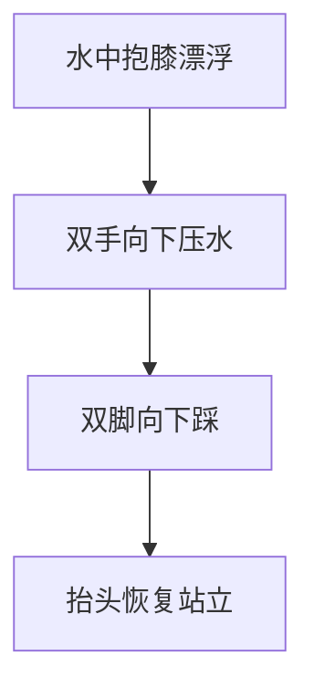
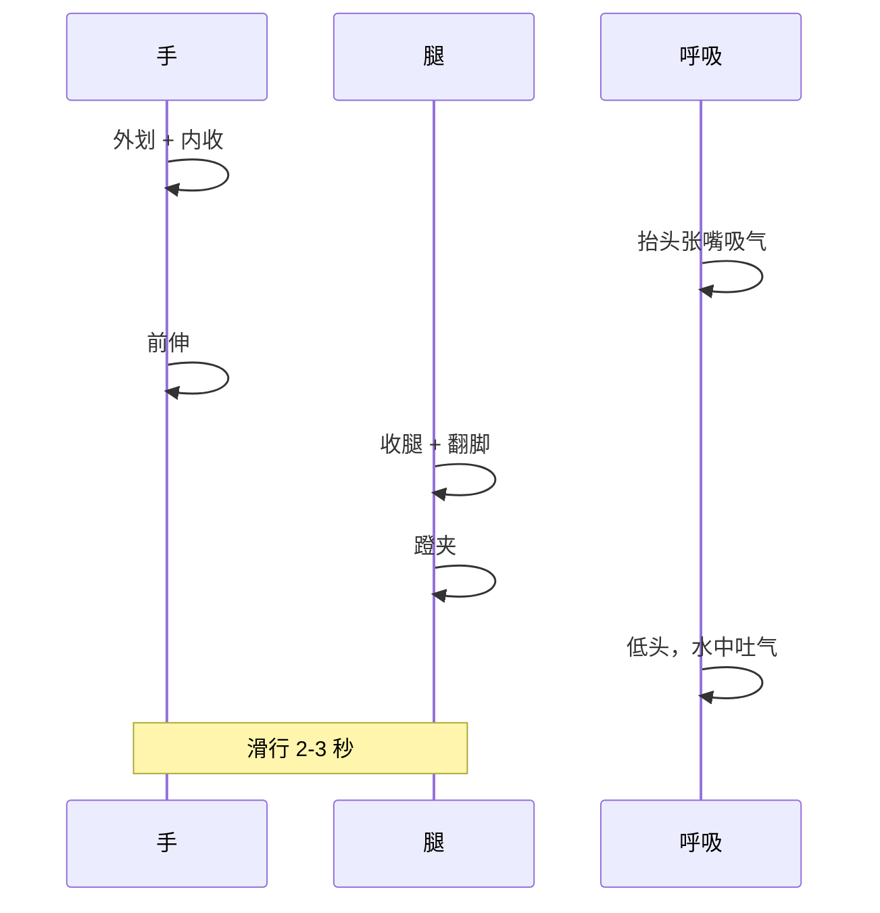
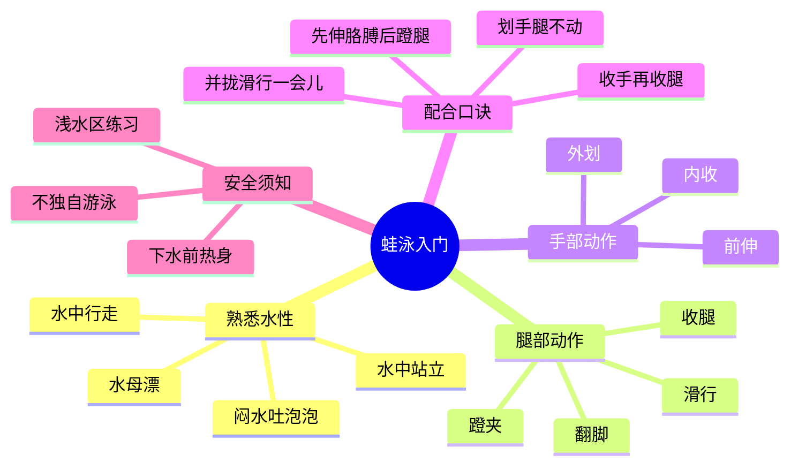

# 蛙泳入门：从零开始教你游泳

> 适用对象：从未下过水、第一次去游泳池的纯新手

---

## 一、下水前的准备

### 1.1 装备清单

| 装备 | 说明 |
|------|------|
| 泳衣/泳裤 | 贴身款，减少水中阻力 |
| 泳镜 | 防止进水刺激眼睛，新手建议选防雾款 |
| 泳帽 | 保护头发、减少阻力，部分泳池强制要求 |
| 鼻夹（可选） | 防止呛水，新手友好 |
| 耳塞（可选） | 防止耳朵进水 |
| 浮板（可选） | 泳池一般提供，辅助练习打腿 |

### 1.2 心理建设

- **水不可怕，紧张才是最大的敌人** —— 身体越放松，浮力越大；越挣扎，越容易下沉
- 初学阶段全程在**浅水区**（水深至胸部），随时可以站起来
- 学会「水中站立」是第一步，也是安全感的来源

---

## 二、第一课：熟悉水性（第 1-2 次）

### 2.1 水中行走

进入浅水区，弯腰让水没过腰部，在池中来回走动，感受水的阻力和浮力。

**目的：** 消除恐惧，适应水温和水压。

### 2.2 水中闭气与吐泡泡

1. 站在浅水区，深吸一口气
2. 蹲下，将脸浸入水中
3. 用鼻子缓慢吐气（水中吐泡泡）
4. 气用完后站起来，张嘴吸气

> **关键：用鼻子吐气，不要用嘴** —— 这样站起来时不会呛水

反复练习 20-30 次，直到脸部入水不再紧张。

### 2.3 水中站立（核心安全技能）

这是新手**必须掌握**的自救技能：

1. 在水中蹲下，双手抱膝
2. 身体会自然漂浮（像水母一样）
3. 想站起来时：**双手向下压水 + 双脚向下踩**
4. 同时抬头，恢复站立

> 反复练习直到成为本能反应，这样在水中任何时候都不会慌。

### 2.4 闷水漂浮（水母漂）

1. 深吸气 → 憋住
2. 脸朝下埋入水中，身体放松
3. 双手自然前伸或抱膝
4. 感受身体自然浮起

**要点：** 人体密度略小于水，吸满气后是可以自然漂浮的。

---

## 三、第二课：蛙泳腿部动作（第 3-5 次）

蛙泳的动力 **70% 来自腿部**，所以先练腿。

### 3.1 动作分解（四拍法）

蛙泳腿分为四个节拍：

| 节拍 | 动作 | 要点 |
|------|------|------|
| ① 收腿 | 脚跟向臀部靠拢，膝盖自然分开 | 膝盖不要过度前收，小腿藏在大腿后面 |
| ② 翻脚 | 脚尖外翻，脚掌朝向蹬水方向 | 像「外八字」，用脚内侧对准后方 |
| ③ 蹬夹 | 向两侧蹬出后迅速夹拢 | 蹬和夹是连贯动作，蹬出后快速夹腿 |
| ④ 滑行 | 双腿并拢伸直，身体呈流线型 | 这是最快的时候，享受滑行！ |

### 3.2 练习步骤

**第一步：池边坐姿练腿**

坐在池边，双腿伸入水中，按四拍节奏练习收、翻、蹬夹。

**第二步：扶板蹬腿**

1. 双手握住浮板前端，手臂伸直
2. 脸埋入水中（戴泳镜）
3. 做蛙泳腿动作：收 → 翻 → 蹬夹 → 滑行
4. 每次蹬腿后滑行 2-3 秒

> **常见错误：**
> - 蹬腿时膝盖分太开（像青蛙）→ 其实膝盖宽度不超过肩宽
> - 没有翻脚动作 → 蹬水效率极低
> - 蹬完不滑行 → 浪费推进力

---

## 四、第三课：蛙泳手部动作与呼吸配合（第 6-8 次）

### 4.1 手部动作

蛙泳手部动作相对简单，主要作用是**辅助抬头换气**：

| 节拍 | 动作 | 要点 |
|------|------|------|
| ① 前伸 | 双手并拢前伸，掌心朝下 | 身体呈流线型 |
| ② 外划 | 双手向两侧分开，略宽于肩 | 掌心向外下方 |
| ③ 内收 | 双手向胸前下方合拢 | **这是抬头换水的时机** |
| ④ 前伸 | 双手快速前伸还原 | 低头，准备下一次配合 |

> **手部动作不要太大！** 划水范围不要超过肩膀太多，否则会产生阻力。

### 4.2 完整配合（口诀）

蛙泳配合有一个经典口诀：

> **划手腿不动，收手再收腿，先伸胳膊后蹬腿，并拢滑行一会儿**

用时间线表示：

### 4.3 练习步骤

1. **站立水中练配合**：在浅水区弯腰，脸入水，练习手腿配合动作（不游，原地做）
2. **蹬腿 + 滑行**：先只练腿，每蹬一次滑行 3 秒
3. **加入手部**：在蹬腿滑行的基础上，加入划手抬头换气
4. **连续游**：尝试连续做 3-5 个完整动作

---

## 五、常见问题与解决方案

| 问题 | 原因 | 解决方案 |
|------|------|----------|
| 腿一直下沉 | 没有抬头/身体太竖 | 身体前倾，头部埋入水中，保持水平 |
| 游不动 / 没有推进力 | 没有翻脚或蹬夹不连贯 | 重点练习翻脚，感受脚内侧推水 |
| 频繁呛水 | 抬头时吸气太急 | 先吐完气再抬头吸气，不要急 |
| 身体下沉 | 憋气而非吐气 | 脸入水后持续用鼻子吐气 |
| 膝盖疼 | 收腿时膝盖过度前收 | 收腿幅度减小，小腿藏在大腿后方 |

---

## 六、学习节奏建议

| 次数 | 目标 | 预计时长 |
|------|------|----------|
| 第 1-2 次 | 熟悉水性，学会水中站立和闷水 | 45-60 分钟 |
| 第 3-5 次 | 扶板蛙泳腿，动作基本正确 | 每次 45-60 分钟 |
| 第 6-8 次 | 手腿配合，能连续游 10-15 米 | 每次 45-60 分钟 |
| 第 9-12 次 | 动作协调，能连续游 25-50 米 | 每次 60 分钟 |

> **关键原则：不要急，每次只解决一个问题。** 水性好的同学 4-5 次就能游起来，慢一些 10-12 次也完全正常。

---

## 七、安全须知

1. **永远不要独自游泳**，新手必须有会游泳的人陪同
2. 下水前做 5-10 分钟热身，防止抽筋
3. 感到寒冷、疲劳时立即上岸
4. 不要在深水区练习，直到你能连续游 50 米以上
5. 抽筋时的处理：深吸一口气，脸入水漂浮，用手扳住脚趾向身体方向拉，缓解后缓慢游向池边

---

## 八、总结

蛙泳是最适合新手的泳姿 —— 节奏慢、换气方便、动作对称。记住：**放松 > 技术 > 力量**。享受在水中的感觉，你会越来越自如。
