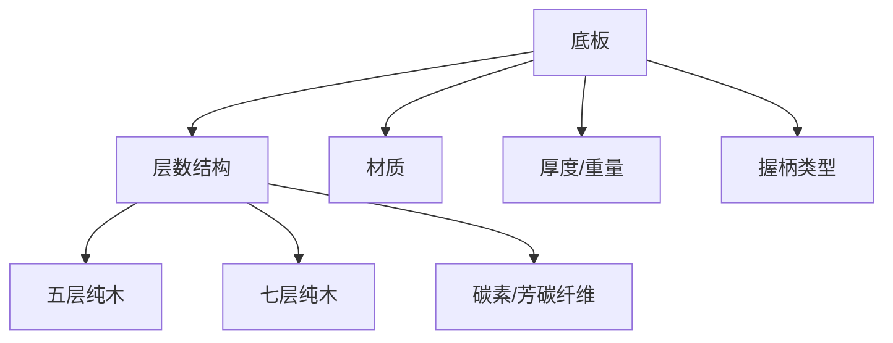
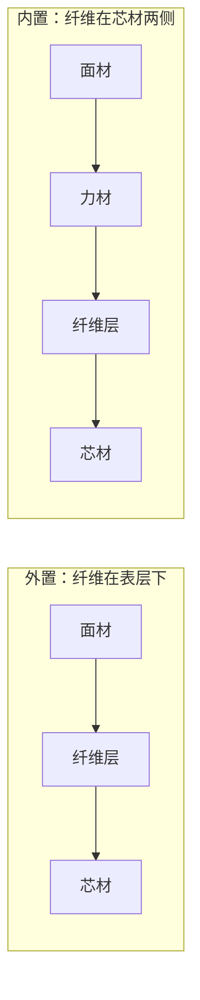
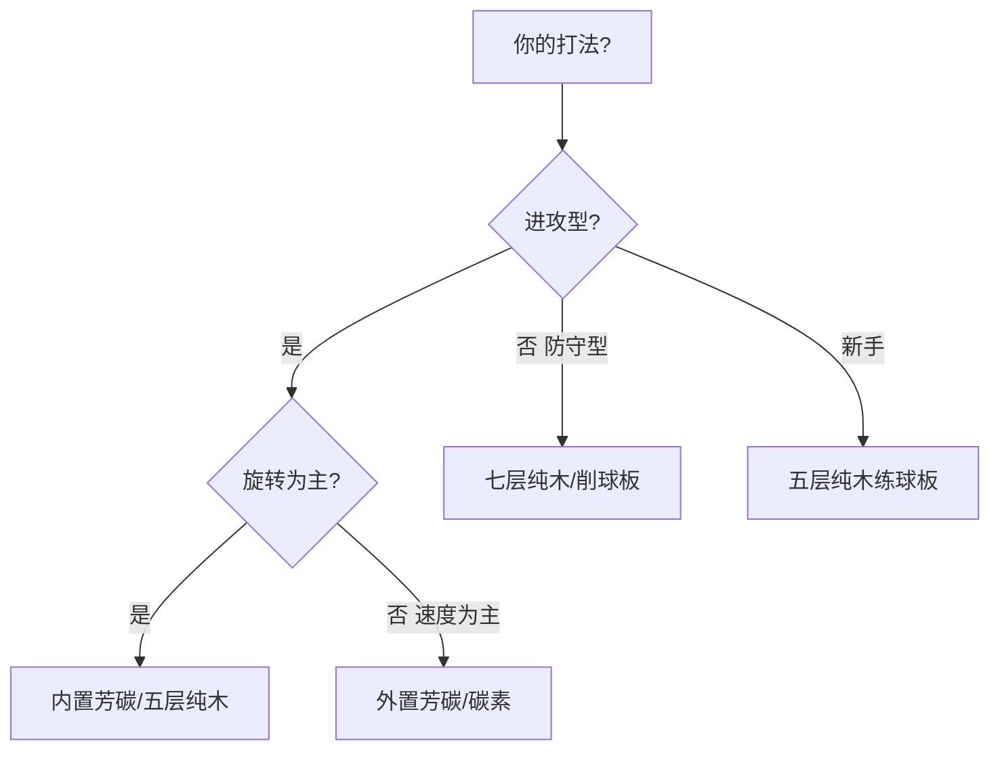
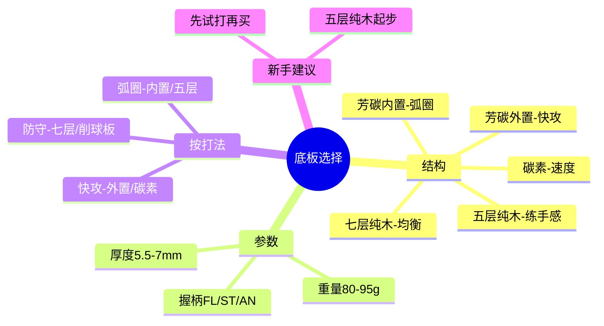

# 乒乓球底板选择指南

> 适用对象：准备入手第一块底板、或想从成品拍升级到专业板的球友

---

## 一、底板是球拍的"骨架"

胶皮决定"手感细节"，底板决定"性能基调"。一块底板由多层木材（部分含碳素等纤维）压合而成，层数、材质、结构直接决定球拍的**速度、控制、底劲**。

---

## 二、底板核心分类

### 2.1 按结构分

| 类型 | 特点 | 代表 | 适合 |
|------|------|------|------|
| **五层纯木** | 形变大、吃球深、控制好、底劲绵长 | 蝴蝶 Korbel、斯帝卡 OC | 弧圈型、新手练球 |
| **七层纯木** | 比五层硬挺、速度快、推挡扎实 | 斯帝卡 CL、红双喜劲极 | 快攻结合弧圈、直拍推挡 |
| **碳素底板** | 速度暴力、弹性大、借力好 | 蝴蝶 普碳、红双喜天弓 | 快攻、力量型 |
| **芳碳底板（外置）** | 纤维靠近表面，速度快、脱板快 | 蝴蝶 Viscaria（维斯） | 快攻结合弧圈主流 |
| **芳碳底板（内置）** | 纤维靠近芯层，吃球深、弧圈底劲好 | 蝴蝶 狂飙皓、樊振东 ALC 系列部分 | 弧圈结合快攻 |
| **纯木+碳木** | 中间层碳素，兼顾速度与手感 | 斯帝卡碳素管王 | 均衡型 |

### 2.2 外置 vs 内置（芳碳板核心概念）

| 对比 | 外置纤维 | 内置纤维 |
|------|----------|----------|
| 击球手感 | 硬挺、干脆、脱板快 | 柔和、吃球、形变大 |
| 速度 | 快 | 中快 |
| 旋转/底劲 | 中 | 强 |
| 台内控制 | 借力好、易冒高 | 手感清晰、小球细腻 |
| 代表 | Viscaria、林高远 ALC | 狂飙皓、樊振东 ALC（部分型号） |

> **一句话**：外置偏"快"，内置偏"转"。现代主流反手强攻型打法多用外置，传统弧圈多用内置。

---

## 三、底板其他参数

### 3.1 厚度与重量

| 参数 | 参考范围 | 说明 |
|------|----------|------|
| 厚度 | 5.5-7mm | 越厚通常越硬挺、速度越快，但手感越钝 |
| 重量（横拍） | 85-95g | 太重伤手腕，太轻底劲不足 |
| 重量（直拍） | 80-90g | 直拍握法灵活，稍轻为宜 |

> **选重口诀**：弧圈型选偏轻（好摆速），快攻型选偏重（借力扎实）。整体重量 = 底板 + 两面胶皮，胶皮也会占 40-60g。

### 3.2 握柄类型

| 握柄 | 全称 | 特点 | 适合 |
|------|------|------|------|
| FL | Flared 收腰柄 | 尾部略宽，防滑防脱手 | 横拍主流，多数人首选 |
| ST | Straight 直柄 | 上下等宽，便于正反手转换 | 手小的球友、两面弧圈 |
| AN | Anatomic 葫芦柄 | 中间收腰，贴合手型 | 少数人的偏好 |
| 直拍柄 | 中式/日式 | 中式短粗、日式细长 | 直拍打法 |

---

## 四、按打法选底板

| 打法 | 推荐结构 | 理由 |
|------|----------|------|
| 弧圈结合快攻 | 内置芳碳、五层纯木 | 吃球深，容易制造旋转和弧线 |
| 快攻结合弧圈 | 外置芳碳、七层纯木 | 速度快、借力好 |
| 纯快攻 | 碳素底板 | 追求极速 |
| 削球打法 | 专用削球板 | 大板面、持球稳定 |
| 新手入门 | 五层纯木 | 控制好、练手感、容错高 |

---

## 五、经典底板推荐（按价位）

### 5.1 入门（200-400 元）

| 型号 | 结构 | 特点 |
|------|------|------|
| 银河 MC-2 | 五层纯木 | 高性价比练球板，手感扎实 |
| 红双喜 劲极7 | 七层纯木 | 速度不错，直拍推挡够用 |
| 斯帝卡 OC | 五层纯木 | 经典弧圈板，吃球好（稍偏软） |

### 5.2 进阶（400-800 元）

| 型号 | 结构 | 特点 |
|------|------|------|
| 蝴蝶 Korbel（科贝尔） | 五层纯木 | "穷人版维斯"，均衡全面 |
| 斯帝卡 CL | 七层纯木 | 快攻+弧圈经典，直拍神器 |
| 蝴蝶 普碳 | 碳素 | 暴力速度流 |

### 5.3 高端（800 元以上）

| 型号 | 结构 | 特点 |
|------|------|------|
| 蝴蝶 Viscaria（维斯） | 外置芳碳 | 反手强攻标杆，无数职业选手使用 |
| 蝴蝶 樊振东 ALC | 外置芳碳 | 维斯升级版，速度更快 |
| 蝴蝶 林高远 ALC | 外置芳碳 | 手感细腻，均衡 |
| 蝴蝶 狂飙皓 | 内置芳碳 | 弧圈利器，底劲十足 |
| 斯帝卡 碳素管王 | 碳木 | 均衡全面 |

> **注意**：高端板性能并不"自动变强"，更多是提供更大的天花板，**对发力要求也更高**。新手买维斯很可能打不出它的性能，反而觉得难控。

---

## 六、选购避坑指南

1. **别迷信高端**：性能天花板 ≠ 适合你，新手从五层纯木起步最划算
2. **重量要试**：别只看参数，握在手里挥几下，感觉太重就换
3. **握柄别选错**：FL 是横拍默认，不确定就选 FL
4. **底板是耐用品**：胶皮半年一换，底板可以用好几年，预算可以适当倾斜
5. **买前试打**：球馆借别人的板子打两局，比看一百篇测评都管用

---

## 七、小结

**一句话总结**：底板选"结构"，胶皮选"手感"——先定打法，再定结构，最后试打验证。选好底板后，下一篇教你怎么把底板和胶皮搭配成一套完整的球拍。
