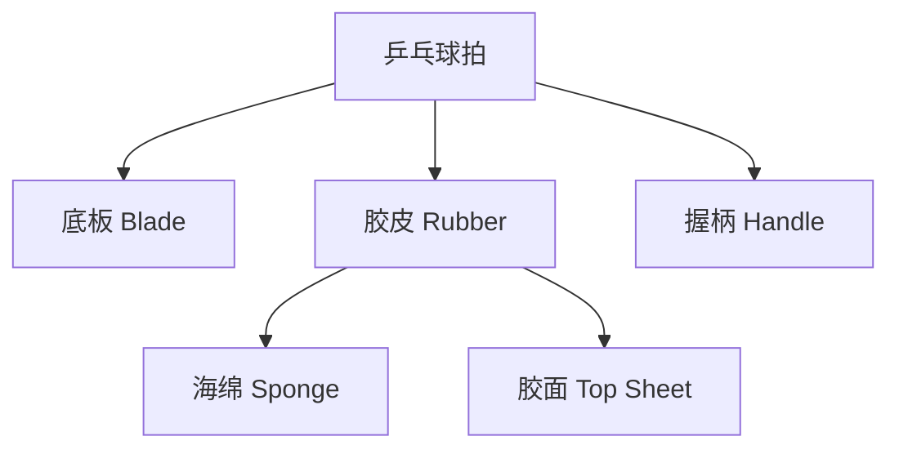
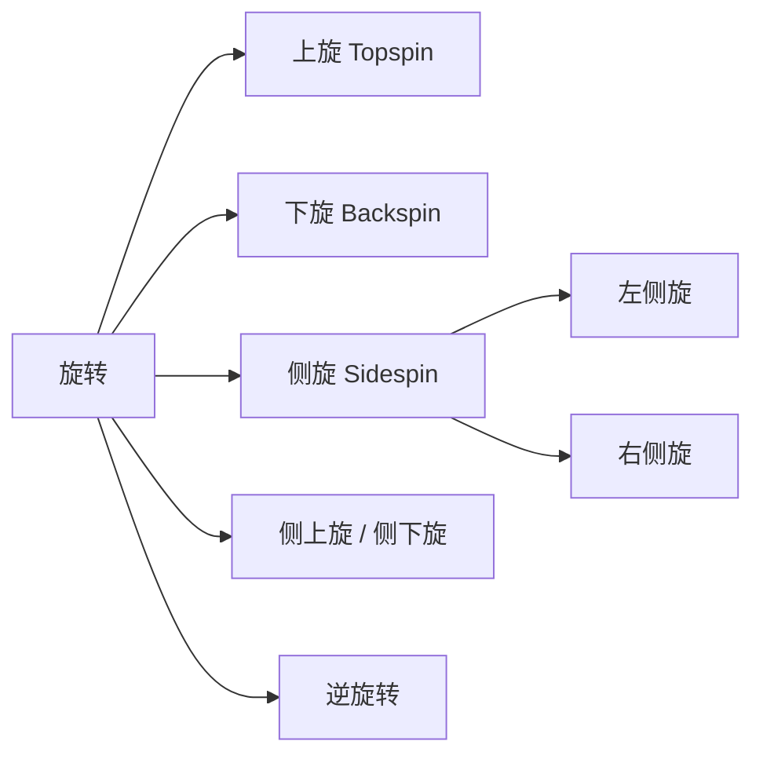
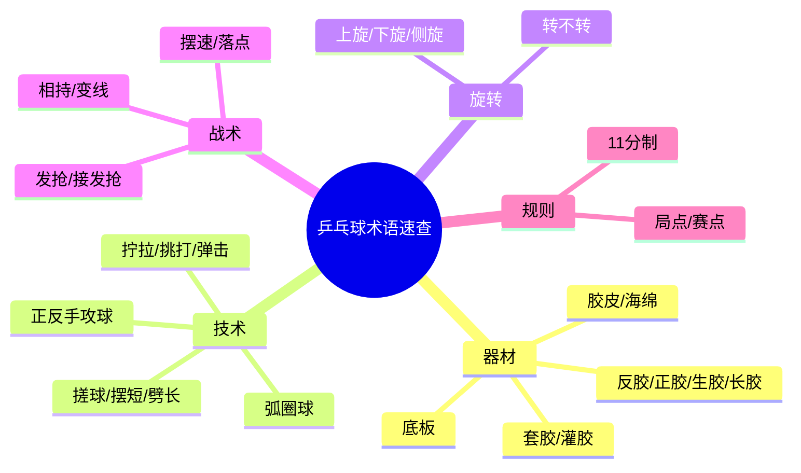

# 乒乓球专业术语入门

> 适用对象：刚接触乒乓球、看比赛/逛论坛经常被术语劝退的新手

---

## 一、器材类术语

### 1.1 球拍构成

| 术语 | 英文 | 说明 |
|------|------|------|
| 底板 | Blade | 球拍的木质主体，决定球拍的整体性能基调 |
| 胶皮 | Rubber | 覆盖在底板两面的橡胶层，直接接触球 |
| 海绵 | Sponge | 胶皮下方的发泡层，影响出球速度和吃球深度 |
| 胶面 | Top Sheet | 海绵上方与球接触的表面，决定摩擦和粘性 |
| 握柄 | Handle | 分直拍（中式直拍/日式直拍）和横拍（FL/ST/AN） |
| 套胶 | Rubber/Sheet | 胶面+海绵一体的成品，市面上大多数胶皮都是套胶 |
| 颗粒胶 | Pimple Rubber | 胶面为颗粒状，分正胶、生胶、长胶 |

### 1.2 胶皮四大类型

**按胶面形态**（光滑还是颗粒）分为四大类：

| 类型 | 特点 | 常见代表 |
|------|------|----------|
| **反胶**（平胶） | 表面光滑，摩擦强，能制造旋转 | 狂飙3、蝴蝶 T05、D09C |
| **正胶** | 颗粒短粗，弹性好，速度快的快攻胶 | 802、TSP Spectol |
| **生胶** | 颗粒较软，回球下沉飘忽，削球/倒板选手用 | 563、TSP P1-R |
| **长胶** | 颗粒细长，回球旋转怪异，防守型选手用 | C7、755、云雾 |

> 新手 99% 用**反胶**，另外三类属于特殊打法，先了解即可。

#### 涩胶属于哪一类？

**涩胶不是第五类，而是"反胶"内部的子分类。** 反胶（平胶）按表面**粘涩性**还能再分三种：

| 反胶子类 | 胶面手感 | 代表 |
|----------|----------|------|
| **粘性反胶** | 表面粘，能"裹住"球，旋转强 | 狂飙3、729 |
| **涩性反胶（涩胶）** | 表面略涩，出球快、借力好 | 蝴蝶 T05、T64 |
| **粘涩结合（微粘）** | 介于两者之间，速度旋转兼顾 | 蝴蝶 D09C |

也就是说：**涩胶 = 涩性反胶**，只是反胶（平胶）大类下按粘涩程度细分出来的一种。四大类（反/正/生/长）看的是**形态**，粘/涩/微粘看的是**手感**——两个维度，别混在一起。详细对比见《胶皮选择指南》。

### 1.3 其他器材

| 术语 | 说明 |
|------|------|
| 底板厚度 | 常见 5.5-7mm，越厚通常越硬挺 |
| 底板重量 | 横拍常见 85-95g，直拍 80-90g |
| 套胶硬度 | 用邵氏硬度标定，度数越高越硬（详见胶皮篇） |
| 灌胶 / 灌油 | 用胶水或膨胀油让海绵膨胀，提升弹性和吃球（狂飙常见玩法） |
| 无机胶水 | 不膨胀海绵的胶水，比赛规则允许，粘贴用 |
| 保护膜 | 贴在胶面上的塑料膜，防尘防氧化 |
| 胶皮清洗剂 | 泡沫或液体清洁剂，用于清除胶面污渍 |

---

## 二、技术类术语

### 2.1 基本动作

| 术语 | 说明 |
|------|------|
| 正手攻球 | 用持拍手同侧的手部击球，最基础的正手技术 |
| 反手攻球 | 用持拍手对侧的手部击球（横拍）或推挡（直拍） |
| 推挡 | 直拍反手的基本技术，借力推挡对方来球 |
| 搓球 | 在台内用下旋摩擦回球，用于控制节奏（分慢搓、快搓） |
| 削球 | 防守型打法，大动作切削来球制造强烈下旋 |
| 挑打 | 台内球用挑的动作主动进攻，回球快 |
| 拧拉 | 反手台内起下旋的进攻技术，近年非常流行（张继科带火） |
| 摆短 | 台内轻碰使球不出台，控制对手无法上手 |
| 劈长 | 台内用力搓长球到对方底线，逼退对手 |
| 弹击 | 反手快速弹打，速度快、旋转弱 |

### 2.2 发力与弧线

| 术语 | 说明 |
|------|------|
| 弧圈球 | 强烈上旋的进攻技术，是现代乒乓球的主流进攻手段 |
| 前冲弧圈 | 上旋强、弧线低平、前冲力大的弧圈，用于得分 |
| 加转弧圈（高吊） | 旋转极强、弧线高，用于过渡和逼失误 |
| 拉球 | 用摩擦为主的方式击球，制造上旋 |
| 击打 / 撞击 | 以撞击为主击球，速度快但旋转弱 |
| 摩擦 | 胶皮与球之间产生相对滑动从而制造旋转的动作 |
| 打磨结合 | 先撞后磨，现代弧圈的主流发力方式 |
| 重心转换 | 借助身体重心移动增强击球力量 |
| 鞭打效应 | 前臂手腕像鞭子一样甩动，获得高挥拍速度 |

---

## 三、旋转类术语

### 3.1 旋转种类

| 术语 | 英文 | 说明 |
|------|------|------|
| 上旋 | Topspin | 球向前上方旋转，过网后下坠快、前冲强 |
| 下旋 | Backspin | 球向后下方旋转，落台后反弹低、减速 |
| 侧旋 | Sidespin | 球向侧面旋转，落台后左右拐弯 |
| 侧上旋 | Sidespin Topspin | 侧旋+上旋复合，既有侧拐又有前冲 |
| 侧下旋 | Sidespin Backspin | 侧旋+下旋复合，既有侧拐又下沉 |
| 逆旋转 | Reverse Spin | 发球时手腕向内/向外翻，产生与常规相反的旋转 |
| 转不转 | Spin / No-spin | 用相同动作发出旋转和不转球，迷惑对手 |
| 吃转 | — | 判断错旋转导致回球失误 |

### 3.2 接旋转的思路

- **接下旋**：拍面立起一些，向前上方摩擦（搓、拉）
- **接上旋**：拍面压低，向前下方压住（推、快带、反拉）
- **接侧旋**：向球拐弯的反方向调整拍面（球往右拐，就向左调）

> 口诀：**上旋压、下旋托、侧旋对着拐弯打。**

---

## 四、战术与计分术语

| 术语 | 说明 |
|------|------|
| 发球抢攻 | 发球后抢先上手进攻的战术体系 |
| 接发球抢攻 | 直接上手接发球，不给对方第三板机会 |
| 相持 | 双方进入多回合对拉/对攻阶段 |
| 变线 | 主动改变回球线路，调动对手跑动 |
| 落点 | 球落台的位置，落点变化是战术核心 |
| 摆速 | 正反手衔接的速度，现代乒乓球的核心能力 |
| 拧拉衔接 | 拧拉起板后连续进攻 |
| 抢拉半出台 | 对半出台球强行起板 |
| 擦边球 / 擦网球 | 碰台边/网边得分，属运气成分 |
| 一局制 | 11 分制，10 平后需领先 2 分 |
| 赛点 / 局点 | 再得一分即获胜/胜局 |
| 轮换发球法 | 长时间僵持后每人发一球的特殊规则（不常用） |

---

## 五、打法风格术语

| 打法 | 说明 | 代表选手 |
|------|------|----------|
| 快攻型 | 以速度取胜，近台快攻 | 刘国梁 |
| 弧圈结合快攻 | 弧圈为主、快攻为辅 | 马龙、樊振东 |
| 快攻结合弧圈 | 快攻为主、弧圈为辅 | 孔令辉 |
| 削球型 | 中远台削球防守，伺机反攻 | 丁松、朱世赫 |
| 直拍横打 | 直拍用反手反面拉球/弹击 | 王皓、许昕（部分） |
| 两面弧圈 | 正反手都以弧圈为主 | 樊振东、林昀儒 |
| 近台快攻 | 站位近台，借力打力 | 伊藤美诚（正胶） |

---

## 六、新手必知术语速查表

## 七、小结

术语是进入乒乓球世界的第一道门，**先记住器材四件套（底板、胶皮、海绵、胶面）和旋转三大类（上旋、下旋、侧旋）**，再看比赛、逛论坛就不会懵了。后面的文章会带你逐步了解胶皮和球拍的选择，把术语用起来。
