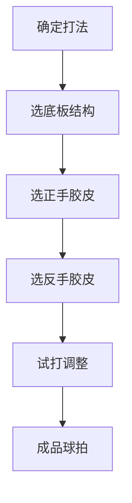
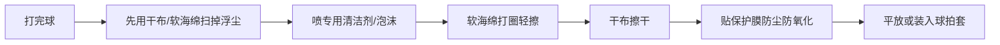
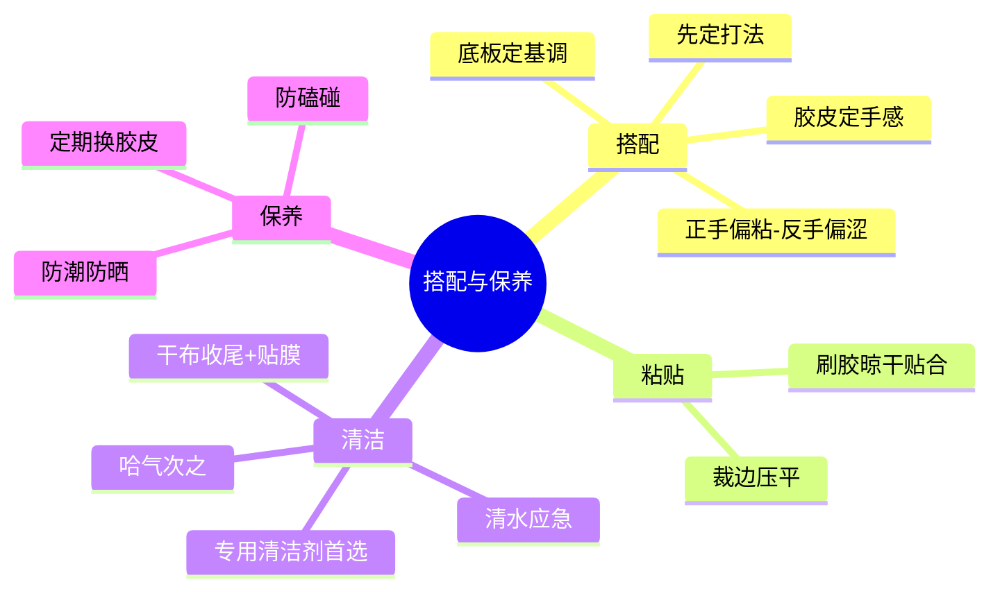

# 乒乓球拍搭配与保养指南

> 适用对象：凑齐了底板和胶皮、想知道怎么配、怎么维护的球友

---

## 一、完整配置方案：先定打法，再配装备

选胶皮和底板时提到过：**底板定基调，胶皮定手感**。配置一套球拍的完整思路：

### 1.1 按打法给三套经典配置

| 打法 | 底板 | 正手 | 反手 | 总预算参考 |
|------|------|------|------|------------|
| 新手入门 | 五层纯木（银河 MC-2） | 729 普及套（软粘） | 729 普及套（软） | 300-500 元 |
| 弧圈结合快攻 | 内置芳碳（狂飙皓） | 狂飙3 39度 或 D09C | T05 或 D09C | 1500-2500 元 |
| 快攻结合弧圈 | 外置芳碳（Viscaria） | D09C 或 T05 | T64 或 T05 | 1800-2800 元 |
| 反手强攻流 | 外置芳碳（樊振东 ALC） | 狂飙8-80 | D09C | 2000-3000 元 |

> 预算紧张时，**优先保证底板**（耐用），胶皮可以先用国产平价套过渡，之后再升级。

### 1.2 正反手搭配原则

- **正手**：偏粘涩结合或粘性，强调旋转和主动发力（狂飙、D09C）
- **反手**：偏涩性或微粘，强调借力、弹击、稳定起下旋（T05、T64、D09C）
- **新手**：两面都选软/中硬，别追求"暴力配置"

---

## 二、胶皮怎么贴

### 2.1 粘贴流程

1. **刷胶**：在底板和胶皮海绵上均匀刷无机胶水（或有机胶水，注意规则允许范围）
2. **晾干**：等胶水干透（约 5-10 分钟），不粘手为准
3. **贴合**：从一边慢慢贴上，用滚棒从中心向外擀，排出气泡
4. **裁边**：用美工刀沿底板边缘裁掉多余胶皮
5. **压平**：贴上保护膜，用书本压半小时以上，让胶层牢固

> **注意**：需要灌胶/灌油的胶皮（传统狂飙），先灌好再粘贴；粘贴时避免胶水渗到胶面。

### 2.2 "刷胶"和"灌胶"是两回事（新手最容易混）

贴胶皮时"要刷胶"和狂飙3"要灌胶"听起来很像，其实是**两个不同的操作**：

| | 粘贴刷胶 | 灌胶（狂飙预处理） |
|--|-----------|---------------------|
| **目的** | 把胶皮粘到板子上 | 让海绵膨胀变弹 |
| **刷在哪** | 底板面 + 胶皮海绵 | 只刷海绵（撕下来状态） |
| **刷几遍** | 各刷 1-2 遍 | 2-3 遍（有机胶水）或 1 遍（膨胀油） |
| **效果** | 粘合固定 | 海绵膨胀、卷曲、变弹 |
| **等待** | 晾干即可贴 | 等膨胀到位（灌油需 8-24 小时） |

**判断标准**：刷完胶水后，如果海绵**明显卷曲变厚**，那是在灌胶；如果只是表面湿润用来粘合，那是正常粘贴。

**同一瓶有机胶水，两种用法**：

- **粘贴**：薄刷晾干贴合——所有胶皮都要做
- **灌胶**：多刷等膨胀——只有传统狂飙这类"死海绵"套胶需要，灌完还要再刷一层胶用于粘贴

> **规则提醒**：正规比赛禁用有机胶水（挥发性有害），比赛党用狂飙必须走"灌油 + 无机胶水"路线；免灌胶套胶（729-5 Pro、D09C 等）完全不需要灌，贴完就能打。

### 2.3 什么时候需要换胶皮

| 信号 | 说明 |
|------|------|
| 胶面发亮打滑 | 表面氧化，摩擦下降，旋转减弱 |
| 边缘开胶、起泡 | 海绵老化或受潮 |
| 弹性明显下降 | 海绵性能衰减（一般 3-6 个月） |
| 打完球胶面一层白霜 | 污渍累积，清洗无效就该换了 |

---

## 三、清洁保养：胶皮是"娇贵"的

### 3.1 清洁方式对比（新手最容易纠结的问题）

| 方式 | 效果 | 风险 | 结论 |
|------|------|------|------|
| **清水 + 毛巾/海绵** | 只能带走浮尘，油性汗渍擦不干净 | 自来水含矿物质，干后留白斑；水量大易渗入开胶 | ❌ 应急可以，不推荐常规用 |
| **哈气 + 干布** | 水汽纯净、量小，软化干结汗渍 | 口腔飞沫带细菌/唾液，且去油能力为零 | ⚠️ 应急还行，优于清水，但仍不专业 |
| **专用清洁剂 + 软海绵** | 去油彻底、不伤胶面 | 几乎无 | ✅ 首选 |
| **纯净水/蒸馏水 + 干布** | 无矿物质残留，接近哈气但更卫生 | 水量需控制 | ✅ 有条件可代替清洁剂 |

### 3.2 正确保养流程

**具体步骤：**

1. 打完球先**干擦**浮尘（汗渍未干时最难擦，尽快处理）
2. 用**泡沫清洁剂**喷在胶面上，软海绵**打圈**轻擦（不要用力搓）
3. 用**干布**把水分和泡沫擦净，确认胶面完全干燥
4. 贴上**保护膜**，挤出空气
5. 装入球拍套，**避免暴晒和高温**存放

### 3.3 常见保养误区

| 误区 | 后果 | 正确做法 |
|------|------|----------|
| 用湿毛巾用力搓胶面 | 刮伤胶面、加速氧化 | 软海绵轻擦 |
| 清水擦完不擦干 | 留水垢白斑、渗水开胶 | 必须干布收尾 |
| 用手/手指抹胶面 | 手上的油脂汗液反污染 | 只用海绵和布接触 |
| 暴晒/放车里高温 | 胶皮老化变硬变脆 | 阴凉干燥处存放 |
| 长期不贴保护膜 | 落灰氧化，胶面发涩 | 打完就贴膜 |

> 还记得前面讨论过的"哈气 vs 清水"吗？结论在这里汇总了：**哈气优于清水，但专用清洁剂才是正解**。日常备一瓶泡沫清洁剂 + 一块软海绵，成本不高，胶皮寿命能明显延长。

---

## 四、底板保养

底板比胶皮皮实，但也要注意：

1. **避免磕碰**：底板边缘磕伤会影响手感，平时用板套保护
2. **防潮防汗**：打完球擦干手柄和板面，别让汗液长期浸泡
3. **不暴晒**：木材受潮/暴晒都会变形
4. **定期检查**：边缘开胶、握柄松动及时处理

---

## 五、常见问题 FAQ

**Q1：清水擦胶皮真的不行吗？**
应急可以，但自来水有矿物质，干后留白斑；且水量不好控制，长期渗水有开胶风险。有条件就用专用清洁剂或纯净水。

**Q2：哈气擦拭靠谱吗？**
比清水好——哈气是纯净水、量又小，不会留水垢。但清洁力弱、还可能带口腔细菌，只能算应急方案，替代不了清洁剂。

**Q3：D09C 需要灌胶吗？**
不需要。D09C 这类现代套胶（包括 T05、T64）都是免灌胶设计，拿来就能打。

**Q4：狂飙3 必须灌胶吗？**
传统狂飙3 不灌胶性能打折（发闷、不出球），可以灌油替代（效果接近灌胶、持续时间更长）。不想折腾就选狂飙8-80、D09C 这类免灌型号。

**Q5：新板子需要"开板"吗？**
没有严格的"开板"流程，但新胶皮贴好后多打几次，让胶层压实、手感稳定是正常的。

**Q6：胶皮多久换一次？**
业余球友一般 3-6 个月，看使用频率和保养情况。出现"胶面打滑、弹性明显下降"就该换了。

---

## 六、小结

**一句话总结**：配置上"底板耐用、胶皮消耗"，预算往底板倾斜；保养上"打完就擦、擦完就干、干了贴膜"，好装备用得久，手感才稳定。
