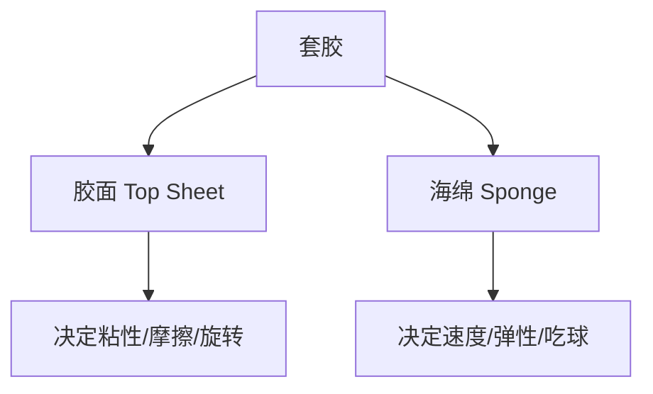
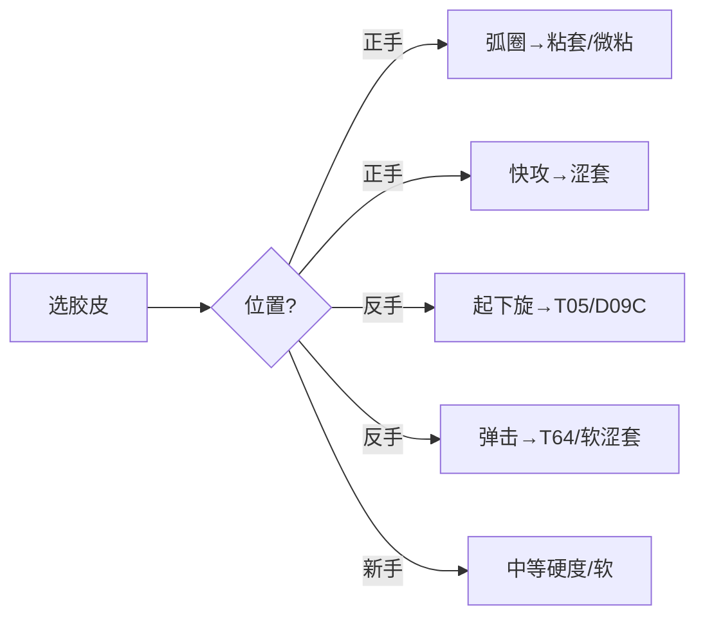

# 乒乓球胶皮选择指南

> 适用对象：准备换胶皮、或对"狂飙、T05、D09C"等型号一头雾水的球友

---

## 一、胶皮是什么？先搞清结构

胶皮（更准确地说是"套胶"）由两部分组成：

- **胶面**：与球直接接触，决定摩擦力和旋转上限
- **海绵**：在胶面之下，决定出球速度和吃球深度

> 买胶皮时标注的"硬度""速度""旋转"数值，都是针对这套组合的整体评价。

---

## 二、胶皮三大流派：粘性、涩性、粘涩结合

这是选胶皮最核心的分歧点，先看对比：

| 维度 | 粘性胶皮（国产主流） | 涩性胶皮（日系主流） | 粘涩结合（微粘） |
|------|----------------------|----------------------|------------------|
| 代表 | 狂飙3、729 | 蝴蝶 T05、T64、D05 | 蝴蝶 D09C、骄猛 踏雪 |
| 胶面手感 | 粘，能"裹住"球 | 涩，表面略滑 | 微粘，介于两者之间 |
| 制造旋转 | 极强（尤其薄摩擦） | 靠吃球和速度带旋转 | 较强 |
| 出球速度 | 相对慢（需灌胶提速） | 快 | 快 |
| 台内小球 | 控制细腻，摆短劈长出色 | 借力好，但小动作易冒高 | 兼顾 |
| 发力门槛 | 高，小力量打不透 | 低，借力就出质量 | 中高，依赖主动发力 |
| 是否需要灌胶/油 | 传统狂飙需要 | 不需要 | 不需要 |
| 重量 | 较重 | 较轻 | 中等 |

### 2.1 粘性胶皮（以狂飙系列为代表）

- **优点**：旋转天花板，薄摩擦都能拉出强烈旋转；台内控制手感一绝；国产性价比高
- **缺点**：传统型号需要灌胶/灌油才发挥性能；出球速度偏慢；对发力要求高
- **适合**：正手弧圈为主、喜欢"裹球感"的选手；从小打狂飙的球友

### 2.2 涩性胶皮（以蝴蝶 T 系为代表）

- **优点**：速度快、弹性好，借力防守轻松；免灌胶即打即用
- **缺点**：薄摩擦制造旋转能力弱于粘套，台内小球需要手法细腻
- **适合**：反手弹击/快撕型打法；正手喜欢暴力前冲的选手

### 2.3 粘涩结合（以 D09C 为代表）

- **优点**：要涩套的速度，又要粘套的旋转和台内控制，正反手通吃
- **缺点**：价格高；小力量下略显"闷"，依赖主动发力才出质量
- **适合**：追求"全面均衡"的进阶选手；反手想稳定起下旋的人

> 一句话：**粘套抓旋转、涩套抓速度、微粘抓平衡**。没有绝对好坏，只有适不适合你的打法。

### 2.4 粘 vs 涩：本质区别（两种摩擦来源）

粘和涩**手感上相反，但本质上不是"有粘"和"没粘"的对立**——它们是两种并行的制造摩擦的手段：

| | 粘性胶皮 | 涩性胶皮 |
|--|---------|---------|
| 手感 | 表面**黏**，能"黏住"胶面 | 表面不黏，但摸起来粗糙（涩） |
| 摩擦来源 | 靠胶面**黏性物质**黏住球（黏附力） | 靠胶面**微观纹理**咬住球（机械摩擦） |
| 薄摩擦能力 | 强（轻轻一蹭就有旋转） | 弱（需要吃住球才出旋转） |
| 厚摩擦能力 | 极强（上限更高） | 强 |

> **粘 = 靠"黏住"产生摩擦；涩 = 靠"粗糙"产生摩擦。** 目的都是制造旋转，只是手段相反。"涩"不是"没摩擦"，而是"不用粘性、改用粗糙纹理来摩擦"——这也是为什么涩胶表面干涩，拉球依然很转。

**关于"粘胶是否需要吃球"的精确理解：**

- 粘胶把"出旋转的门槛"降低了：**薄摩擦（轻蹭）就能出旋转**，台内球、起下旋是它的主场
- 但**高强度旋转（狂摩擦）粘胶也离不开吃球**：薄摩擦接触时间太短，只能出"中等旋转"；要出又转又冲的前冲弧圈，必须让球压入海绵增大接触面积和时间（马龙拉球同样深吃球）
- 区别在于：**涩胶不吃球等于零，粘胶不吃球至少还有保底（中等的转）**

### 2.5 什么是"吃住球"？

**吃住球 = 接触后短暂滞留 + 蓄能 + 甩出**，感觉上是"咬住再放"，不是"慢速碰球"。

**常见误解**：以为"吃球 = 接触前速度低"。恰恰相反——**接触前挥拍速度要够快，吃球发生在接触后的极短瞬间**（几毫秒）：球撞上胶面后没有被立刻弹走，而是压入海绵、被胶面包裹，短暂"滞留"一下再被甩出。

| 状态 | 手感 |
|------|------|
| **吃住球了** | 击球瞬间感到球在拍面上"停了一下"，有被胶皮"包住、咬住"的实感，然后"啪"地甩出去——声音"闷实" |
| **没吃住** | 球一碰就"叮"地弹飞，手感薄、脆、虚，没有停留感——声音发"空" |

**吃球深浅取决于撞击速度和角度**：挥拍越快、撞得越实，球压入海绵越深，吃球越明显。判断标准：拉球后能感到"球被咬住再吐出去"就是吃住了；只觉得球从拍上"滑走/弹走"就没吃住（压得太浅，或拍型太开只蹭不撞）。

---

## 三、胶皮硬度的选择

硬度通常用邵氏硬度标定，数字越大越硬：

| 硬度区间 | 特点 | 适用 |
|----------|------|------|
| 软（35-38度） | 吃球深、易透板、控制好，但速度慢 | 反手、新手、力量小的选手 |
| 中（39-41度） | 平衡型，兼顾速度与控制 | 绝大多数业余球友首选 |
| 硬（42度+） | 速度快、支撑强，但难打透 | 正手、发力好的选手 |

> **新手提示**：先从中等硬度入手。上来就用 42 度以上的"正手标配套"，很可能打不透，反而觉得球拍"没弹性"。

---

## 四、常见胶皮型号横评

### 4.1 国产篇

| 型号 | 类型 | 硬度 | 定位 | 适合 |
|------|------|------|------|------|
| 狂飙3（普狂） | 粘性 | 39/40/41 | 正手经典，旋转强 | 正手弧圈、灌胶玩家 |
| 狂飙8 / 狂飙8-80 | 粘性偏弹 | 38/39 | 免灌胶的"现代狂飙" | 不想灌胶的正手 |
| 狂飙9 | 粘涩结合 | 中 | 新一代均衡国产 | 正反手过渡 |
| 729 普及套 | 粘性 | 软 | 入门神胶，几十元 | 新手第一块 |
| 729-5 Pro | 粘性 | 中 | 中端粘套，免灌胶、旋转强 | 正手、不想灌狂飙的进阶替代 |
| CJ8000 | 粘性 | 软-中（多档） | 入门粘套，便宜耐用容错高 | 反手、新手练球、学生党 |
| 银河 北斗 | 粘性 | 中 | 性价比国产 | 预算有限的球友 |

### 4.2 日系篇（蝴蝶为主）

| 型号 | 类型 | 硬度 | 定位 | 适合 |
|------|------|------|------|------|
| T05 | 涩性 | 中硬 | 反手标杆，旋转速度均衡 | 反手弧圈/快撕 |
| T64 | 涩性 | 中 | 速度型，出球轻快 | 反手弹击、快攻 |
| D05 | 涩性偏硬 | 硬 | 暴力进攻，球速极快 | 正手暴力弧圈 |
| **D09C** | 粘涩结合 | 硬（约40度体感） | 微粘+高弹，全面均衡 | 正反手通用、进阶选手 |
| 樊振东 ALC 配胶（官方推荐） | — | — | 与底板配套的推荐方案 | 参考组合 |

### 4.3 D09C 详细解读

前面提到过，这里展开讲：

**优点**
- 起下旋能力强，接近粘套；台内摆短劈长手感清晰
- 借力防守稳定，顶大板、反带心里有数
- 比狂飙轻，免灌胶，拿来就能打
- 林昀儒、波尔等反手在用，被称为"反手天板"

**缺点**
- 价格昂贵（旗舰价位）
- 依赖主动发力：小力量、借力时手感"闷"，不如 T05 好打
- 不是纯粘套的裹球感，也不是纯涩套的脆弹感，需要适应期

**适合谁**
- 正手：喜欢狂飙手感但嫌灌胶麻烦、想提速的弧圈选手
- 反手：想要"稳定起下旋 + 借力防守"的人（最常见用法）
- 不适合：纯快攻、不爱主动制造旋转的人

> **建议**：D09C 价格高、手感特殊，换之前先借朋友的板子试打两天再决定。

---

## 五、按位置选择

### 5.1 正手怎么选

- **弧圈为主** → 粘性或粘涩结合（狂飙3、D09C）
- **快攻为主** → 涩性或偏弹（T64、狂飙8-80）
- **新手** → 中等硬度粘性（729 普及套、狂飙8 38度）

### 5.2 反手怎么选

- **稳定起下旋 + 防守** → D09C、T05（公认反手好手）
- **弹击、快撕、借力** → T64、轻量化涩套
- **新手** → 软硬度涩套，容易打透

---

## 六、预算与购买建议

| 预算 | 推荐方案 |
|------|----------|
| 100 元以内 | 729 普及套、银河北斗（先打起来再说） |
| 100-200 元 | 狂飙8、狂飙3 普狂 |
| 200-400 元 | T05、T64 水货/二手，或国产高端（狂飙9） |
| 400 元以上 | D09C、D05、T05 全新行货 |

> **省预算技巧**：正手可以配国产粘套（性能差距小、价格差几倍），把预算留给反手涩套或更好的底板。

---

## 七、小结

选胶皮记住三条主线：

1. **流派**：粘性（旋转）/ 涩性（速度）/ 粘涩结合（平衡）
2. **硬度**：新手用中等或偏软，别一上来就硬
3. **位置**：正手偏粘涩结合或粘性，反手偏涩性或微粘

> 胶皮是消耗品（一般 3-6 个月性能衰减明显），先选对方向，再慢慢找自己的"本命胶皮"。下一篇文章讲底板怎么选，搭配起来看效果更好。
