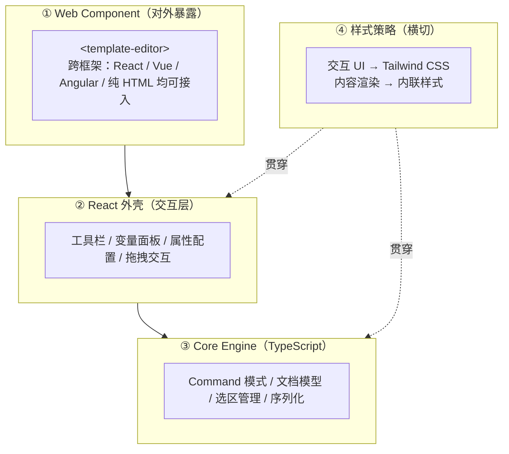
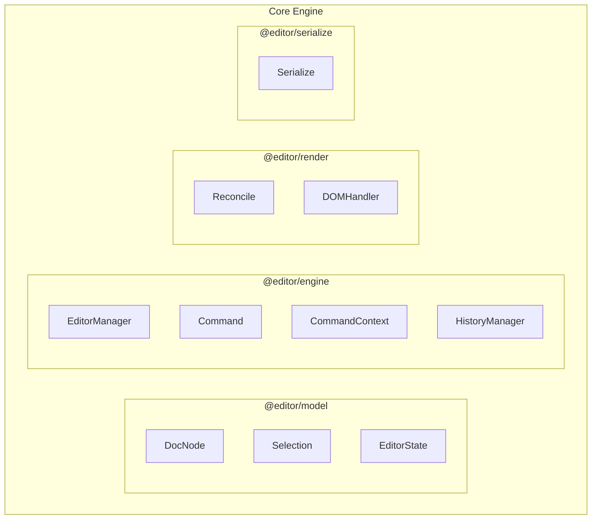

# 01 · 总览与架构

> 目标：读完这篇，你能说清这个编辑器是什么、由哪几层组成、Core Engine 怎么分包，以及几个关键技术选型的理由。
> 后续几篇逐个模块深入。

## 一、它是什么

一个**可视化模板编辑工具**，让运营 / 产品人员无需写代码即可编辑 Email 和 PDF 模板。

**核心能力**：

| 能力 | 说明 |
|------|------|
| 双模式 | Email 模式 / PDF 模式，渲染规则不同 |
| 模板语法 | 基于 FreeMarker，支持条件、循环、表达式 |
| 变量系统 | 导入变量 → 拖拽到编辑区 → 高亮展示友好 label |
| 填充预览 | 填入变量值后实时预览最终渲染效果 |

一句话：用户在富文本里操作，编辑器底层维护一棵结构化的文档树，最终导出成 FreeMarker 模板字符串交给生产渲染。

## 二、整体架构

从上到下分四层，**上层依赖下层，Core Engine 不依赖任何 UI**：



| 层 | 职责 | 关键点 |
|----|------|--------|
| Web Component | 对外暴露，屏蔽框架差异 | 宿主只认标准自定义元素，不关心内部是 React 还是别的 |
| React 外壳 | 承载所有交互 UI | 工具栏、变量面板、属性配置、拖拽，是"用户看得见"的部分 |
| Core Engine | 编辑器内核（纯 TS） | Command / 文档模型 / 选区 / 序列化，**不碰 UI**，可单测 |
| 样式策略 | 区分"交互 UI"和"内容渲染"两套样式体系 | 内联样式保证 WYSIWYG（见第五节） |

**为什么要这样分层**：宿主技术栈不可控（React 项目、Vue 项目、纯 HTML 页面都可能），所以把"跨框架"这件事收敛到最外层一个 Web Component，内部实现用什么框架与宿主无关；Core Engine 又和 React 无关，保证内核可测试、可替换。

## 三、Core Engine 模块划分

按职责和依赖关系，Core Engine 拆成 4 个包：

```
packages/
├── @editor/model        # 纯数据层，无 DOM 依赖
├── @editor/engine       # 核心引擎，Command + Manager
├── @editor/render       # 渲染层，DOM 操作
└── @editor/serialize    # 序列化层，DocNode → FreeMarker 模板
```



**模块职责**：

| 模块 | 包 | 职责 |
|------|-----|------|
| DocNode | `model` | 文档树，Single Source of Truth |
| Selection | `model` | 选区管理（模型坐标 nodeId + offset） |
| EditorState | `model` | 顶层状态容器，区分持久化配置和运行时状态 |
| EditorManager | `engine` | 状态中枢，持有 DocNode、选区、历史栈 |
| Command | `engine` | 封装所有编辑操作（输入、拖拽、样式修改） |
| CommandContext | `engine` | Command 与 Manager 的通信通道，解耦两者 |
| HistoryManager | `engine` | DocNode JSON 快照，支持 Undo/Redo |
| Reconcile | `render` | 统一渲染引擎，首次加载和后续 patch 共用 |
| DOMHandler | `render` | 按节点类型导出 create/bindEvents/destroy 纯函数 |
| Serialize | `serialize` | DocNode 树 → FreeMarker 模板字符串（保存/预览） |

依赖方向单一：`model` ← `engine` ← `render` / `serialize`。`model` 是纯数据、无 DOM 依赖，所以可单测、可序列化、可在 Node 环境跑。

各包的细节分别在后续篇展开：[文档模型](./02-document-model.md)、[Command 引擎](./03-command-engine.md)、[渲染引擎](./04-render-engine.md)、[序列化](./06-serialization.md)。

## 四、技术选型

| 选型 | 选择 | 理由 |
|------|------|------|
| 语言 | TypeScript | 文档模型、Command、Handler 契约都需要类型约束 |
| UI 框架 | React | 只用于交互外壳，内核与框架无关 |
| 构建 | Vite | 开发体验 + Web Component 打包 |
| 对外形态 | Web Component | 框架无关，见下 |
| 内容样式 | 内联样式 | 保证预览 = 真实渲染，见第五节 |

### 为什么用 Web Component 暴露？

编辑器需要被不同技术栈的项目接入（React 项目、Vue 项目、甚至纯 HTML 页面），Web Component 是框架无关的标准：

```html
<!-- 任何框架中都能这样用 -->
<template-editor
  mode="email"
  variables='[{"name":"user_name","label":"用户名"}]'
></template-editor>
```

宿主只需要挂一个自定义元素、传属性、监听事件，不关心内部实现。完整的接入协议见 [08 · Web Component 接入](./08-embedding.md)。

## 五、样式策略

编辑器中样式分两套体系，这是一个关键设计决策：

| 场景 | 方案 | 原因 |
|------|------|------|
| 编辑器交互 UI（工具栏、面板、按钮） | Tailwind CSS | 快速开发，不影响输出内容 |
| 模板内容渲染（文字、布局、间距） | 内联样式 | Email 客户端不支持 class，PDF 渲染需要确定性样式 |

**核心原则**：编辑区看到什么样，最终渲染就是什么样（WYSIWYG）。内联样式保证编辑态和输出态一致，不会因为运行环境缺少 CSS 文件而样式丢失。

> 这是"内容样式"必须内联、而"交互样式"可以用 Tailwind 的根因：内容会被导出到编辑器之外（邮件客户端、PDF 渲染器），那里没有你的 CSS 文件；而交互 UI 只活在编辑器内部。

## 六、双模式差异

同一套架构支撑 Email / PDF 两种输出，差异收敛在设置（settings）和序列化环节：

| 维度 | Email 模式 | PDF 模式 |
|------|-----------|---------|
| 布局 | 表格布局为主（兼容邮件客户端） | 自由布局 / Flex |
| 样式 | 内联 + 受限 CSS 子集 | 完整 CSS 支持 |
| 尺寸 | 固定宽度（600px 常见） | A4 / 自定义尺寸 |
| 输出 | HTML 字符串 | PDF 文件（服务端渲染） |

模式由宿主通过 Web Component 属性传入，编辑器内部只读取和使用（详见 [02 · 文档模型与选区](./02-document-model.md) 的 EditorState 一节）。

---

**下一篇**：[02 · 文档模型与选区](./02-document-model.md) —— 编辑器到底在维护什么数据结构。
