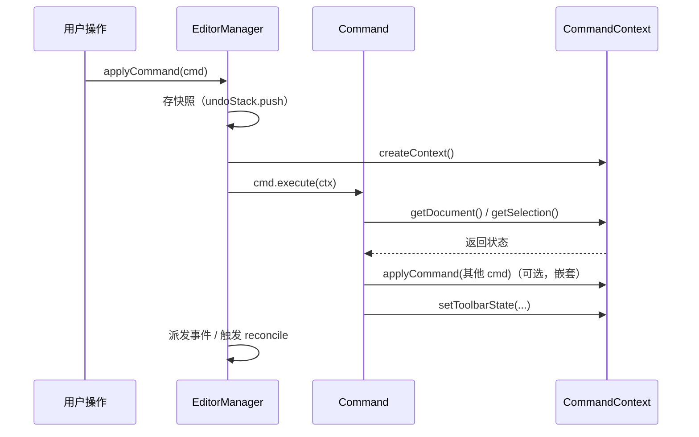

# 03 · Command 引擎

> 目标：读完这篇，你能说清"所有编辑操作是怎么被统一收口的"，以及 CommandContext 这个中间层到底解决了什么问题。

## 一、Command 模式

所有编辑操作封装为 Command 对象：

```typescript
interface Command {
  execute(ctx: CommandContext): void;
}
```

每个用户操作（输入文字、拖入变量、修改样式）= 一个 Command，统一走引擎调度。

**为什么没有 undo/redo 接口？** 因为 Undo/Redo 由快照机制承担（见 [07 · Undo/Redo](./07-history.md)），不需要 Command 自己实现逆操作。Manager 执行 Command 前存快照，undo 时直接恢复快照，跟 Command 本身无关。Command 只关心"怎么做"，不关心"怎么撤"。

> 这个取舍很关键：如果要求每个 Command 实现 `undo()`，那么"拖入变量 = 插入节点 + 绑定数据 + 应用样式"这类复合操作，逆操作要逐步写反，很容易出 bug；而快照天然覆盖复合操作。

## 二、CommandContext 通信机制

Command 不直接引用 EditorManager，而是通过一个 **Context 对象**与外界通信。这是引擎解耦的关键设计：

```typescript
interface CommandContext {
  // 查询状态
  getSelection(): Selection;
  getDocument(): DocNode;
  getMode(): 'email' | 'pdf';
  getVariables(): VariableRef[];
  getSettings(): EmailSettings | PDFSettings;

  // UI 状态通知
  setToolbarState(state: {
    undoable: boolean;
    redoable: boolean;
    disabled: string[];   // 当前不可用的按钮
  }): void;

  // 操作
  applyCommand(cmd: Command): void;   // 嵌套调用其他 command
  undo(): void;
  redo(): void;
}
```

**Command 通过 Context 执行**，而不是自己去改内部状态：

```typescript
interface Command {
  execute(ctx: CommandContext): void;
}

// 示例：插入变量
class InsertVariableCommand implements Command {
  constructor(private variable: VariableRef, private position: Position) {}

  execute(ctx: CommandContext) {
    const doc = ctx.getDocument();
    const newDoc = insertNode(doc, this.position, {
      type: 'variable',
      variable: this.variable,
    });

    // 通知外界更新
    ctx.setToolbarState({ undoable: true, redoable: false, disabled: [] });
  }
}
```

### 设计意图

| 好处 | 说明 |
|------|------|
| 解耦 | Command 只依赖 Context 接口，不知道 Manager 存在，可独立单测 |
| 单一通道 | 所有 Command 与外界的交互收口在一个对象，职责清晰 |
| 可控暴露 | Manager 决定 Context 上挂什么能力，Command 拿不到不该拿的东西 |
| 状态集中 | 选区、文档、历史栈由 Manager 持有，Context 只是访问代理 |

## 三、Manager 与 Context 的关系

```
EditorManager（持有所有状态）
  │
  ├── document: DocNode
  ├── selection: Selection
  ├── history: HistoryManager
  ├── mode: 'email' | 'pdf'
  │
  └── createContext(): CommandContext  ← 每次执行 Command 时创建
        │
        ▼
      Command.execute(ctx)  ← Command 通过 ctx 读写状态
```

Manager 是状态的 Owner，Context 是 Command 视角的"窗口"。这样 Command 无法绕过 Manager 直接修改内部状态，**所有变更都经过 Manager 的调度**（快照、事件派发、脏标记等）。

用 Mermaid 看一层的调用关系：



```typescript
createContext(): CommandContext {
  return {
    getMode: () => this.state.mode,
    getVariables: () => this.state.variables,
    getSettings: () => this.state.settings,
    getDocument: () => this.state.content,
    // ...
  };
}
```

## 四、与其他层的关系

Command 只负责"改模型"，它**不碰 DOM**。模型改完之后，DOM 怎么同步由渲染层接手（见 [04 · 渲染引擎](./04-render-engine.md)）：

```
Command（改模型）→ Reconcile / DOMHandler（同步 DOM）
```

典型分工：

| Command | 做什么（改模型） |
|---------|----------------|
| `InsertVariableCommand` | 在指定位置插入 variable 节点 |
| `InsertConditionCommand` | 插入 condition 节点 + true/false 两个分支 block |
| `InsertLoopCommand` | 插入 loop 节点 + 内部 block |
| `BoldCommand` / `ItalicCommand` | 给选区内 text 节点加 mark |
| `AlignCommand` | 改选中 block 的 `attrs.textAlign` |
| `UpdateTextCommand` | 把 DOM 里新输入的文本同步回 text 节点 |
| `DeleteVariableCommand` / `MoveNodeCommand` | 删除变量节点 / 移动块节点 |

具体每个工具的 Command + DOMHandler 实现见 [05 · 工具设计](./05-tools.md)。

---

**上一篇**：[02 · 文档模型与选区](./02-document-model.md) ｜ **下一篇**：[04 · 渲染引擎](./04-render-engine.md)
