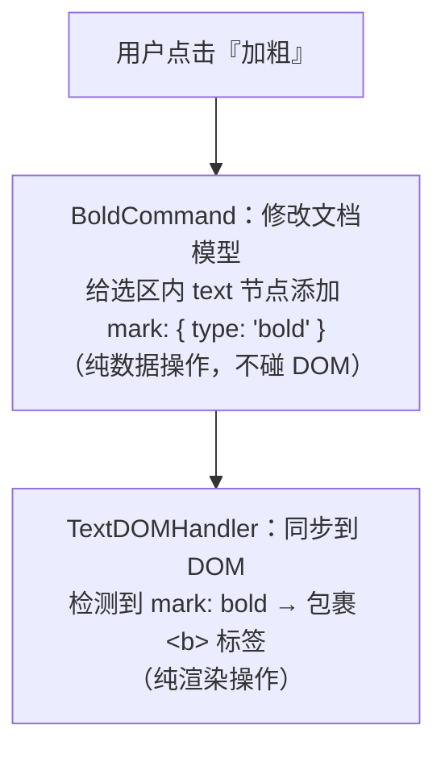
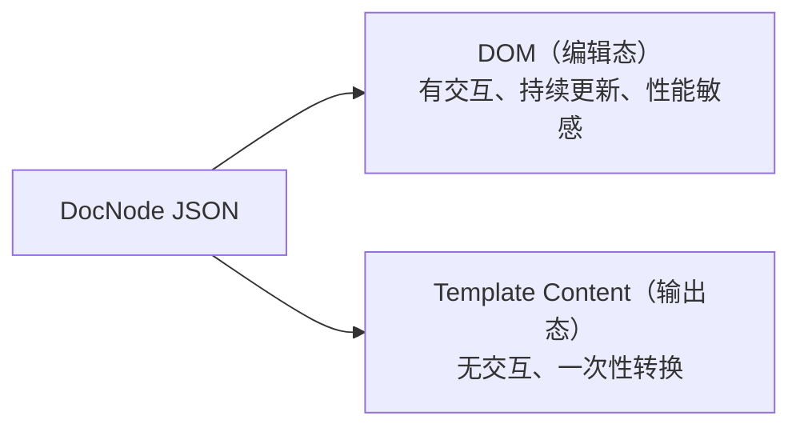

# 04 · 渲染引擎

> 目标：读完这篇，你能说清"模型改了之后 DOM 怎么变"——DOMHandler 契约、统一 Reconcile、事件驱动的靶向更新，以及为什么要这样设计。

## 一、职责边界：Command 管模型，DOMHandler 管 DOM

Command 只操作文档模型（DocNode 树），**所有跟 DOM 相关的逻辑由 DOMHandler 承担**。每个节点类型有一个对应的 Handler 模块，导出 create/bindEvents/destroy 等纯函数。

以"加粗"为例，看一眼职责怎么切开：



**Command 示例**（操作模型）：

```typescript
class BoldCommand implements Command {
  execute(ctx: CommandContext) {
    const { anchor, focus } = ctx.getSelection();
    const doc = ctx.getDocument();
    applyMark(doc, anchor, focus, { type: 'bold' });
  }
}

class AlignCommand implements Command {
  constructor(private align: 'left' | 'center' | 'right') {}

  execute(ctx: CommandContext) {
    const block = getSelectedBlock(ctx);
    block.attrs.textAlign = this.align;
  }
}
```

## 二、DOMHandler 契约

接口参考 ProseMirror NodeView 设计：每个 Handler 是一个模块，导出**纯函数**，而不是类。

```typescript
interface DOMHandler {
  create(node: DocNode): HTMLElement;          // 必须：根据 DocNode 创建 DOM 元素
  bindEvents(el: HTMLElement, ctx: CommandContext): void;  // 必须：绑定交互事件
  destroy(el: HTMLElement): void;              // 必须：节点移除时清理
  update?(el: HTMLElement, node: DocNode): void;  // 可选：原地 patch，不实现则自动重建
}
```

`update` 是**可选**的：简单组件不导出，reconcile 自动 destroy + create 重建；复杂组件导出了就原地 patch，避免子节点不必要的重建。

用不用 `update`，本质是"重建成本 vs 定点更新成本"的权衡：

| 组件类型 | 是否实现 update | 原因 |
|---------|----------------|------|
| text / block | 否 | 结构简单，重建代价小，少写代码 |
| variable | 否 | chip 元素轻量 |
| condition / loop | 是 | 内部有分支结构，重建会丢失折叠状态、造成子节点闪动 |

### 简单组件示例（不导出 update，重建即可）

```typescript
// handlers/text.ts
export function create(node: DocNode): HTMLElement {
  const el = document.createElement('span');
  el.textContent = node.content;
  if (node.marks?.some(m => m.type === 'bold')) return wrapWith(el, 'b');
  if (node.marks?.some(m => m.type === 'italic')) return wrapWith(el, 'i');
  return el;
}
export function bindEvents() {}
export function destroy() {}
// 不导出 update → reconcile 发现属性变了直接重建

// handlers/variable.ts
export function create(node: DocNode): HTMLElement {
  const chip = document.createElement('span');
  chip.className = 'variable-chip';
  chip.textContent = node.variable.label;
  chip.dataset.variableName = node.variable.name;
  return chip;
}
export function bindEvents(el: HTMLElement, ctx: CommandContext) {
  el.addEventListener('click', () => showConfig(el, ctx));
  el.addEventListener('contextmenu', (e) => {
    e.preventDefault();
    ctx.applyCommand(new DeleteVariableCommand(el.dataset.variableName));
  });
}
export function destroy() {}

// handlers/block.ts
export function create(node: DocNode): HTMLElement {
  const el = document.createElement('div');
  el.style.textAlign = node.attrs.textAlign || 'left';
  return el;
}
export function bindEvents() {}
export function destroy() {}
```

### 复杂组件示例（导出 update，原地 patch）

```typescript
// handlers/condition.ts
export function create(node: DocNode): HTMLElement {
  const el = document.createElement('div');
  el.className = 'condition-block';
  el.innerHTML = `
    <div data-branch="true"></div>
    <div data-branch="false"></div>
  `;
  return el;
}

export function update(el: HTMLElement, node: DocNode) {
  // 原地切换显隐，不重建子节点
  const result = evaluateExpression(node.expression, ctx.getVariables());
  el.querySelector('[data-branch="true"]').style.display = result ? '' : 'none';
  el.querySelector('[data-branch="false"]').style.display = result ? 'none' : '';
}

export function bindEvents() {}
export function destroy() {}
```

## 三、统一 Reconcile

首次渲染和后续 patch 走**同一个 reconcile 函数**，不关心容器是空还是已有内容：

```typescript
import * as text from './handlers/text';
import * as variable from './handlers/variable';
import * as block from './handlers/block';
import * as condition from './handlers/condition';
import * as loop from './handlers/loop';

const handlerMap: Record<NodeType, DOMHandler> = {
  text, variable, block, condition, loop,
};

function reconcile(parentEl: HTMLElement, newNodes: DocNode[], ctx: CommandContext) {
  const oldChildren = Array.from(parentEl.children)
    .filter(c => c.dataset.nodeId);

  for (let i = 0; i < Math.max(oldChildren.length, newNodes.length); i++) {
    const oldEl = oldChildren[i];
    const newNode = newNodes[i];

    if (!newNode) {
      // 多余的老节点 → 从叶到父依次销毁
      destroyNode(oldEl);
    } else if (!oldEl) {
      // 新节点 → 创建 + 递归子节点
      const el = createNode(newNode, ctx);
      parentEl.appendChild(el);
    } else if (oldEl.dataset.nodeId !== newNode.id) {
      // 节点被替换 → 销毁旧的（含子节点），创建新的
      destroyNode(oldEl);
      const el = createNode(newNode, ctx);
      oldEl.replaceWith(el);
    } else {
      // 同一节点 → 有 update 就原地 patch，没有就重建
      const handler = handlerMap[newNode.type];
      if (handler.update) {
        handler.update(oldEl, newNode);
        // update 只处理自身属性，子节点需要递归 reconcile
        reconcile(oldEl, newNode.children ?? [], ctx);
      } else {
        // 没有 update → 重建，createNode 内部已递归处理子节点
        destroyNode(oldEl);
        const el = createNode(newNode, ctx);
        oldEl.replaceWith(el);
      }
    }
  }
}

function createNode(node: DocNode, ctx: CommandContext): HTMLElement {
  const handler = handlerMap[node.type];
  const el = handler.create(node);
  el.dataset.nodeId = node.id;
  el.dataset.nodeType = node.type;
  handler.bindEvents(el, ctx);
  reconcile(el, node.children ?? [], ctx);
  return el;
}

// 从叶到父递归销毁（先清理子节点，再清理自身）
function destroyNode(el: HTMLElement) {
  for (const child of Array.from(el.children)) {
    if (child.dataset.nodeId) destroyNode(child);
  }
  handlerMap[el.dataset.nodeType].destroy(el);
  el.remove();
}
```

### 三种场景统一走 reconcile

```typescript
// 场景 1：首次加载（容器为空，oldChildren 为空数组，全走"新节点→创建"分支）
reconcile(container, [doc], ctx);

// 场景 2：Undo/Redo 后 patch（diff 出 dirtyIds，对变化的子节点调用 reconcile）
const dirtyIds = diffDocNodes(currentDoc, prevDoc);
for (const id of dirtyIds) {
  const parentEl = findParent(id);
  reconcile(parentEl, parentDocNode.children, ctx);
}

// 场景 3：正常编辑后局部更新（事件已知变化位置，对父节点调用 reconcile）
ctx.applyCommand(new InsertVariableCommand(variable, pos));
reconcile(parentEl, parentDocNode.children, ctx);
```

### 分层职责

| | Command | DOMHandler | Reconcile |
|---|---|---|---|
| 职责 | 模型怎么变 | 单个节点怎么创建/更新/销毁 | 树结构怎么同步（增删改查 + 递归） |
| 复杂度 | 按工具有差异 | 简单组件 3 行，复杂组件按需实现 update | 统一一份，所有节点类型共用 |

> **一个函数吃三种场景**是这里最省心的点：不用维护"首次挂载"和"更新"两套逻辑，容器空不空都交给 reconcile 判断。

## 四、JSON → DOM：事件驱动，靶向操作，无需 diff

正常编辑时，**事件本身就告诉你改了什么**，不需要 diff 整棵树：

| 操作 | 事件告知的信息 | 处理方式 |
|------|--------------|-------------|
| 手动输入 | 哪个文本节点、内容变了 | DOM 已自动更新（contenteditable），只需同步回 DocNode |
| 加粗/斜体 | 选区范围 | 更新模型 + 对选区内节点包裹/解包标签 |
| 对齐 | 当前 block 节点 | 更新模型 + 改 `style.textAlign` |
| 变量拖入 | 变量数据 + 插入位置 | 更新模型 + 在目标位置插入 chip 元素 |
| 块级拖拽排序 | 源节点 + 目标位置 | 更新模型 + moveBefore/moveAfter |

### DOM ↔ DocNode 怎么互相定位

事件处理器里拿到的只有 DOM 元素，如何找到对应的虚拟节点？答案是 `createNode` 时烙在元素上的 `dataset.nodeId` 双向桥：

```typescript
// 创建节点时烙上 ID（见上文 createNode）
el.dataset.nodeId = node.id;
el.dataset.nodeType = node.type;

// DOM → DocNode：事件里向上找最近带 ID 的祖先
const nodeId = e.target.closest('[data-node-id]').dataset.nodeId;
const node = doc.getNodeById(nodeId);

// DocNode → DOM：定位某节点的元素
const el = container.querySelector(`[data-node-id="${pos.nodeId}"]`);
```

- `closest` 处理深层元素：点击落在 text 节点的文本子节点上，向上找到最近带 ID 的容器
- `dataset` 读取 O(1)，`querySelector` 浏览器原生实现很快；节点量大时可维护 `Map<nodeId, HTMLElement>`（createNode 注册、destroyNode 注销），双向都变 O(1)
- **为什么不直接存 DOM 引用进 DocNode**：`@editor/model` 是纯数据层（无 DOM 依赖，可单测、可序列化），dataset 桥接既保持纯数据、又拿到 O(1) 映射

```typescript
// 示例：手动输入（contenteditable 下 DOM 已自动变化，只需同步模型）
function handleInput(e: InputEvent, ctx: CommandContext) {
  const nodeId = e.target.closest('[data-node-id]').dataset.nodeId;
  const newContent = e.target.textContent;

  // DOM 已经是最新的了，只需要把变更同步回 DocNode
  ctx.applyCommand(new UpdateTextCommand(nodeId, newContent));
}

// 示例：变量拖入
function handleDrop(e: DragEvent, ctx: CommandContext) {
  const variableRef = JSON.parse(e.dataTransfer.getData('variable'));
  const pos = getDropPosition(e);

  // 1. 更新模型
  ctx.applyCommand(new InsertVariableCommand(variableRef, pos));

  // 2. 靶向插入 DOM
  const newNode = ctx.getDocument().getNodeById(newNodeId);
  const chip = variable.create(newNode);
  const refEl = getInsertionReference(pos);
  refEl.parentNode.insertBefore(chip, refEl);
  variable.bindEvents(chip, ctx);
}
```

### 为什么不需要 diff

diff 解决的是"不知道什么变了"的问题。但编辑器的每次变更都是用户操作触发的，**操作类型 + 目标节点 + 变更内容全都知道**，直接操作 DOM 即可。唯一需要 diff 的场景是 Undo/Redo（那里是"从快照恢复到某个状态"，不知道该改哪里），见 [07 · Undo/Redo](./07-history.md)。

### 选区保持

DOM 更新前后保存和恢复选区（模型坐标 `nodeId + offset`），只要节点 ID 稳定就能定位回去：

```typescript
function updateWithSelection(updateFn: () => void) {
  const saved = saveSelection();
  updateFn();
  restoreSelection(saved);
}
```

## 五、性能优化

DocNode JSON 有两条转换路径，性能关注点完全不同：



- **JSON → Template Content**：无交互、无增量更新，就是遍历树拼字符串，性能不是瓶颈。唯一优化是防抖（细节见 [06 · 序列化](./06-serialization.md)）
- **JSON → DOM**：性能核心，靠首次加载离屏构建 + 编辑期事件驱动靶向更新

首次加载用 DocumentFragment 离屏构建，一次挂载、一次 reflow：

```typescript
// 首次加载：容器为空，reconcile 全走"新节点→创建"分支
const fragment = document.createDocumentFragment();
reconcile(fragment, [doc], ctx);
container.appendChild(fragment);
```

### 优化策略汇总

| 阶段 | 策略 | 说明 |
|------|------|------|
| 首次加载 | reconcile + DocumentFragment | 离屏构建，一次 reflow |
| 正常编辑 | 事件驱动 + reconcile | 对变化节点的父节点调用 reconcile |
| Undo/Redo | 快照 diff + reconcile | diff 出 dirtyIds，对父节点调用 reconcile |
| 序列化 | 防抖 300ms | 避免频繁序列化 FreeMarker |
| 快照 | 节流 500ms | 连续输入合并为一次快照 |
| 长文档 | 虚拟化 | PDF 模式只渲染可视区域节点 |

---

**上一篇**：[03 · Command 引擎](./03-command-engine.md) ｜ **下一篇**：[05 · 工具设计](./05-tools.md)
