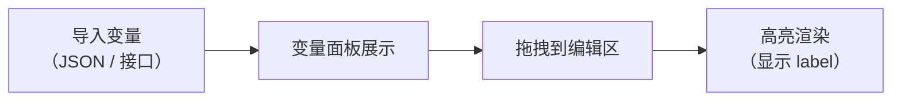
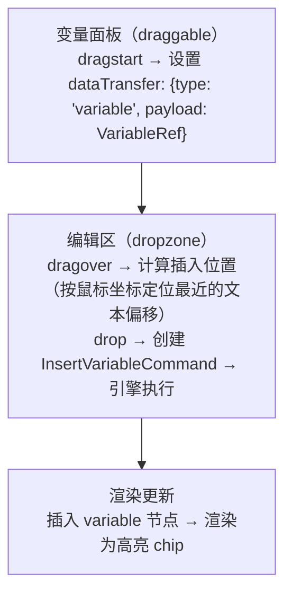

# 05 · 工具设计

> 目标：读完这篇，你能说清每个工具是怎么拼出来的（Command + DOMHandler + UI 三件套），以及变量系统和拖拽是怎么串起来的。

## 一、工具的组成

编辑器提供多种工具，每个工具由三部分组成，正好对应前几篇讲的三层：

| 部分 | 职责 | 对应篇目 |
|------|------|---------|
| **Command** | 改模型 | [03 · Command 引擎](./03-command-engine.md) |
| **DOMHandler** | 渲染 / 更新 DOM | [04 · 渲染引擎](./04-render-engine.md) |
| **UI 交互** | 触发入口（工具栏 / 拖拽 / 快捷键） | 本篇 |

所以"新增一个工具"= 加一个 Command + 一个 Handler + 一个触发入口，不用动引擎（面试高频题，见 [09 · 设计决策与面试复盘](./09-decisions.md)）。

---

## 二、变量插入工具

**触发方式**：从变量面板拖拽 / 点击变量后插入到光标位置。

**Command**：

```typescript
class InsertVariableCommand implements Command {
  constructor(private variable: VariableRef, private position: Position) {}

  execute(ctx: CommandContext) {
    const doc = ctx.getDocument();
    // 在指定位置插入 variable 节点
    insertNode(doc, this.position, {
      type: 'variable',
      variable: this.variable,
    });
  }
}
```

**DOMHandler**（`handlers/variable.ts`）：

```typescript
export function create(node: DocNode): HTMLElement {
  const chip = document.createElement('span');
  chip.className = 'variable-chip';
  chip.textContent = node.variable.label;  // 显示友好名
  chip.dataset.variableName = node.variable.name;
  return chip;
}

export function bindEvents(el: HTMLElement, ctx: CommandContext) {
  el.addEventListener('click', () => showVariableConfig(el, ctx));
  el.addEventListener('contextmenu', (e) => {
    e.preventDefault();
    ctx.applyCommand(new DeleteVariableCommand(el.dataset.variableName));
  });
}
export function destroy() {}
```

**样式**：

```css
.variable-chip {
  background: #e0f2fe;
  border: 1px solid #0284c7;
  border-radius: 4px;
  padding: 2px 6px;
  cursor: pointer;
  user-select: none;  /* 不可部分选中 */
}
```

> `user-select: none` 配合选区模型里"进入变量节点自动整节点选中"的处理（见 [02 · 文档模型与选区](./02-document-model.md)），保证变量永远是原子单位，不会被部分选中或部分删除。

---

## 三、条件块工具

**触发方式**：工具栏点击"插入条件"按钮。

**Command**：

```typescript
class InsertConditionCommand implements Command {
  constructor(private expression: string, private position: Position) {}

  execute(ctx: CommandContext) {
    const doc = ctx.getDocument();
    insertNode(doc, this.position, {
      type: 'condition',
      expression: this.expression,
      children: [
        { type: 'block', branch: 'true', children: [] },
        { type: 'block', branch: 'false', children: [] },
      ],
    });
  }
}
```

**DOMHandler**（`handlers/condition.ts`）：

```typescript
export function create(node: DocNode): HTMLElement {
  const container = document.createElement('div');
  container.className = 'condition-block';
  container.dataset.collapsed = 'false';

  // 标题栏（点击折叠/展开）
  const header = document.createElement('div');
  header.className = 'condition-header';
  header.innerHTML = `
    <span class="toggle-icon">▼</span>
    <span class="expression">条件：${node.expression}</span>
  `;
  header.addEventListener('click', () => toggleCollapse(container));
  container.appendChild(header);

  // 分支内容区（由 reconcile 递归渲染 children）
  const branches = document.createElement('div');
  branches.className = 'condition-branches';
  container.appendChild(branches);

  return container;
}

export function update(el: HTMLElement, node: DocNode) {
  el.querySelector('.expression').textContent = `条件：${node.expression}`;
}

export function bindEvents() {}
export function destroy() {}

function toggleCollapse(container: HTMLElement) {
  const collapsed = container.dataset.collapsed === 'true';
  container.dataset.collapsed = String(!collapsed);
  container.querySelector('.toggle-icon').textContent = collapsed ? '▼' : '▶';
  const branches = container.querySelector('.condition-branches');
  branches.style.display = collapsed ? '' : 'none';
}
```

**样式**：

```css
.condition-block {
  border: 1px solid #d1d5db;
  border-radius: 6px;
  margin: 8px 0;
  background: #f9fafb;
}

.condition-header {
  padding: 6px 10px;
  background: #e5e7eb;
  cursor: pointer;
  user-select: none;
  display: flex;
  align-items: center;
  gap: 6px;
}

.condition-header:hover {
  background: #d1d5db;
}

.condition-branches {
  padding: 10px;
}

.condition-block[data-collapsed="true"] .condition-branches {
  display: none;
}
```

**嵌套支持**：reconcile 递归渲染 children，condition 内部可以有 loop，loop 内部可以有 condition，每个容器独立管理折叠状态。

---

## 四、循环块工具

**触发方式**：工具栏点击"插入循环"按钮。

**Command**：

```typescript
class InsertLoopCommand implements Command {
  constructor(private expression: string, private position: Position) {}

  execute(ctx: CommandContext) {
    const doc = ctx.getDocument();
    insertNode(doc, this.position, {
      type: 'loop',
      expression: this.expression,  // 如 "items as item"
      children: [{ type: 'block', children: [] }],
    });
  }
}
```

**DOMHandler**（`handlers/loop.ts`）：与 ConditionDOMHandler 结构类似，标题显示"循环：${expression}"，内部递归渲染 children。

---

## 五、文本样式工具

**触发方式**：工具栏按钮 / 快捷键（Ctrl+B / Ctrl+I）。

**Command**：

```typescript
class BoldCommand implements Command {
  execute(ctx: CommandContext) {
    const { anchor, focus } = ctx.getSelection();
    const doc = ctx.getDocument();
    applyMark(doc, anchor, focus, { type: 'bold' });
  }
}

class ItalicCommand implements Command {
  execute(ctx: CommandContext) {
    const { anchor, focus } = ctx.getSelection();
    const doc = ctx.getDocument();
    applyMark(doc, anchor, focus, { type: 'italic' });
  }
}
```

**DOMHandler**（`handlers/text.ts`）：

```typescript
export function create(node: DocNode): HTMLElement {
  const el = document.createElement('span');
  el.textContent = node.content;
  if (node.marks?.some(m => m.type === 'bold')) return wrapWith(el, 'b');
  if (node.marks?.some(m => m.type === 'italic')) return wrapWith(el, 'i');
  return el;
}
export function bindEvents() {}
export function destroy() {}
// 不导出 update → 属性变化时 reconcile 自动重建
```

---

## 六、对齐工具

**触发方式**：工具栏对齐按钮（左 / 中 / 右）。

**Command**：

```typescript
class AlignCommand implements Command {
  constructor(private align: 'left' | 'center' | 'right') {}

  execute(ctx: CommandContext) {
    const block = getSelectedBlock(ctx);
    block.attrs.textAlign = this.align;
  }
}
```

**DOMHandler**（`handlers/block.ts`）：

```typescript
export function create(node: DocNode): HTMLElement {
  const el = document.createElement('div');
  el.style.textAlign = node.attrs.textAlign || 'left';
  return el;
}
export function bindEvents() {}
export function destroy() {}
```

---

## 七、变量系统

### 工作流程



### 编辑区展示

变量在编辑区中**不显示原始变量名**，而是显示友好的 label：

```
编辑区显示：  [用户名]  ← 高亮 chip
实际模板输出：${user_name}  ← FreeMarker 语法
```

这个"展示 label、输出 name"的分离由 `VariableRef` 的两个字段承担（见 [02 · 文档模型与选区](./02-document-model.md)）：`label` 给运营看，`name` 给 FreeMarker 渲染用。

### 变量填充与预览

支持填入模拟数据，实时预览模板最终渲染效果：

```
编辑模式：  亲爱的 [用户名]，您的订单 [订单号] 已发货
预览模式：  亲爱的 张三，您的订单 ORD-20260101 已发货
```

---

## 八、拖拽系统

### 变量拖拽流程



### 插入位置计算

拖拽到编辑区时，要把鼠标坐标换算成文档模型的 `Position`：

```typescript
function getDropPosition(e: DragEvent): Position {
  // 利用 caretRangeFromPoint 获取鼠标位置对应的文本偏移
  const range = document.caretRangeFromPoint(e.clientX, e.clientY);
  const nodeId = range.startContainer.parentElement.dataset.nodeId;
  const offset = range.startOffset;
  return { nodeId, offset };
}
```

> 这里又用到了 `dataset.nodeId`：浏览器只给到 DOM 坐标，靠这个桥换回模型坐标。

### 编辑区内拖拽排序

块级节点（block）支持拖拽排序：

- `dragstart` 记录源节点 ID
- `dragover` 时显示插入指示线（上方 / 下方）
- `drop` 时创建 `MoveNodeCommand`

---

**上一篇**：[04 · 渲染引擎](./04-render-engine.md) ｜ **下一篇**：[06 · 序列化与单一数据源](./06-serialization.md)
