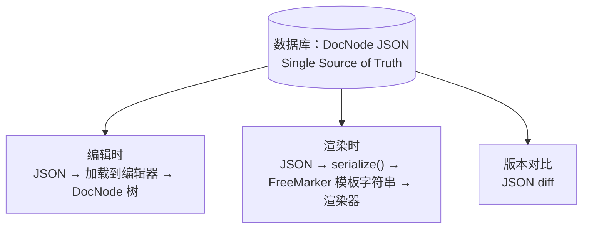

# 06 · 序列化与单一数据源

> 目标：读完这篇，你能说清编辑器的产出是什么、为什么数据库只存一份 DocNode JSON，以及文档树怎么变成 FreeMarker 模板。

## 一、底层模板语法（FreeMarker）

编辑器底层使用 FreeMarker 语法，支持变量、条件、循环：

```ftl
<#-- 变量输出 -->
${user_name}

<#-- 条件判断 -->
<#if is_vip>
  尊敬的 VIP 用户
<#else>
  亲爱的用户
</#if>

<#-- 循环 -->
<#list items as item>
  ${item.name} - ¥${item.price}
</#list>
```

编辑器把这些语法封装为可视化操作，用户无需直接编写模板代码（变量 = chip、条件 = 折叠块、循环 = 容器块，见 [05 · 工具设计](./05-tools.md)）。

## 二、单一数据源

数据库**只存一份 DocNode JSON**，模板字符串是它的派生产物：



不再维护"模板字符串 + 编辑器内容"两份数据，避免同步不一致的问题。

> 这是整个项目里最重要的一条数据契约。编辑态、预览态、生产渲染态**都从同一份 JSON 派生**，所以"编辑器里预览的 = 最终发出去的"才有可能成立——一致性是机制保证的，不是靠人去对齐两份数据。

## 三、序列化（文档树 → 模板）

保存和预览时，DocNode 树序列化为 FreeMarker 模板字符串：

```typescript
function serialize(nodes: DocNode[]): string {
  return nodes.map(node => {
    switch (node.type) {
      case 'text':
        return node.content;
      case 'variable':
        return `\${${node.variable.name}}`;
      case 'condition':
        const trueBranch = serialize(node.children.filter(n => n.branch === 'true'));
        const falseBranch = serialize(node.children.filter(n => n.branch === 'false'));
        return `<#if ${node.expression}>\n${trueBranch}<#else>\n${falseBranch}</#if>`;
      case 'loop':
        const body = serialize(node.children);
        return `<#list ${node.expression} as item>\n${body}</#list>`;
      case 'block':
        const inner = serialize(node.children);
        return wrapWithHTML(node, inner); // 包裹对应的 HTML 标签 + 内联样式
    }
  }).join('');
}
```

**设计要点**：

- 序列化时**内联样式从节点 `attrs` 生成**，确保输出 HTML 自包含（呼应 [01 · 总览与架构](./01-overview.md) 的样式策略：内容样式必须内联）
- 保留原始模板中**编辑器不识别的 FreeMarker 指令**（作为 raw 节点透传），这样编辑器不必支持全部语法也不会丢内容

## 四、JSON → Template Content 的两条路径

这条路径无交互、无增量更新，就是遍历树拼接字符串，性能不是瓶颈：

| 场景 | 触发时机 | 说明 |
|------|---------|------|
| 保存 | 用户点击保存 | 序列化为 FreeMarker 模板字符串存入数据库，业务用它 + 生产变量渲染真实邮件 / PDF |
| 预览 | 用户填充变量后点击预览 | 序列化 → 调用渲染服务 → 用填充的变量值渲染出最终效果 |

唯一优化：**防抖**（停止编辑 300ms 后再序列化），避免频繁触发。

## 五、双模式下的输出差异

序列化结果随后按模式走不同渲染通道（对照 [01 · 总览与架构](./01-overview.md) 的双模式差异表）：

| 模式 | 序列化产出 | 后续 |
|------|-----------|------|
| Email | 内联样式 HTML + FreeMarker | 交给邮件渲染，注意客户端 CSS 兼容 |
| PDF | 结构 HTML + FreeMarker | 服务端渲染成 PDF，支持完整 CSS |

---

**上一篇**：[05 · 工具设计](./05-tools.md) ｜ **下一篇**：[07 · Undo/Redo](./07-history.md)
