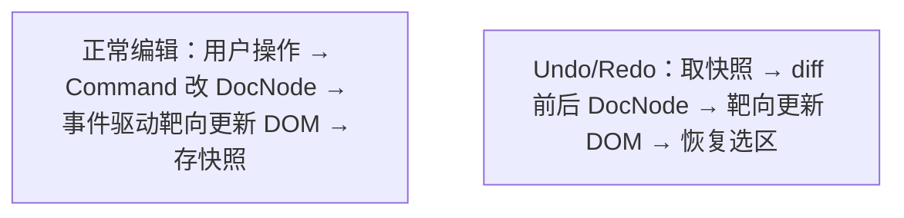
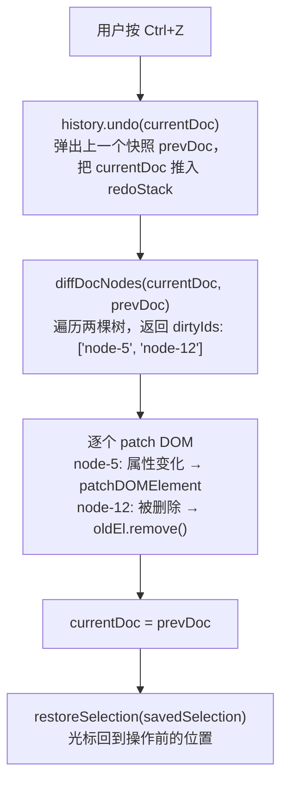

# 07 · Undo/Redo

> 目标：读完这篇，你能说清撤销 / 重做为什么用快照而不是逆操作、diff 怎么找差异、DOM 怎么靶向更新，以及那个必踩的坑。

## 一、整体思路



**为什么选快照而非逆操作**：模板编辑涉及复合操作（拖入变量 = 插入节点 + 绑定数据 + 应用样式），逆操作实现复杂且容易出 bug。快照简单可靠，DocNode JSON 体积小，加上 diff 靶向更新 DOM，性能完全够用。

## 二、快照存储

```typescript
class HistoryManager {
  private undoStack: DocNode[] = [];
  private redoStack: DocNode[] = [];
  private lastPushTime = 0;

  push(doc: DocNode) {
    const now = Date.now();
    // 500ms 内连续输入合并为一次快照（如连续打字）
    if (now - this.lastPushTime < 500 && this.undoStack.length > 0) {
      return;
    }
    this.undoStack.push(structuredClone(doc));
    this.redoStack = [];  // 新操作清空 redo 栈
    this.lastPushTime = now;
  }

  undo(currentDoc: DocNode): DocNode | null {
    const prev = this.undoStack.pop();
    if (!prev) return null;
    this.redoStack.push(structuredClone(currentDoc));
    return prev;
  }

  redo(currentDoc: DocNode): DocNode | null {
    const next = this.redoStack.pop();
    if (!next) return null;
    this.undoStack.push(structuredClone(currentDoc));
    return next;
  }
}
```

**关键设计**：

- 快照存的是 **DocNode JSON 的深拷贝**，不存 DOM
- **500ms 节流**：连续打字合并为一次快照，避免 undo 要按几十次才退回去
- **新操作清空 redo 栈**：符合用户直觉（做了新操作就不能 redo 回去了）

## 三、Diff 算法

基于节点稳定 ID 的树遍历，找出前后两棵树的差异节点：

```typescript
function diffDocNodes(before: DocNode, after: DocNode): string[] {
  const dirtyIds: string[] = [];

  function walk(oldNode: DocNode | undefined, newNode: DocNode | undefined) {
    if (!oldNode && newNode) { dirtyIds.push(newNode.id); return; }  // 新增
    if (oldNode && !newNode) { dirtyIds.push(oldNode.id); return; }  // 删除
    if (!shallowEqual(oldNode, newNode)) { dirtyIds.push(newNode.id); }  // 修改

    const maxLen = Math.max(oldNode.children?.length ?? 0, newNode.children?.length ?? 0);
    for (let i = 0; i < maxLen; i++) {
      walk(oldNode.children?.[i], newNode.children?.[i]);
    }
  }

  walk(before, after);
  return dirtyIds;
}
```

模板文档从几十到上千节点不等（PDF 长模板如多页合同、报表节点较多），但 diff 是 **O(n) 遍历**，千级节点也在毫秒级。而且 PDF 模板静态内容偏多，undo/redo 时变化的往往只是少数节点，`dirtyIds` 通常很少。

## 四、DOM 靶向更新

diff 出 `dirtyIds` 后，逐个 patch，**不全量 re-render**：

```typescript
function performUndo() {
  const prevDoc = history.undo(currentDoc);
  if (!prevDoc) return;

  const dirtyIds = diffDocNodes(currentDoc, prevDoc);

  for (const id of dirtyIds) {
    const newNode = prevDoc.getNodeById(id);
    const oldEl = container.querySelector(`[data-node-id="${id}"]`);

    if (!newNode) {
      oldEl.remove();                              // 节点被删除
    } else if (!oldEl) {
      insertDOMAtPosition(newNode, prevDoc);       // 节点被恢复
    } else {
      patchDOMElement(oldEl, newNode);             // 节点属性变化
    }
  }

  currentDoc = prevDoc;
  restoreSelection(history.getSelection());
}
```

三种情况的处理：

- **节点被删除**（undo 撤销了插入）：移除对应 DOM 元素
- **节点被恢复**（undo 撤销了删除）：在正确位置重新插入 DOM 元素
- **节点属性变化**（undo 撤销了修改）：原地 patch 属性，复用 DOM 元素

> 这也是全篇唯一**需要 diff** 的地方：正常编辑时事件知道改了什么（见 [04 · 渲染引擎](./04-render-engine.md)），而 undo 是从快照恢复，不知道该改哪里，只能比。

## 五、选区恢复

```typescript
function restoreSelection(selection: Selection) {
  const anchor = positionToDOM(selection.anchor, container);
  const focus = positionToDOM(selection.focus, container);

  window.getSelection().setBaseAndExtent(
    anchor.startContainer, anchor.startOffset,
    focus.startContainer, focus.startOffset
  );
}
```

选区以模型坐标（`nodeId + offset`）保存在快照中，DOM 更新后通过 `positionToDOM` 翻译回浏览器坐标恢复光标位置。**只要节点 ID 稳定，DOM 替换后依然能定位回去**（这正是 [02 · 文档模型与选区](./02-document-model.md) 里强调 ID 稳定的原因之一）。

## 六、完整流程



## 七、恢复期间的 input 事件拦截（必踩的坑）

Undo/Redo 恢复 DOM 时（`patchDOMElement` / `oldEl.remove()`），会触发 contentEditable 的 `input` 事件。如果没有拦截，`handleInput` 会把"恢复出来的内容"当作一次新的编辑，生成 `UpdateTextCommand` 推入历史栈——**undo 操作自己污染了历史**，连续按 Ctrl+Z 可能出现"撤销又被顶回去"的循环。

解决：恢复期间设置 `isRestoring` 标志，`handleInput` 检测到直接跳过：

```typescript
let isRestoring = false;

function performUndo() {
  isRestoring = true;   // 恢复前上锁
  try {
    // ...diff + patch DOM + restoreSelection
  } finally {
    isRestoring = false;  // 恢复完解锁
  }
}

function handleInput(e: InputEvent, ctx: CommandContext) {
  if (isRestoring) return;  // 恢复 DOM 触发的 input 事件，不当作新编辑
  const nodeId = e.target.closest('[data-node-id]').dataset.nodeId;
  const newContent = e.target.textContent;
  ctx.applyCommand(new UpdateTextCommand(nodeId, newContent));
}
```

其他同样会触发 `input` / `change` 的恢复路径（redo、从外部 `setTemplate()` 加载）也要走同一把锁。

> 这个坑的本质是**程序性 DOM 变更和用户输入走同一个事件通道**，不区分来源就会互相污染。面试里讲这个比讲"我用了快照"更能体现真实踩坑经验。

---

**上一篇**：[06 · 序列化与单一数据源](./06-serialization.md) ｜ **下一篇**：[08 · Web Component 接入](./08-embedding.md)
