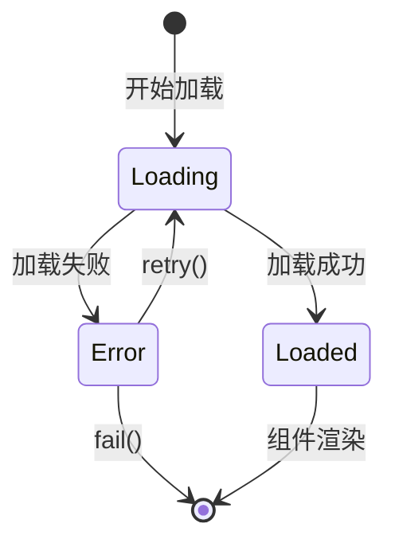

# Vue3 异步组件

## 解决的问题

用户可利用 `import()` 自行实现异步组件，但框架封装的异步组件解决了以下体验问题：

1. **加载中状态**：如何展示 loading？
2. **加载失败**：如何展示错误？
3. **失败重试**：是否需要重试机制？
4. **延迟加载**：避免加载过快造成的闪烁？

## 使用示例

```typescript
import { defineAsyncComponent } from 'vue';

// 基础用法
const AsyncComp = defineAsyncComponent(() => import('./MyComponent.vue'));

// 高级选项
const AsyncCompWithOptions = defineAsyncComponent({
  loader: () => import('./MyComponent.vue'),
  loadingComponent: LoadingSpinner,
  errorComponent: ErrorDisplay,
  delay: 200,      // 延迟 200ms 显示 loading
  timeout: 10000,  // 10s 超时
  onError(error, retry, fail, attempts) {
    if (attempts <= 3) {
      retry();
    } else {
      fail();
    }
  },
});
```

## 状态流转



## 实现原理

```typescript
export function defineAsyncComponent(
  source: AsyncComponentLoader | AsyncComponentOptions
): Component {
  if (typeof source === 'function') {
    source = { loader: source };
  }

  const {
    loader,
    loadingComponent,
    errorComponent,
    delay = 200,
    timeout,
    onError: userOnError,
  } = source;

  let resolvedComp: Component | null = null;
  let retries = 0;

  // 加载函数，支持重试
  const load = (): Promise<Component> => {
    return loader()
      .catch((err: Error) => {
        if (userOnError) {
          return new Promise((resolve, reject) => {
            const retry = () => {
              retries++;
              resolve(load());
            };
            const fail = () => reject(err);
            userOnError(err, retry, fail, retries + 1);
          });
        } else {
          throw err;
        }
      });
  };

  return {
    name: 'AsyncComponentWrapper',

    setup() {
      const loaded = ref(false);
      const error = shallowRef<Error | null>(null);
      const loading = ref(false);

      // 延迟显示 loading
      let loadingTimer: ReturnType<typeof setTimeout> | null = null;
      if (delay) {
        loadingTimer = setTimeout(() => {
          loading.value = true;
        }, delay);
      } else {
        loading.value = true;
      }

      // 开始加载
      load()
        .then((comp) => {
          resolvedComp = comp;
          loaded.value = true;
        })
        .catch((err: Error) => {
          error.value = err;
        })
        .finally(() => {
          loading.value = false;
          if (loadingTimer) clearTimeout(loadingTimer);
        });

      // 超时处理
      let timeoutTimer: ReturnType<typeof setTimeout> | null = null;
      if (timeout) {
        timeoutTimer = setTimeout(() => {
          if (!loaded.value) {
            error.value = new Error(
              `Async component timed out after ${timeout}ms.`
            );
          }
        }, timeout);
      }

      // 渲染函数
      return () => {
        if (loaded.value && resolvedComp) {
          return createVNode(resolvedComp);
        } else if (error.value && errorComponent) {
          return createVNode(errorComponent, { error: error.value });
        } else if (loading.value && loadingComponent) {
          return createVNode(loadingComponent);
        } else {
          // 占位符
          return createVNode(Comment, '');
        }
      };
    },
  };
}
```

## 关键设计

### 1. 重试机制

```typescript
onError(error, retry, fail, attempts) {
  if (attempts <= 3) {
    retry();  // 重新调用 load()
  } else {
    fail();   // 放弃加载
  }
}
```

### 2. 延迟加载

避免加载过快导致 loading 闪烁：

```typescript
if (delay) {
  loadingTimer = setTimeout(() => {
    loading.value = true;
  }, delay);
}
```

如果组件在 delay 时间内加载完成，loading 不会显示。

### 3. 超时处理

```typescript
if (timeout) {
  timeoutTimer = setTimeout(() => {
    if (!loaded.value) {
      error.value = new Error(`Async component timed out after ${timeout}ms.`);
    }
  }, timeout);
}
```

### 4. 缓存已加载组件

```typescript
let resolvedComp: Component | null = null;

// 加载成功后缓存
load().then((comp) => {
  resolvedComp = comp;
  loaded.value = true;
});

// 后续渲染直接使用缓存
if (loaded.value && resolvedComp) {
  return createVNode(resolvedComp);
}
```

## 与 React.lazy 对比

| 维度 | Vue defineAsyncComponent | React.lazy |
|------|-------------------------|------------|
| **加载函数** | `() => import()` | `() => import()` |
| **loading 状态** | 内置 loadingComponent | 需配合 Suspense fallback |
| **错误处理** | 内置 errorComponent + onError | 需配合 Error Boundary |
| **重试机制** | 内置 retry | 需手动实现 |
| **延迟加载** | 内置 delay | 无 |
| **超时处理** | 内置 timeout | 需配合 Suspense timeout |

## 函数式组件

Vue3 中函数式组件性能与有状态组件差异不大，因为：

1. Vue3 的组件实例创建已经高度优化
2. 函数式组件无法使用响应式、生命周期等特性
3. 推荐使用普通组件或 `<script setup>`
