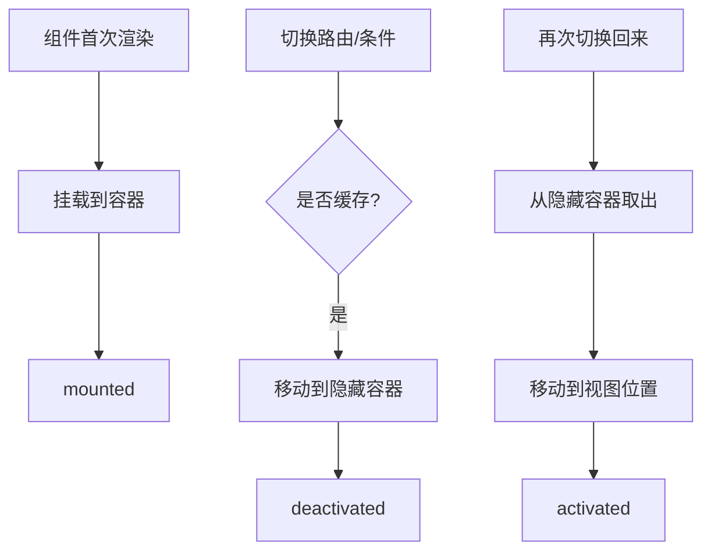
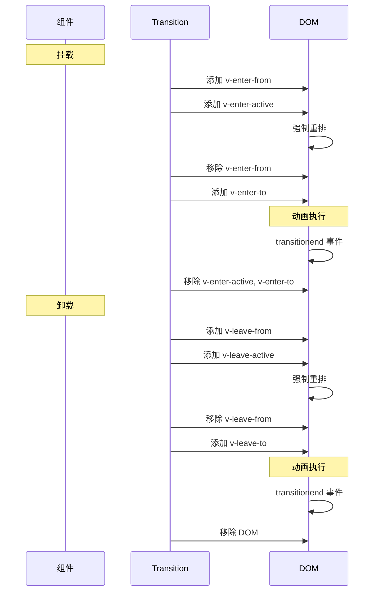

# Vue3 内置组件

Vue3 提供了多个内置组件，用于解决常见的 UI 场景问题。

## KeepAlive

KeepAlive 用于缓存组件实例，避免重复创建和销毁，通过移动 DOM 节点实现隐藏和激活。

### 使用示例

```vue
<template>
  <KeepAlive :include="['Home', 'About']" :max="10">
    <component :is="currentView" />
  </KeepAlive>
</template>
```

### 生命周期

| 钩子 | 触发时机 |
|------|---------|
| activated | 组件从缓存中激活时 |
| deactivated | 组件被缓存隐藏时 |



### 实现原理

```typescript
export const KeepAlive = {
  name: 'KeepAlive',
  props: {
    include: [String, RegExp, Array],
    exclude: [String, RegExp, Array],
    max: [String, Number],
  },

  setup(props: KeepAliveProps, { slots }: SetupContext) {
    const cache = new Map();  // 缓存 Map，key 为组件 type
    const keys = new Set();   // 缓存的 key 集合

    return () => {
      const vnode = slots.default?.();
      if (!vnode || vnode.length !== 1) return vnode;

      const child = vnode[0];
      const { type, key } = child;

      // 判断是否需要缓存
      if (!shouldCache(type, props)) {
        return child;
      }

      const cachedKey = key ?? type;

      // 从缓存中获取
      const cached = cache.get(cachedKey);
      if (cached) {
        // 复用缓存的 vnode
        child.el = cached.el;
        child.component = cached.component;
        child.ssContent = cached.ssContent;
        child.ssFallback = cached.ssFallback;

        // 更新 LRU 顺序
        keys.delete(cachedKey);
        keys.add(cachedKey);
      } else {
        // 首次渲染，加入缓存
        keys.add(cachedKey);
        cache.set(cachedKey, child);

        // 超过 max 限制，删除最旧的
        if (props.max && keys.size > Number(props.max)) {
          const oldestKey = keys.values().next().value;
          cache.delete(oldestKey);
          keys.delete(oldestKey);
        }
      }

      child.shapeFlag |= ShapeFlags.COMPONENT_KEPT_ALIVE;
      return child;
    };
  },
};
```

### include/exclude 匹配

```typescript
function matches(pattern: string | RegExp | string[], name: string): boolean {
  if (Array.isArray(pattern)) {
    return pattern.includes(name);
  }
  if (typeof pattern === 'string') {
    return pattern.split(',').includes(name);
  }
  if (pattern instanceof RegExp) {
    return pattern.test(name);
  }
  return false;
}

function shouldCache(type: any, props: KeepAliveProps): boolean {
  const name = type.name || type.__name;
  if (!name) return false;

  if (props.exclude) {
    if (matches(props.exclude, name)) return false;
  }
  if (props.include) {
    return matches(props.include, name);
  }
  return true;
}
```

## Teleport

Teleport 用于将组件渲染到 DOM 树的其他位置，解决 CSS 层级问题（如模态框、弹窗）。

### 使用示例

```vue
<template>
  <Teleport to="#modal-container">
    <div class="modal">
      <p>这是一个模态框</p>
    </div>
  </Teleport>
</template>
```

### 实现原理

```typescript
export const Teleport = {
  name: 'Teleport',
  props: {
    to: { type: [String, Object], required: true },
    disabled: Boolean,
  },

  process(
    n1: VNode | null,
    n2: VNode,
    container: RendererElement,
    anchor: RendererNode | null,
  ): void {
    const { to, disabled } = n2.props;

    // 获取目标容器
    const target = typeof to === 'string'
      ? document.querySelector(to)
      : to;

    if (n1 === null) {
      // 挂载
      mountTeleport(n2, target, anchor);
    } else {
      // 更新
      updateTeleport(n1, n2, target);
    }
  },
};

function mountTeleport(
  vnode: VNode,
  target: RendererElement,
  anchor: RendererNode | null,
): void {
  const children = vnode.children;

  // 将子节点挂载到目标容器
  if (Array.isArray(children)) {
    for (const child of children) {
      patch(null, child, target, anchor);
    }
  }

  // 保存目标容器引用
  vnode.target = target;
}
```

### 禁用 Teleport

```vue
<Teleport to="#modal" :disabled="isMobile">
  <Modal />
</Teleport>
```

`disabled` 为 true 时，组件会渲染在原地而非目标容器。

## Transition

Transition 用于给组件/元素添加进入/离开动画，通过 CSS 类名或 JS 钩子实现。

### 使用示例

```vue
<template>
  <Transition name="fade" mode="out-in">
    <component :is="currentView" />
  </Transition>
</template>

<style>
.fade-enter-active,
.fade-leave-active {
  transition: opacity 0.3s ease;
}

.fade-enter-from,
.fade-leave-to {
  opacity: 0;
}
</style>
```

### CSS 类名

| 类名 | 触发时机 |
|------|---------|
| v-enter-from | 进入动画起始状态 |
| v-enter-active | 进入动画生效状态 |
| v-enter-to | 进入动画结束状态 |
| v-leave-from | 离开动画起始状态 |
| v-leave-active | 离开动画生效状态 |
| v-leave-to | 离开动画结束状态 |

### 动画流程



### 实现原理

```typescript
export const Transition = {
  name: 'Transition',
  props: {
    name: String,
    mode: String,  // 'in-out' | 'out-in' | 'default'
    css: { type: Boolean, default: true },
    duration: [String, Number, Object],
    enterFromClass: String,
    enterActiveClass: String,
    enterToClass: String,
    leaveFromClass: String,
    leaveActiveClass: String,
    leaveToClass: String,
    onBeforeEnter: Function,
    onEnter: Function,
    onAfterEnter: Function,
    onBeforeLeave: Function,
    onLeave: Function,
    onAfterLeave: Function,
  },

  setup(props: TransitionProps, { slots }: SetupContext) {
    return () => {
      const children = slots.default?.();
      if (!children || children.length === 0) return;

      const child = children[0];
      return cloneVNode(child, {
        onVnodeBeforeMount: (vnode) => onBeforeEnter(vnode, props),
        onVnodeMounted: (vnode) => onEnter(vnode, props),
        onVnodeBeforeUnmount: (vnode) => onBeforeLeave(vnode, props),
        onVnodeUnmounted: (vnode) => onLeave(vnode, props),
      });
    };
  },
};

function onEnter(vnode: VNode, props: TransitionProps): void {
  const el = vnode.el;
  const name = props.name || 'v';

  // 添加进入动画类名
  addClass(el, `${name}-enter-from`);
  addClass(el, `${name}-enter-active`);

  // 强制重排
  forceReflow(el);

  // 移除起始类名，添加结束类名
  requestAnimationFrame(() => {
    removeClass(el, `${name}-enter-from`);
    addClass(el, `${name}-enter-to`);
  });

  // 动画结束后清理
  el.addEventListener('transitionend', () => {
    removeClass(el, `${name}-enter-active`);
    removeClass(el, `${name}-enter-to`);
  });
}
```

### JS 钩子

```vue
<Transition
  @before-enter="onBeforeEnter"
  @enter="onEnter"
  @after-enter="onAfterEnter"
  @before-leave="onBeforeLeave"
  @leave="onLeave"
  @after-leave="onAfterLeave"
>
  <div v-if="show">内容</div>
</Transition>
```

```typescript
function onEnter(el: HTMLElement, done: () => void): void {
  // 使用 GSAP 等动画库
  gsap.fromTo(el, { opacity: 0 }, { opacity: 1, onComplete: done });
}
```

## 内置组件对比

| 组件 | 解决的问题 | 核心机制 | 典型场景 |
|------|-----------|---------|---------|
| **KeepAlive** | 组件重复创建销毁 | 缓存 vnode + 移动 DOM | 路由缓存、Tab 切换 |
| **Teleport** | DOM 层级限制 | 渲染到指定容器 | 模态框、弹窗、Tooltip |
| **Transition** | 动画实现复杂 | CSS 类名 + JS 钩子 | 页面切换、列表动画 |
