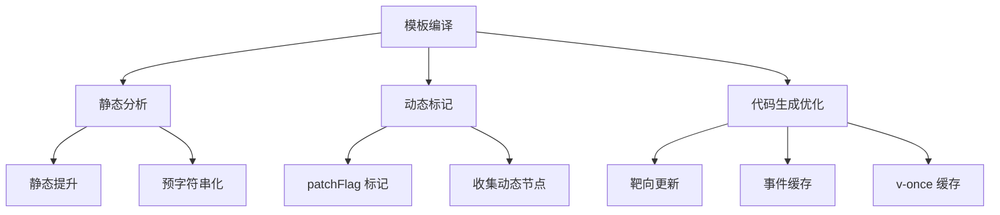
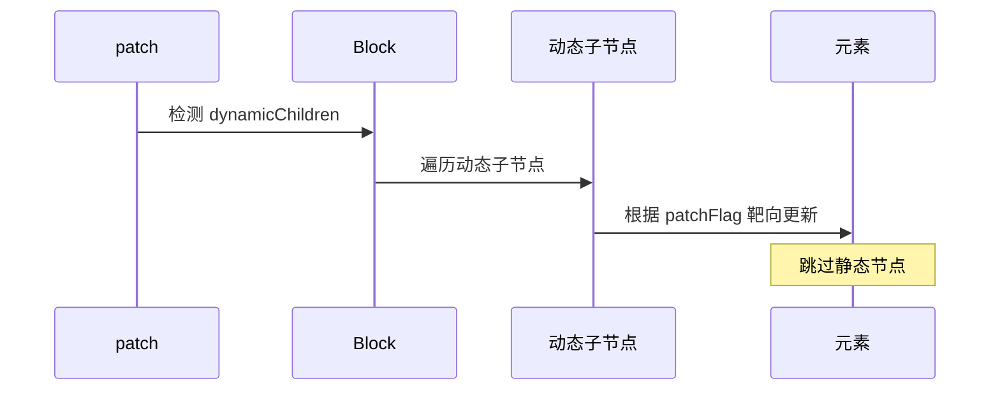

# Vue3 编译优化

Vue3 编译器通过多种优化手段，将模板编译成高效的渲染函数，实现运行时性能提升。

## 整体优化策略



## patchFlag 标记

编译过程中，编译器会分析节点的动态属性，通过 `patchFlag` 进行位运算标记。

### patchFlag 枚举值

```typescript
enum PatchFlags {
  TEXT = 1,           // 动态文本节点
  CLASS = 1 << 1,     // 2 - 动态 class
  STYLE = 1 << 2,     // 4 - 动态 style
  PROPS = 1 << 3,     // 8 - 动态属性（不含 class/style）
  FULL_PROPS = 1 << 4,// 16 - 动态属性（含 class/style，key 变化）
  HYDRATE_EVENTS = 1 << 5, // 32 - 事件监听
  STABLE_FRAGMENT = 1 << 6, // 64 - 稳定 Fragment（子节点顺序不变）
  KEYED_FRAGMENT = 1 << 7,  // 128 - 带 key 的 Fragment
  UNKEYED_FRAGMENT = 1 << 8, // 256 - 不带 key 的 Fragment
  NEED_PATCH = 1 << 9,     // 512 - 需要 patch（ref、指令等）
  DYNAMIC_SLOTS = 1 << 10, // 1024 - 动态插槽
  DEV_ROOT_FRAGMENT = 1 << 11, // 2048 - 开发模式根 Fragment
  HOISTED = -1,        // 静态节点（提升）
  BAIL = -2,           // 跳过优化
}
```

### 编译示例

```vue
<!-- 模板 -->
<div class="static" :id="dynamicId" :style="dynamicStyle">
  {{ message }}
</div>
```

```javascript
// 编译后
_createVNode("div", {
  id: _ctx.dynamicId,
  style: _ctx.dynamicStyle,
  class: "static"
}, _toDisplayString(_ctx.message), 13 /* TEXT, PROPS */, ["id", "style"])
//                                                         ^^^^^^^^^^^^^^^^^^
//                                                         patchFlag: 13 = 1 | 8 | 4
//                                                         动态文本 + 动态属性 + 动态 style
```

### 运行时靶向更新

```typescript
function patchElement(n1: VNode, n2: VNode): void {
  const el = (n2.el = n1.el);
  const oldProps = n1.props;
  const newProps = n2.props;
  const patchFlag = n2.patchFlag;

  // 根据 patchFlag 精准更新
  if (patchFlag & PatchFlags.FULL_PROPS) {
    // 属性全量更新（key 变化）
    patchProps(el, oldProps, newProps);
  } else {
    // 按需更新
    if (patchFlag & PatchFlags.CLASS) {
      if (oldProps.class !== newProps.class) {
        patchClass(el, newProps.class);
      }
    }
    if (patchFlag & PatchFlags.STYLE) {
      if (oldProps.style !== newProps.style) {
        patchStyle(el, newProps.style);
      }
    }
    if (patchFlag & PatchFlags.PROPS) {
      // 只更新动态属性（dynamicProps 数组指定）
      const dynamicProps = n2.dynamicProps;
      for (let i = 0; i < dynamicProps.length; i++) {
        const key = dynamicProps[i];
        patchProp(el, key, oldProps[key], newProps[key]);
      }
    }
  }

  if (patchFlag & PatchFlags.TEXT) {
    if (n1.children !== n2.children) {
      hostSetText(el, n2.children as string);
    }
  }
}
```

## 收集动态节点（Block Tree）

在生成渲染函数过程中，编译器通过 `_openBlock` 开启 block 作用域，收集动态节点。

### 编译示例

```vue
<!-- 模板 -->
<div>
  <div>静态内容</div>
  <div :id="dynamicId">{{ message }}</div>
  <div>静态内容</div>
</div>
```

```javascript
// 编译后
export function render(_ctx, _cache, $props, $setup, $data, $options) {
  return (_openBlock(), _createBlock("div", null, [
    _createVNode("div", null, "静态内容"),
    _createVNode("div", { id: _ctx.dynamicId },
      _toDisplayString(_ctx.message), 9 /* TEXT, PROPS */, ["id"]),
    _createVNode("div", null, "静态内容")
  ]))
}
```

### Block 结构

```typescript
// 运行时生成的 vnode 结构
{
  type: "div",
  children: [...],
  dynamicChildren: [  // 只包含动态节点
    {
      type: "div",
      props: { id: "xxx" },
      children: "hello",
      patchFlag: 9
    }
  ]
}
```

### 靶向更新流程



```typescript
function patchElement(n1: VNode, n2: VNode): void {
  // 优先使用 dynamicChildren 进行靶向更新
  if (n2.dynamicChildren) {
    patchBlockChildren(n1.dynamicChildren, n2.dynamicChildren);
  } else {
    // 降级到传统 diff
    patchChildren(n1, n2, n2.el);
  }
}

function patchBlockChildren(
  oldChildren: VNode[],
  newChildren: VNode[],
): void {
  // 直接遍历动态节点，无需 diff
  for (let i = 0; i < newChildren.length; i++) {
    patch(oldChildren[i], newChildren[i]);
  }
}
```

## 静态提升（Hoist Static）

静态节点和属性会被提升到渲染函数外部，整个生命周期只创建一次。

### 编译示例

```vue
<!-- 模板 -->
<div>
  <div class="static">静态内容</div>
  <div :id="dynamicId">动态内容</div>
</div>
```

```javascript
// 编译后
const _hoisted_1 = { class: "static" }
const _hoisted_2 = /*#__PURE__*/ _createVNode("div", _hoisted_1, "静态内容")

export function render(_ctx, _cache, $props, $setup, $data, $options) {
  return (_openBlock(), _createBlock("div", null, [
    _hoisted_2,  // 直接引用，无需重新创建
    _createVNode("div", { id: _ctx.dynamicId }, "动态内容", 8 /* PROPS */, ["id"])
  ]))
}
```

### 提升规则

```typescript
function hoistStatic(root: RootNode): void {
  // 1. 纯静态节点（无动态绑定、无指令）
  // 2. 静态属性对象
  // 3. 静态文本节点
  // 4. 不包含动态子节点的静态元素
}
```

## 预字符串化（Stringify Static）

大量连续的静态节点会被合并成一个字符串，减少 vnode 创建开销。

### 编译示例

```vue
<!-- 模板 -->
<div>
  <ul>
    <li>item1</li>
    <li>item2</li>
    <li>item3</li>
    <!-- ... 大量静态 li -->
  </ul>
  <div :id="dynamicId">动态内容</div>
</div>
```

```javascript
// 编译后
const _hoisted_1 = /*#__PURE__*/ _createStaticVNode(
  "<ul><li>item1</li><li>item2</li><li>item3</li>...</ul>",
  1  // 1 个静态节点
)

export function render(_ctx, _cache, $props, $setup, $data, $options) {
  return (_openBlock(), _createBlock("div", null, [
    _hoisted_1,  // 静态 HTML 字符串，直接 innerHTML
    _createVNode("div", { id: _ctx.dynamicId }, "动态内容", 8 /* PROPS */, ["id"])
  ]))
}
```

### 触发条件

```typescript
// 连续静态节点数量 >= 阈值（默认 20）
const STRINGIFY_THRESHOLD = 20;

function shouldStringify(children: TemplateChildNode[]): boolean {
  let staticCount = 0;
  for (const child of children) {
    if (isStaticNode(child)) {
      staticCount++;
    } else {
      staticCount = 0;
    }
    if (staticCount >= STRINGIFY_THRESHOLD) {
      return true;
    }
  }
  return false;
}
```

## 缓存内联事件回调函数

内联事件回调函数会被缓存，避免每次渲染都创建新函数。

### 编译示例

```vue
<!-- 模板 -->
<button @click="() => console.log('clicked')">点击</button>
```

```javascript
// 编译后（无缓存）
_createVNode("button", {
  onClick: () => console.log('clicked')  // 每次渲染都创建新函数
})

// 编译后（有缓存）
export function render(_ctx, _cache, $props, $setup, $data, $options) {
  return (_openBlock(), _createBlock("button", {
    onClick: _cache[0] || (_cache[0] = $event => console.log('clicked'))
    //       ^^^^^^^^^^^^^^^^^^^^^^^^^^^^^^^^^^^^^^^^^^^^^^^^^^^^^^^^^^^^
    //       首次创建后缓存到 _cache[0]，后续直接复用
  }, "点击"))
}
```

### 缓存机制

```typescript
// 渲染函数签名中的 _cache 参数
export function render(
  _ctx,
  _cache,      // 缓存数组
  $props,
  $setup,
  $data,
  $options
) {
  // _cache[0] = onClick 回调
  // _cache[1] = onMouseenter 回调
  // ...
}
```

## v-once 指令缓存

带 `v-once` 指令的节点只渲染一次，后续更新不参与 patch。

### 编译示例

```vue
<!-- 模板 -->
<div v-once>{{ expensiveComputation }}</div>
<div>{{ normalData }}</div>
```

```javascript
// 编译后
const _hoisted_1 = /*#__PURE__*/ _createVNode("div", null, "计算结果", -1 /* HOISTED */)

export function render(_ctx, _cache, $props, $setup, $data, $options) {
  return (_openBlock(), _createBlock(_Fragment, null, [
    _hoisted_1,  // 静态提升，不参与更新
    _createVNode("div", null, _toDisplayString(_ctx.normalData), 1 /* TEXT */)
  ], 64 /* STABLE_FRAGMENT */))
}
```

## 优化效果对比

| 优化手段 | 优化前 | 优化后 | 提升 |
|---------|--------|--------|------|
| **patchFlag** | 全量对比所有属性 | 按需更新指定属性 | 减少 60-80% 属性对比 |
| **Block Tree** | 遍历整棵 vnode 树 diff | 只遍历动态节点 | 减少 70-90% 节点遍历 |
| **静态提升** | 每次渲染重新创建静态 vnode | 只创建一次，后续复用 | 减少 50-70% vnode 创建 |
| **预字符串化** | 每个静态节点单独创建 vnode | 合并成字符串，innerHTML | 减少 90%+ 静态节点开销 |
| **事件缓存** | 每次渲染创建新函数 | 缓存复用 | 减少函数创建开销 |
| **v-once** | 参与每次 patch | 跳过 patch | 完全跳过更新 |
