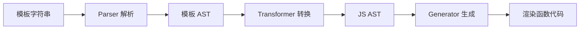
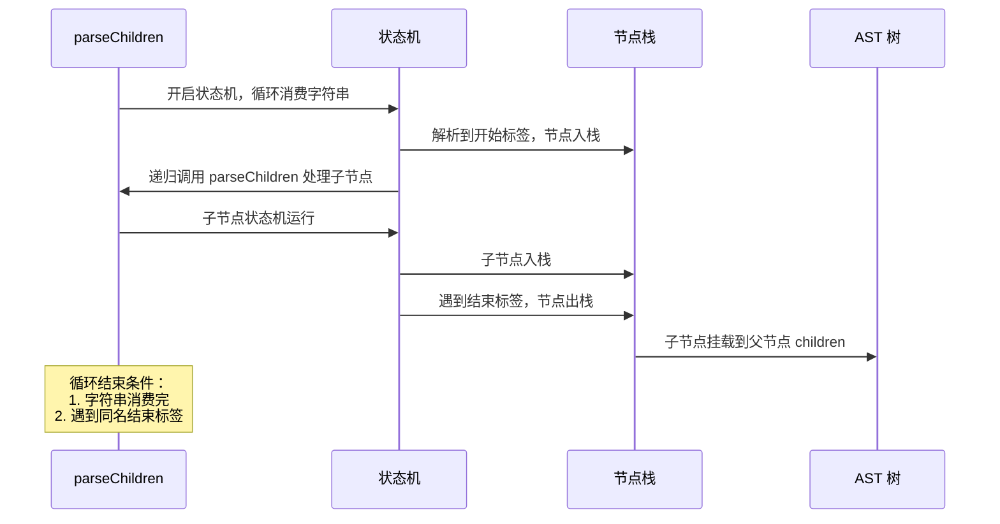
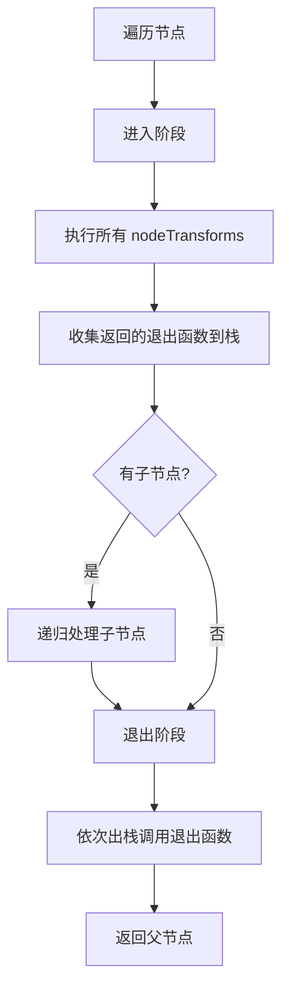
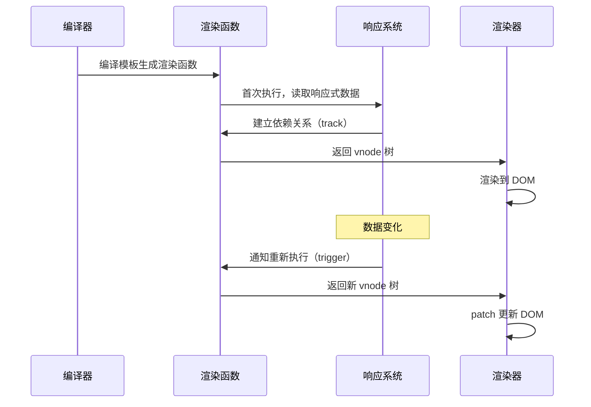

# Vue3 编译器总览

编译器（compiler）的作用是将一种语言转换成另一种语言。Vue 的模板语法是一种 DSL（领域特定语言），编译器将其转换成 JavaScript 渲染函数。

## 整体流程



与 React 对比：React 使用 JSX 语法，由 Babel 解析成 `React.createElement` 调用。两者实质相同，都是模板语法生成渲染函数代码。差异在于：

| 维度 | Vue Template | React JSX |
|------|--------------|-----------|
| **语法基础** | HTML 模板语法（从 UI 出发，扩展 JS） | JavaScript 语法（从 JS 出发，扩展 UI） |
| **灵活性** | 受限于框架规定的语法 | 更灵活，可使用完整 JS 表达式 |
| **编译时机** | 预编译（构建时）或运行时编译 | Babel 编译（构建时） |
| **学习成本** | 低，熟悉 HTML 即可 | 需要理解 JSX 与 JS 的关系 |

## Parser（解析器）

Parser 通过有限状态机逐个消费模板字符串，将解析出的标签用**栈**结构维护层级关系，同时构建树形 AST。

### 有限状态机

```typescript
enum ParserState {
  TEXT,           // 文本
  TAG_OPEN,       // 开始标签
  TAG_NAME,       // 标签名
  BEFORE_ATTRIBUTE_NAME,  // 属性前
  ATTRIBUTE_NAME,         // 属性名
  AFTER_ATTRIBUTE_NAME,   // 属性后
  BEFORE_ATTRIBUTE_VALUE, // 属性值前
  ATTRIBUTE_VALUE,        // 属性值
  SELF_CLOSING_TAG,       // 自闭合标签
  END_TAG_OPEN,           // 结束标签开始
  END_TAG_NAME,           // 结束标签名
  COMMENT,                // 注释
  DOCTYPE,                // DOCTYPE
}
```

### 递归下降算法

Vue 采用解析与构造 AST 同时进行的递归算法，用栈维护层级关系。



### 核心代码

```typescript
function parse(template: string): RootNode {
  const context = createParserContext(template);
  const children = parseChildren(context, []);
  return { type: NodeTypes.ROOT, children };
}

function parseChildren(
  context: ParserContext,
  ancestors: ElementNode[],
): TemplateChildNode[] {
  const nodes: TemplateChildNode[] = [];

  while (!isEnd(context, ancestors)) {
    let node: TemplateChildNode;

    // 根据当前字符判断节点类型
    if (context.source.startsWith('{{')) {
      node = parseInterpolation(context);  // 插值表达式
    } else if (context.source[0] === '<') {
      if (context.source[1] === '!') {
        if (context.source.startsWith('<!--')) {
          node = parseComment(context);    // 注释
        } else {
          node = parseCDATA(context);      // CDATA
        }
      } else if (/[a-z]/i.test(context.source[1])) {
        node = parseElement(context, ancestors);  // 元素
      }
    }

    if (node) {
      nodes.push(node);
    } else {
      // 文本节点
      node = parseText(context);
      nodes.push(node);
    }
  }

  return nodes;
}

function parseElement(
  context: ParserContext,
  ancestors: ElementNode[],
): ElementNode {
  // 1. 解析开始标签
  const element = parseTag(context, TagType.Start, ancestors);

  // 2. 递归解析子节点
  const children = parseChildren(context, ancestors);
  element.children = children;

  // 3. 解析结束标签
  parseTag(context, TagType.End, ancestors);

  return element;
}
```

### AST 节点结构

```typescript
interface ElementNode {
  type: NodeTypes.ELEMENT;
  tag: string;              // 标签名
  tagType: ElementTypes;    // 元素类型（ELEMENT, COMPONENT, SLOT, TEMPLATE）
  props: (AttributeNode | DirectiveNode)[];  // 属性/指令
  children: TemplateChildNode[];  // 子节点
  loc: SourceLocation;      // 位置信息
}

interface TextNode {
  type: NodeTypes.TEXT;
  content: string;
  loc: SourceLocation;
}

interface InterpolationNode {
  type: NodeTypes.INTERPOLATION;
  content: ExpressionNode;  // JS 表达式
  loc: SourceLocation;
}
```

## Transformer（转换器）

Transformer 采用深度优先遍历模板 AST，结合**插件化架构**对节点进行转换，生成 JS AST。

### 插件化架构

```typescript
interface TransformContext {
  // 当前转换状态
  currentNode: Node | null;
  parent: Node | null;
  childIndex: number;

  // 转换器函数列表
  nodeTransforms: NodeTransformFn[];
  directiveTransforms: Record<string, DirectiveTransformFn>;

  // 工具函数
  helper: (name: symbol) => symbol;
  removeHelper: (name: symbol) => void;
}

type NodeTransformFn = (
  node: Node,
  context: TransformContext
) => void | (() => void);  // 返回的函数在退出阶段执行
```

### 深度优先遍历流程



### 核心代码

```typescript
function transform(root: RootNode, options: TransformOptions): void {
  const context = createTransformContext(root, options);

  // 深度优先遍历
  traverseNode(root, context);

  // 创建根节点的 JS AST
  createRootCodegen(root, context);
}

function traverseNode(
  node: Node,
  context: TransformContext,
): void {
  context.currentNode = node;

  // 1. 进入阶段：执行所有转换器
  const exitFns: (() => void)[] = [];
  for (const transform of context.nodeTransforms) {
    const onExit = transform(node, context);
    if (onExit) {
      exitFns.push(onExit);  // 收集退出函数
    }
    if (!context.currentNode) return;  // 节点被移除
  }

  // 2. 递归处理子节点
  switch (node.type) {
    case NodeTypes.ELEMENT:
    case NodeTypes.ROOT:
      traverseChildren(node, context);
      break;
    case NodeTypes.INTERPOLATION:
      // 插值表达式需要转换
      break;
  }

  // 3. 退出阶段：逆序调用退出函数
  context.currentNode = node;
  let i = exitFns.length;
  while (i--) {
    exitFns[i]();
  }
}
```

### 关键转换器

```typescript
// 转换元素节点
const transformElement: NodeTransformFn = (node, context) => {
  if (node.type !== NodeTypes.ELEMENT) return;

  return () => {
    // 退出阶段：生成 JS AST
    const { tag, props, children } = node;

    // 分析动态属性，生成 patchFlag
    const { patchFlag, dynamicProps } = getPatchFlag(node);

    // 生成 createVNode 调用
    node.codegenNode = createVNodeCall(
      context,
      tag,
      props,
      children,
      patchFlag,
      dynamicProps
    );
  };
};

// 转换文本插值
const transformInterpolation: NodeTransformFn = (node, context) => {
  if (node.type !== NodeTypes.INTERPOLATION) return;

  // 将 {{ message }} 转换为 _toDisplayString(_ctx.message)
  node.content.codegenNode = createCallExpression(
    context.helper(TO_DISPLAY_STRING),
    [node.content]
  );
};
```

## Generator（生成器）

Generator 深度遍历 JS AST，根据节点类型进入不同的代码生成函数，最终输出完整的 JavaScript 字符串。

### 核心代码

```typescript
function generate(
  ast: RootNode,
  options: CodegenOptions = {},
): CodegenResult {
  const context = createCodegenContext(ast, options);
  const { push, indent, deindent, newline } = context;

  // 生成函数签名
  genFunctionPreamble(ast, context);

  // 生成函数体
  push(`export function render(`);
  genFunctionArgs(ast, context);
  push(`) {`);
  indent();

  // 生成渲染函数体
  genNode(ast.codegenNode, context);

  deindent();
  push(`}`);

  return {
    code: context.code,
    map: context.map,
  };
}

function genNode(node: CodegenNode, context: CodegenContext): void {
  switch (node.type) {
    case NodeTypes.ELEMENT:
      genVNodeCall(node, context);
      break;
    case NodeTypes.TEXT_CALL:
      genCallExpression(node, context);
      break;
    case NodeTypes.COMPOUND_EXPRESSION:
      genCompoundExpression(node, context);
      break;
    case NodeTypes.JS_CALL_EXPRESSION:
      genCallExpression(node, context);
      break;
  }
}

function genVNodeCall(node: VNodeCall, context: CodegenContext): void {
  const { push } = context;
  const { tag, props, children, patchFlag, dynamicProps } = node;

  push(`_createVNode(`);
  genExpression(tag, context);

  if (props) {
    push(`, `);
    genExpression(props, context);
  }

  if (children) {
    push(`, `);
    genExpression(children, context);
  }

  if (patchFlag) {
    push(`, ${patchFlag}`);
    if (dynamicProps) {
      push(`, ${JSON.stringify(dynamicProps)}`);
    }
  }

  push(`)`);
}
```

### 生成示例

```javascript
// 输入模板
<div :id="dynamicId">{{ message }}</div>

// 输出渲染函数
export function render(_ctx, _cache, $props, $setup, $data, $options) {
  return (_openBlock(), _createBlock("div", {
    id: _ctx.dynamicId
  }, _toDisplayString(_ctx.message), 9 /* TEXT, PROPS */, ["id"]))
}
```

## 渲染函数与响应系统的关系

渲染函数就是渲染器的输入。Vue 通过预编译将模板信息编译成渲染函数，然后将渲染函数与响应系统建立联系：



首次执行渲染函数 → 输出页面；数据变化 → 通过响应系统关联通知渲染器 → 渲染器重新执行 → 页面更新。
