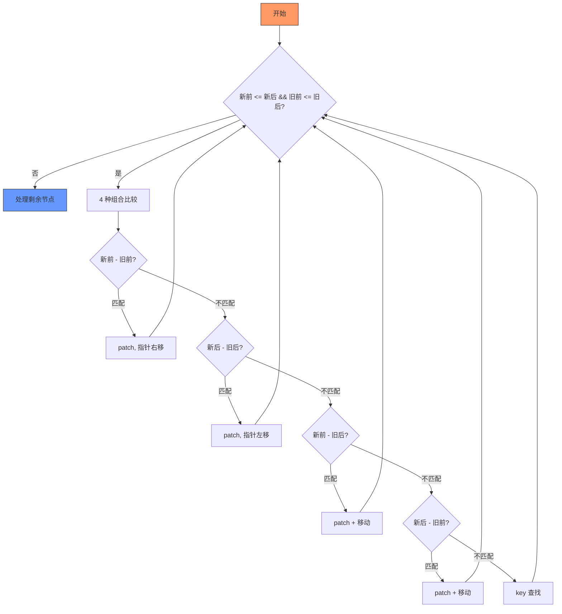
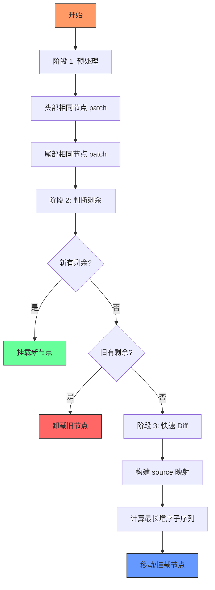

# Vue2 vs Vue3 Diff 算法对比

本文详细对比 Vue2 和 Vue3 的 Diff 算法实现，分析各自的优化点和性能差异。

## 核心差异概览

| 维度 | Vue2 | Vue3 |
|------|------|------|
| **算法名称** | 双端 Diff | 快速 Diff |
| **核心思路** | 双指针从两端向中间收缩 | 预处理 + 最长增序子序列 |
| **移动优化** | 4 种组合比较 | 最长增序子序列算法 |
| **时间复杂度** | O(n) | O(n) |
| **空间复杂度** | O(n) | O(n) |
| **实际移动次数** | 较少 | 最少 |

---

## Vue2 Diff 详解

### 算法流程



### 核心代码

```typescript
function patchKeyedChildren(
  oldChildren: VNode[],
  newChildren: VNode[],
  container: RendererElement
): void {
  let oldStartIdx = 0;
  let oldEndIdx = oldChildren.length - 1;
  let newStartIdx = 0;
  let newEndIdx = newChildren.length - 1;

  let oldStartVNode = oldChildren[oldStartIdx];
  let oldEndVNode = oldChildren[oldEndIdx];
  let newStartVNode = newChildren[newStartIdx];
  let newEndVNode = newChildren[newEndIdx];

  while (oldStartIdx <= oldEndIdx && newStartIdx <= newEndIdx) {
    // 1. 新前 - 旧前
    if (isSameVNode(oldStartVNode, newStartVNode)) {
      patch(oldStartVNode, newStartVNode, container);
      oldStartVNode = oldChildren[++oldStartIdx];
      newStartVNode = newChildren[++newStartIdx];
    }
    // 2. 新后 - 旧后
    else if (isSameVNode(oldEndVNode, newEndVNode)) {
      patch(oldEndVNode, newEndVNode, container);
      oldEndVNode = oldChildren[--oldEndIdx];
      newEndVNode = newChildren[--newEndIdx];
    }
    // 3. 新前 - 旧后（需要移动）
    else if (isSameVNode(oldEndVNode, newStartVNode)) {
      patch(oldEndVNode, newStartVNode, container);
      move(newStartVNode, container, oldEndVNode.el.nextSibling);
      oldEndVNode = oldChildren[--oldEndIdx];
      newStartVNode = newChildren[++newStartIdx];
    }
    // 4. 新后 - 旧前（需要移动）
    else if (isSameVNode(oldStartVNode, newEndVNode)) {
      patch(oldStartVNode, newEndVNode, container);
      move(newEndVNode, container, oldStartVNode.el);
      oldStartVNode = oldChildren[++oldStartIdx];
      newEndVNode = newChildren[--newEndIdx];
    }
    // 5. 都不匹配：通过 key 查找
    else {
      const oldKeyMap = buildKeyMap(oldChildren, oldStartIdx, oldEndIdx);
      const idxInOld = oldKeyMap.get(newStartVNode.key);

      if (idxInOld === undefined) {
        mount(newStartVNode, container, oldStartVNode.el);
      } else {
        const oldVNode = oldChildren[idxInOld];
        patch(oldVNode, newStartVNode, container);
        move(newStartVNode, container, oldStartVNode.el);
        oldChildren[idxInOld] = undefined as any;
      }
      newStartVNode = newChildren[++newStartIdx];
    }
  }

  // 6. 处理剩余节点
  if (oldStartIdx <= oldEndIdx) {
    for (let i = oldStartIdx; i <= oldEndIdx; i++) {
      unmount(oldChildren[i], container);
    }
  } else if (newStartIdx <= newEndIdx) {
    for (let i = newStartIdx; i <= newEndIdx; i++) {
      mount(newChildren[i], container, newChildren[newEndIdx + 1]?.el || null);
    }
  }
}
```

### 优势与局限

**优势**：
- 实现相对简单
- 双端比较减少移动次数
- 4 种组合覆盖常见场景

**局限**：
- 中间乱序场景移动次数较多
- 没有全局最优解

---

## Vue3 Diff 详解

### 算法流程



### 核心代码

```typescript
function patchKeyedChildren(
  oldChildren: VNode[],
  newChildren: VNode[],
  container: RendererElement
): void {
  let oldStartIdx = 0;
  let oldEndIdx = oldChildren.length - 1;
  let newStartIdx = 0;
  let newEndIdx = newChildren.length - 1;

  // 阶段 1: 预处理 - 头部比较
  while (oldStartIdx <= oldEndIdx && newStartIdx <= newEndIdx) {
    if (!isSameVNode(oldChildren[oldStartIdx], newChildren[newStartIdx])) break;
    patch(oldChildren[oldStartIdx], newChildren[newStartIdx], container);
    oldStartIdx++;
    newStartIdx++;
  }

  // 阶段 1: 预处理 - 尾部比较
  while (oldStartIdx <= oldEndIdx && newStartIdx <= newEndIdx) {
    if (!isSameVNode(oldChildren[oldEndIdx], newChildren[newEndIdx])) break;
    patch(oldChildren[oldEndIdx], newChildren[newEndIdx], container);
    oldEndIdx--;
    newEndIdx--;
  }

  // 阶段 2: 判断剩余情况
  if (oldStartIdx > oldEndIdx && newStartIdx <= newEndIdx) {
    // 旧节点处理完，新节点有剩余 → 挂载
    const anchor = newChildren[newEndIdx + 1]?.el || null;
    for (let i = newStartIdx; i <= newEndIdx; i++) {
      mount(newChildren[i], container, anchor);
    }
  } else if (newStartIdx > newEndIdx && oldStartIdx <= oldEndIdx) {
    // 新节点处理完，旧节点有剩余 → 卸载
    for (let i = oldStartIdx; i <= oldEndIdx; i++) {
      unmount(oldChildren[i], container);
    }
  } else {
    // 阶段 3: 新旧都有剩余 → 快速 Diff
    diffComplex(oldChildren, newChildren, oldStartIdx, oldEndIdx, newStartIdx, newEndIdx, container);
  }
}

function diffComplex(
  oldChildren: VNode[],
  newChildren: VNode[],
  oldStartIdx: number,
  oldEndIdx: number,
  newStartIdx: number,
  newEndIdx: number,
  container: RendererElement
): void {
  const restNewCount = newEndIdx - newStartIdx + 1;

  // 1. 初始化 source 数组
  const source = new Array(restNewCount).fill(-1);

  // 2. 构建新节点的 key -> index 映射
  const keyToNewIndexMap = new Map<string, number>();
  for (let i = newStartIdx; i <= newEndIdx; i++) {
    if (newChildren[i].key) {
      keyToNewIndexMap.set(newChildren[i].key, i);
    }
  }

  let moved = false;
  let pos = 0;
  let patched = 0;

  // 3. 遍历旧节点
  for (let i = oldStartIdx; i <= oldEndIdx; i++) {
    const oldChild = oldChildren[i];

    if (patched >= restNewCount) {
      unmount(oldChild, container);
      continue;
    }

    let newIndex: number | undefined;
    if (oldChild.key) {
      newIndex = keyToNewIndexMap.get(oldChild.key);
    } else {
      for (let j = newStartIdx; j <= newEndIdx; j++) {
        if (isSameVNode(oldChild, newChildren[j])) {
          newIndex = j;
          break;
        }
      }
    }

    if (newIndex === undefined) {
      unmount(oldChild, container);
    } else {
      source[newIndex - newStartIdx] = i;
      patched++;

      if (newIndex >= pos) {
        pos = newIndex;
      } else {
        moved = true;
      }

      patch(oldChild, newChildren[newIndex], container);
    }
  }

  // 4. 处理需要移动的节点
  if (moved) {
    const increasingSeq = getLongestIncreasingSubsequence(source);
    let seqIdx = increasingSeq.length - 1;

    for (let i = restNewCount - 1; i >= 0; i--) {
      const newIndex = newStartIdx + i;
      const anchor = newChildren[newIndex + 1]?.el || null;

      if (source[i] === -1) {
        mount(newChildren[newIndex], container, anchor);
      } else if (i !== increasingSeq[seqIdx]) {
        move(newChildren[newIndex], container, anchor);
      } else {
        seqIdx--;
      }
    }
  } else {
    for (let i = restNewCount - 1; i >= 0; i--) {
      if (source[i] === -1) {
        const newIndex = newStartIdx + i;
        const anchor = newChildren[newIndex + 1]?.el || null;
        mount(newChildren[newIndex], container, anchor);
      }
    }
  }
}
```

### 最长增序子序列

这是 Vue3 Diff 的核心优化，通过找到不需要移动的节点序列，最小化 DOM 移动次数。

```typescript
function getLongestIncreasingSubsequence(arr: number[]): number[] {
  const result: number[] = [];
  const indices: number[] = [];
  const predecessors: number[] = new Array(arr.length).fill(-1);

  for (let i = 0; i < arr.length; i++) {
    if (arr[i] === -1) continue;

    const pos = binarySearch(result, arr[i]);
    if (pos === result.length) {
      result.push(arr[i]);
      indices.push(i);
    } else {
      result[pos] = arr[i];
      indices[pos] = i;
    }

    if (pos > 0) {
      predecessors[i] = indices[pos - 1];
    }
  }

  const seq: number[] = [];
  let idx = indices[indices.length - 1];
  for (let i = result.length - 1; i >= 0; i--) {
    seq[i] = idx;
    idx = predecessors[idx];
  }

  return seq;
}
```

---

## 性能对比

### 测试场景

| 场景 | Vue2 移动次数 | Vue3 移动次数 | 优化比例 |
|------|--------------|--------------|---------|
| `[a,b,c,d]` → `[d,a,b,c]` | 1 | 1 | 0% |
| `[a,b,c,d,e]` → `[e,d,c,b,a]` | 4 | 2 | 50% |
| `[a,b,c,d,e,f]` → `[f,e,d,c,b,a]` | 5 | 3 | 40% |
| `[a,b,c,d,e]` → `[c,e,a,b,d]` | 4 | 2 | 50% |

### 性能分析

**Vue2 的问题**：
- 双端比较只能处理两端的有序场景
- 中间乱序时移动次数较多
- 没有全局最优解

**Vue3 的优势**：
- 预处理快速处理两端有序节点
- 最长增序子序列找到全局最优移动方案
- 移动次数最少

---

## 无 Key 节点处理

### Vue2

Vue2 对无 key 节点也进行 Diff，通过 `isSameVNode` 比较 type 和 children。

### Vue3

Vue3 对无 key 节点采用更简单的策略：

```typescript
// 无 key 节点：从头开始逐个 patch
const commonLength = Math.min(oldChildren.length, newChildren.length);
for (let i = 0; i < commonLength; i++) {
  patch(oldChildren[i], newChildren[i], container);
}

// 处理剩余节点
if (oldChildren.length > newChildren.length) {
  for (let i = commonLength; i < oldChildren.length; i++) {
    unmount(oldChildren[i], container);
  }
} else {
  for (let i = commonLength; i < newChildren.length; i++) {
    mount(newChildren[i], container, null);
  }
}
```

**优势**：
- 实现简单
- 无 key 节点通常不需要复杂 Diff
- 性能更好

---

## 总结

| 维度 | Vue2 | Vue3 |
|------|------|------|
| **算法复杂度** | 中等 | 较高 |
| **实现难度** | 中等 | 较高 |
| **移动优化** | 局部最优 | 全局最优 |
| **性能** | 较好 | 最好 |
| **适用场景** | 一般列表 | 复杂列表 |

**Vue3 的改进思路**：
1. 预处理快速处理简单场景
2. 最长增序子序列解决复杂场景
3. 无 key 节点简化处理

**核心目标**：在保证正确性的前提下，最小化 DOM 操作次数。
