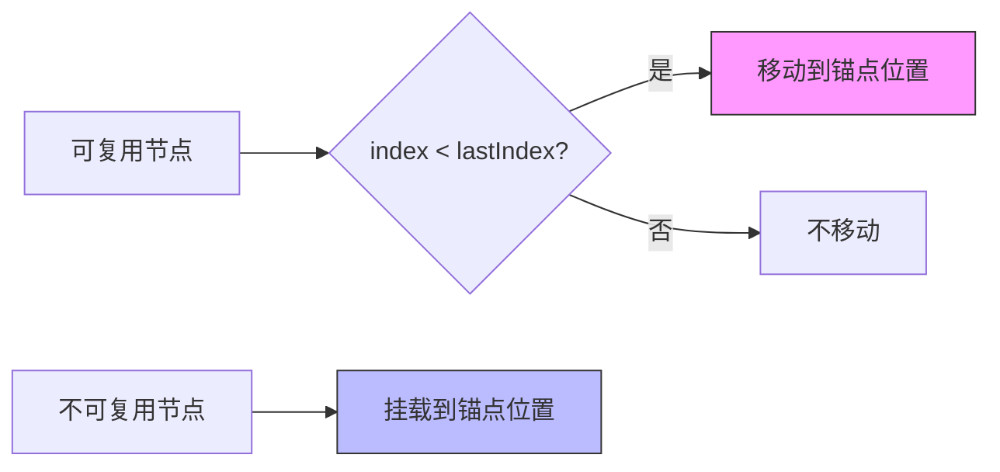
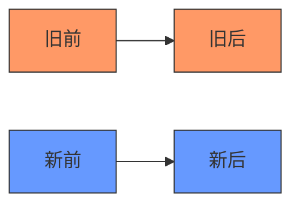
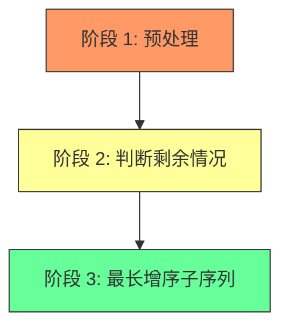

# Diff 算法的前世今生

Diff 算法是虚拟 DOM 的核心，用于计算新旧虚拟 DOM 树的差异，最小化 DOM 操作。

## 什么是 Diff

当数据变化时，Vue 会生成新的虚拟 DOM 树，然后通过 Diff 算法对比新旧两棵树，找出需要更新的节点，最后只更新变化的部分。

```typescript
// 简化的 patch 流程
function patch(oldVNode: VNode | null, newVNode: VNode, container: RendererElement): void {
  if (oldVNode === null) {
    // 挂载新节点
    mount(newVNode, container);
  } else if (oldVNode.type !== newVNode.type) {
    // 类型不同，替换节点
    replace(oldVNode, newVNode, container);
  } else {
    // 类型相同，更新节点
    update(oldVNode, newVNode);
  }
}
```

**核心目标**：最小化 DOM 操作次数，提升性能。

---

## 最简单的 Diff：单向遍历

### 算法思路

1. 将旧节点构造成 `key -> node` 的 Map
2. 声明变量 `lastIndex`，存储上次复用节点的索引
3. 遍历新节点，通过 key 从 Map 中查找是否存在旧节点
   - 存在：复用，判断是否需要移动
   - 不存在：挂载新节点
4. 处理完新节点后，卸载剩余的旧节点

### 代码实现

```typescript
function diffSimple(oldChildren: VNode[], newChildren: VNode[], container: RendererElement): void {
  // 1. 构建旧节点的 key -> node 映射
  const oldKeyMap = new Map<string, VNode>();
  oldChildren.forEach(child => {
    if (child.key) oldKeyMap.set(child.key, child);
  });

  let lastIndex = 0;

  // 2. 遍历新节点
  newChildren.forEach((newChild, newIndex) => {
    const oldChild = oldKeyMap.get(newChild.key);

    if (oldChild) {
      // 3. 复用：patch 新旧节点
      patch(oldChild, newChild, container);

      // 4. 判断是否需要移动
      const oldIndex = oldChildren.indexOf(oldChild);
      if (oldIndex < lastIndex) {
        // 需要移动：将节点移动到正确位置
        move(newChild, container, newIndex);
      } else {
        lastIndex = oldIndex;
      }

      // 5. 标记已处理
      oldKeyMap.delete(newChild.key);
    } else {
      // 6. 不可复用：挂载新节点
      mount(newChild, container, newIndex);
    }
  });

  // 7. 卸载剩余的旧节点
  oldKeyMap.forEach(oldChild => {
    unmount(oldChild, container);
  });
}
```

### 节点移动说明



**锚点选择**：
- 可复用：取上一个处理过的节点的 `nextSibling` 作为锚点
- 不可复用：取上一个处理过的节点的 `nextSibling`，若是第一个节点则取容器的第一个子节点

### 局限性

React 采用这种单向遍历的 Diff 算法。由于 React 的 current FiberNode 是树结构，JSX 通过 `React.createElement` 生成的是数组结构，因此无法采用双端 Diff 优化。

**值得注意的是**：Vue 在 Diff 过程中就完成了 DOM 操作，而 React 只是标记，具体 DOM 操作发生在 Commit 的 Mutation 阶段。

---

## 双端 Diff 算法（Vue2）

### 算法思路

对新旧节点列表分别采用**双指针遍历**，从两端向中间收缩。



**循环条件**：`新前 <= 新后 && 旧前 <= 旧后`

### 比较顺序

按照以下 4 种组合依次比较：

1. **新前 - 旧前**：相同则复用，指针同时右移
2. **新后 - 旧后**：相同则复用，指针同时左移
3. **新前 - 旧后**：相同则复用，节点需要移动（移到旧后后面）
4. **新后 - 旧前**：相同则复用，节点需要移动（移到旧前前面）

### 代码实现

```typescript
function diffDoubleEnd(
  oldChildren: VNode[],
  newChildren: VNode[],
  container: RendererElement
): void {
  let oldStartIdx = 0;
  let oldEndIdx = oldChildren.length - 1;
  let newStartIdx = 0;
  let newEndIdx = newChildren.length - 1;

  let oldStartVNode = oldChildren[oldStartIdx];
  let oldEndVNode = oldChildren[oldEndIdx];
  let newStartVNode = newChildren[newStartIdx];
  let newEndVNode = newChildren[newEndIdx];

  while (oldStartIdx <= oldEndIdx && newStartIdx <= newEndIdx) {
    // 1. 新前 - 旧前
    if (isSameVNode(oldStartVNode, newStartVNode)) {
      patch(oldStartVNode, newStartVNode, container);
      oldStartVNode = oldChildren[++oldStartIdx];
      newStartVNode = newChildren[++newStartIdx];
    }
    // 2. 新后 - 旧后
    else if (isSameVNode(oldEndVNode, newEndVNode)) {
      patch(oldEndVNode, newEndVNode, container);
      oldEndVNode = oldChildren[--oldEndIdx];
      newEndVNode = newChildren[--newEndIdx];
    }
    // 3. 新前 - 旧后（需要移动）
    else if (isSameVNode(oldEndVNode, newStartVNode)) {
      patch(oldEndVNode, newStartVNode, container);
      // 移动到旧后后面
      move(newStartVNode, container, oldEndVNode.el.nextSibling);
      oldEndVNode = oldChildren[--oldEndIdx];
      newStartVNode = newChildren[++newStartIdx];
    }
    // 4. 新后 - 旧前（需要移动）
    else if (isSameVNode(oldStartVNode, newEndVNode)) {
      patch(oldStartVNode, newEndVNode, container);
      // 移动到旧前前面
      move(newEndVNode, container, oldStartVNode.el);
      oldStartVNode = oldChildren[++oldStartIdx];
      newEndVNode = newChildren[--newEndIdx];
    }
    // 5. 都不匹配：通过 key 查找
    else {
      const oldKeyMap = buildKeyMap(oldChildren, oldStartIdx, oldEndIdx);
      const idxInOld = oldKeyMap.get(newStartVNode.key);

      if (idxInOld === undefined) {
        // 新节点，挂载
        mount(newStartVNode, container, oldStartVNode.el);
      } else {
        const oldVNode = oldChildren[idxInOld];
        patch(oldVNode, newStartVNode, container);
        // 移动到旧前前面
        move(newStartVNode, container, oldStartVNode.el);
        oldChildren[idxInOld] = undefined as any;
      }
      newStartVNode = newChildren[++newStartIdx];
    }
  }

  // 6. 处理剩余节点
  if (oldStartIdx <= oldEndIdx) {
    // 旧节点有剩余，卸载
    for (let i = oldStartIdx; i <= oldEndIdx; i++) {
      unmount(oldChildren[i], container);
    }
  } else if (newStartIdx <= newEndIdx) {
    // 新节点有剩余，挂载
    for (let i = newStartIdx; i <= newEndIdx; i++) {
      mount(newChildren[i], container, newChildren[newEndIdx + 1]?.el || null);
    }
  }
}
```

### 优势对比

**案例**：`[a, b, c, d]` → `[d, a, b, c]`

| 算法 | 移动次数 | 说明 |
|------|---------|------|
| 单向遍历 | 3 次 | a、b、c 都需要移动 |
| 双端 Diff | 1 次 | 只需要移动 d 到最前面 |

**双端 Diff 的优势**：通过从两端同时比较，可以更快地找到可复用节点，减少移动次数。

---

## 快速 Diff 算法（Vue3）

### 算法思路

快速 Diff 是 Vue3 的核心优化，分为三个阶段：



### 阶段 1：预处理

双指针从两端向中间遍历，将可复用且不需要移动的节点先 patch 完。

```typescript
// 从头部开始比较
while (oldStartIdx <= oldEndIdx && newStartIdx <= newEndIdx) {
  if (!isSameVNode(oldChildren[oldStartIdx], newChildren[newStartIdx])) break;
  patch(oldChildren[oldStartIdx], newChildren[newStartIdx], container);
  oldStartIdx++;
  newStartIdx++;
}

// 从尾部开始比较
while (oldStartIdx <= oldEndIdx && newStartIdx <= newEndIdx) {
  if (!isSameVNode(oldChildren[oldEndIdx], newChildren[newEndIdx])) break;
  patch(oldChildren[oldEndIdx], newChildren[newEndIdx], container);
  oldEndIdx--;
  newEndIdx--;
}
```

### 阶段 2：判断剩余情况

```typescript
if (oldStartIdx > oldEndIdx && newStartIdx <= newEndIdx) {
  // 旧节点处理完，新节点有剩余 → 挂载
  const anchor = newChildren[newEndIdx + 1]?.el || null;
  for (let i = newStartIdx; i <= newEndIdx; i++) {
    mount(newChildren[i], container, anchor);
  }
} else if (newStartIdx > newEndIdx && oldStartIdx <= oldEndIdx) {
  // 新节点处理完，旧节点有剩余 → 卸载
  for (let i = oldStartIdx; i <= oldEndIdx; i++) {
    unmount(oldChildren[i], container);
  }
} else {
  // 新旧都有剩余 → 进入阶段 3
  diffComplex(oldChildren, newChildren, oldStartIdx, oldEndIdx, newStartIdx, newEndIdx, container);
}
```

### 阶段 3：最长增序子序列

这是快速 Diff 的核心，通过**最长增序子序列算法**找到不需要移动的节点，最小化 DOM 移动次数。

```typescript
function diffComplex(
  oldChildren: VNode[],
  newChildren: VNode[],
  oldStartIdx: number,
  oldEndIdx: number,
  newStartIdx: number,
  newEndIdx: number,
  container: RendererElement
): void {
  const restNewCount = newEndIdx - newStartIdx + 1;
  const restOldCount = oldEndIdx - oldStartIdx + 1;

  // 1. 初始化 source 数组：newIndex -> oldIndex 的映射
  const source = new Array(restNewCount).fill(-1);

  // 2. 构建新节点的 key -> index 映射
  const keyToNewIndexMap = new Map<string, number>();
  for (let i = newStartIdx; i <= newEndIdx; i++) {
    if (newChildren[i].key) {
      keyToNewIndexMap.set(newChildren[i].key, i);
    }
  }

  let moved = false; // 是否需要移动
  let pos = 0; // 记录上个可复用节点的 newIndex
  let patched = 0; // 已处理的数量

  // 3. 遍历旧节点
  for (let i = oldStartIdx; i <= oldEndIdx; i++) {
    const oldChild = oldChildren[i];

    if (patched >= restNewCount) {
      // 新节点处理完，卸载旧节点
      unmount(oldChild, container);
      continue;
    }

    let newIndex: number | undefined;
    if (oldChild.key) {
      newIndex = keyToNewIndexMap.get(oldChild.key);
    } else {
      // 无 key，遍历新节点查找
      for (let j = newStartIdx; j <= newEndIdx; j++) {
        if (isSameVNode(oldChild, newChildren[j])) {
          newIndex = j;
          break;
        }
      }
    }

    if (newIndex === undefined) {
      // 旧节点在新节点中不存在，卸载
      unmount(oldChild, container);
    } else {
      // 复用：patch 并更新 source
      source[newIndex - newStartIdx] = i;
      patched++;

      if (newIndex >= pos) {
        pos = newIndex;
      } else {
        moved = true; // 需要移动
      }

      patch(oldChild, newChildren[newIndex], container);
    }
  }

  // 4. 处理需要移动的节点
  if (moved) {
    // 计算最长增序子序列
    const increasingSeq = getLongestIncreasingSubsequence(source);
    let seqIdx = increasingSeq.length - 1;

    // 逆序遍历，从后往前处理
    for (let i = restNewCount - 1; i >= 0; i--) {
      const newIndex = newStartIdx + i;
      const anchor = newChildren[newIndex + 1]?.el || null;

      if (source[i] === -1) {
        // 新节点，挂载
        mount(newChildren[newIndex], container, anchor);
      } else if (i !== increasingSeq[seqIdx]) {
        // 需要移动
        move(newChildren[newIndex], container, anchor);
      } else {
        // 不需要移动
        seqIdx--;
      }
    }
  } else {
    // 不需要移动，只需要挂载新节点
    for (let i = restNewCount - 1; i >= 0; i--) {
      if (source[i] === -1) {
        const newIndex = newStartIdx + i;
        const anchor = newChildren[newIndex + 1]?.el || null;
        mount(newChildren[newIndex], container, anchor);
      }
    }
  }
}
```

### 最长增序子序列算法

```typescript
function getLongestIncreasingSubsequence(arr: number[]): number[] {
  const result: number[] = [];
  const indices: number[] = [];
  const predecessors: number[] = new Array(arr.length).fill(-1);

  for (let i = 0; i < arr.length; i++) {
    if (arr[i] === -1) continue;

    const pos = binarySearch(result, arr[i]);
    if (pos === result.length) {
      result.push(arr[i]);
      indices.push(i);
    } else {
      result[pos] = arr[i];
      indices[pos] = i;
    }

    if (pos > 0) {
      predecessors[i] = indices[pos - 1];
    }
  }

  // 回溯构建最长增序子序列
  const seq: number[] = [];
  let idx = indices[indices.length - 1];
  for (let i = result.length - 1; i >= 0; i--) {
    seq[i] = idx;
    idx = predecessors[idx];
  }

  return seq;
}

function binarySearch(arr: number[], target: number): number {
  let left = 0;
  let right = arr.length;
  while (left < right) {
    const mid = (left + right) >> 1;
    if (arr[mid] < target) left = mid + 1;
    else right = mid;
  }
  return left;
}
```

### 算法示例

```
旧节点：[a, b, c, d, e]
新节点：[a, c, b, e, f]

阶段 1 预处理：
- 头部：a 相同，patch
- 尾部：e 相同，patch

剩余：
- 旧：[b, c, d]
- 新：[c, b, f]

阶段 3 快速 Diff：
- source: [1, 0, -1]（c->1, b->0, f->-1）
- 最长增序子序列：[0]（只有 b 不需要移动）
- 移动：c 移到 b 前面，f 挂载到末尾
```

---

## 三种 Diff 算法对比

| 特性 | 单向遍历 | 双端 Diff | 快速 Diff |
|------|---------|----------|----------|
| **实现框架** | React | Vue2 | Vue3 |
| **时间复杂度** | O(n) | O(n) | O(n) |
| **移动次数** | 较多 | 较少 | 最少 |
| **实现复杂度** | 简单 | 中等 | 复杂 |
| **核心优化** | 无 | 双端比较 | 最长增序子序列 |
| **适用场景** | 简单列表 | 一般列表 | 复杂列表 |

---

## 总结

Diff 算法的演进思路：

1. **单向遍历**：最简单的实现，但移动次数多
2. **双端 Diff**：从两端同时比较，减少移动次数
3. **快速 Diff**：预处理 + 最长增序子序列，移动次数最少

**核心目标**：在保证正确性的前提下，最小化 DOM 操作次数。
