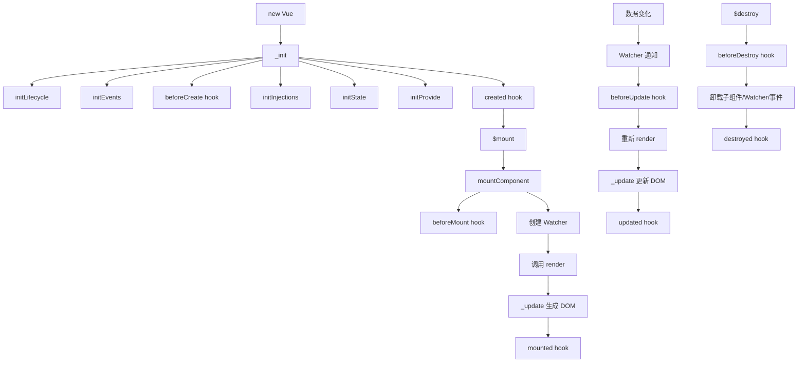
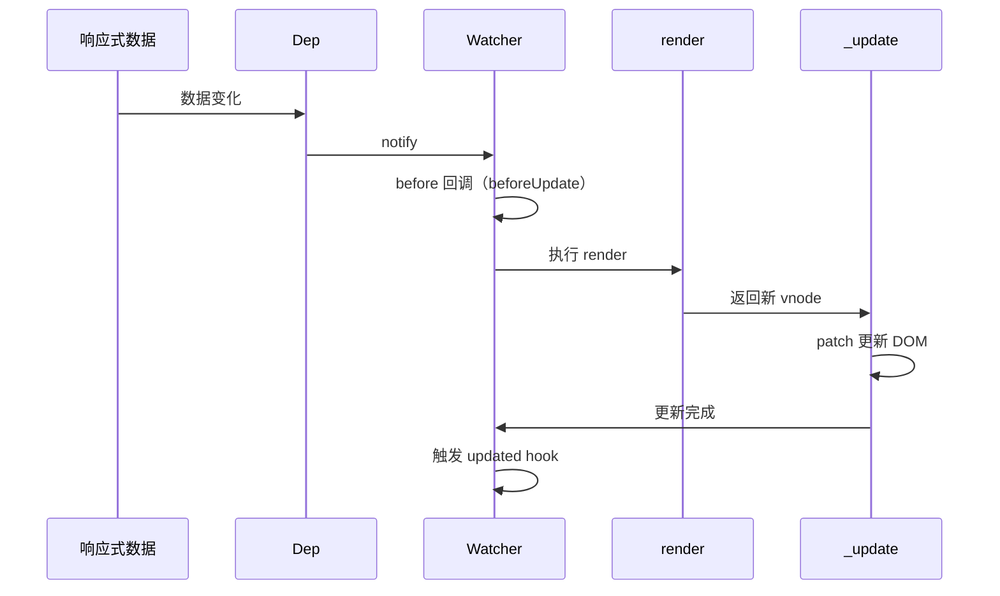

# Vue2 生命周期

## 整体流程



## 生命周期钩子

| 钩子 | 触发时机 | 可访问 |
|------|---------|--------|
| beforeCreate | 实例初始化后，数据观测和事件配置之前 | 无 |
| created | 实例创建完成后，数据观测、事件配置完成 | data、methods、computed、watch |
| beforeMount | 挂载开始之前，render 首次调用前 | 同上，$el 未挂载 |
| mounted | 挂载完成后，$el 已替换为真实 DOM | 同上，可访问 DOM |
| beforeUpdate | 数据变化后，DOM 更新前 | 最新数据，旧 DOM |
| updated | DOM 更新完成后 | 最新数据和 DOM |
| beforeDestroy | 实例销毁之前 | 同上，实例仍可用 |
| destroyed | 实例销毁完成后 | 所有绑定已解除 |

## 初始化流程

### initMixin

给 Vue 原型挂载 `_init` 函数，实例化 Vue 时执行：

```typescript
function initMixin(Vue: typeof Component): void {
  Vue.prototype._init = function (options?: Record<string, any>) {
    const vm: Component = this;

    // 合并 options
    vm.$options = mergeOptions(
      resolveConstructorOptions(vm.constructor),
      options || {},
      vm
    );

    // 初始化实例属性
    vm._self = vm;
    initLifecycle(vm);
    initEvents(vm);
    initRender(vm);

    // beforeCreate hook
    callHook(vm, 'beforeCreate');

    // 初始化 injections
    initInjections(vm);

    // 初始化 state（props、methods、data、computed、watch）
    initState(vm);

    // 初始化 provide
    initProvide(vm);

    // created hook
    callHook(vm, 'created');

    // 挂载
    if (vm.$options.el) {
      vm.$mount(vm.$options.el);
    }
  };
}
```

### initState

```typescript
function initState(vm: Component): void {
  const opts = vm.$options;

  if (opts.props) initProps(vm, opts.props);
  if (opts.methods) initMethods(vm, opts.methods);
  if (opts.data) {
    initData(vm);
  } else {
    observe((vm._data = {}), true);
  }
  if (opts.computed) initComputed(vm, opts.computed);
  if (opts.watch && opts.watch !== nativeWatch) {
    initWatch(vm, opts.watch);
  }
}
```

### mountComponent

```typescript
function mountComponent(
  vm: Component,
  el: Element | null | undefined,
): Component {
  vm.$el = el;

  // beforeMount hook
  callHook(vm, 'beforeMount');

  // 定义更新函数
  let updateComponent = () => {
    vm._update(vm._render());
  };

  // 创建组件级 Watcher
  new Watcher(
    vm,
    updateComponent,
    noop,
    {
      before() {
        // 数据变化时，DOM 更新前触发
        if (vm._isMounted && !vm._isDestroyed) {
          callHook(vm, 'beforeUpdate');
        }
      },
    },
    true /* isRenderWatcher */
  );

  // mounted hook
  callHook(vm, 'mounted');

  return vm;
}
```

## 更新流程

当响应式数据变化时，Dep 通知 Watcher 重新执行：



## 销毁流程

```typescript
Vue.prototype.$destroy = function (): void {
  const vm: Component = this;

  if (vm._isBeingDestroyed) return;

  // beforeDestroy hook
  callHook(vm, 'beforeDestroy');

  vm._isBeingDestroyed = true;

  // 移除父组件引用
  const parent = vm.$parent;
  if (parent && !parent._isBeingDestroyed && !vm.$options.abstract) {
    remove(parent.$children, vm);
  }

  // 卸载 Watcher
  if (vm._watcher) {
    vm._watcher.teardown();
  }

  // 移除所有依赖
  let i = vm._watchers.length;
  while (i--) {
    vm._watchers[i].teardown();
  }

  // 移除事件监听
  if (vm._events && Object.keys(vm._events).length) {
    vm.$off();
  }

  // 卸载 DOM
  if (vm.$el) {
    vm.__patch__(vm._vnode, null);
  }

  // destroyed hook
  callHook(vm, 'destroyed');

  // 关闭实例
  vm.$off();
  if (vm.$vnode) {
    vm.$vnode.parent = null;
  }
};
```

## 关键 Mixin

### stateMixin

```typescript
function stateMixin(Vue: typeof Component): void {
  // $data、$props
  Object.defineProperty(Vue.prototype, '$data', {
    get() { return this._data; },
  });

  Object.defineProperty(Vue.prototype, '$props', {
    get() { return this._props; },
  });

  // $set、$delete、$watch
  Vue.prototype.$set = set;
  Vue.prototype.$delete = del;
  Vue.prototype.$watch = function (
    expOrFn: string | Function,
    cb: any,
    options?: Object
  ): Function {
    const watcher = new Watcher(vm, expOrFn, cb, options);
    if (options.immediate) {
      cb.call(vm, watcher.value);
    }
    return function unwatchFn() {
      watcher.teardown();
    };
  };
}
```

### eventsMixin

```typescript
function eventsMixin(Vue: typeof Component): void {
  Vue.prototype.$on = function (event: string, fn: Function): Component {
    (this._events[event] || (this._events[event] = [])).push(fn);
    return this;
  };

  Vue.prototype.$emit = function (event: string): Component {
    const cbs = this._events[event];
    if (cbs) {
      cbs.forEach(cb => cb.apply(this, args));
    }
    return this;
  };

  Vue.prototype.$off = function (event?: string, fn?: Function): Component {
    if (!arguments.length) {
      this._events = Object.create(null);
      return this;
    }
    // 移除指定事件或回调
  };

  Vue.prototype.$once = function (event: string, fn: Function): Component {
    const on = () => {
      this.$off(event, on);
      fn.apply(this, arguments);
    };
    on.fn = fn;
    this.$on(event, on);
    return this;
  };
}
```

### renderMixin

```typescript
function renderMixin(Vue: typeof Component): void {
  Vue.prototype.$nextTick = function (fn: Function): Promise<void> {
    return nextTick(fn, this);
  };

  Vue.prototype._render = function (): VNode {
    const vm: Component = this;
    const { render, _parentVnode } = vm.$options;
    const vnode = render.call(vm._renderProxy, vm.$createElement);
    return vnode;
  };
}
```

## computed 实现

```typescript
function initComputed(vm: Component, computed: Object): void {
  const watchers = (vm._computedWatchers = Object.create(null));

  for (const key in computed) {
    const userDef = computed[key];
    const getter = typeof userDef === 'function' ? userDef : userDef.get;

    // 创建 computed Watcher（lazy: true）
    watchers[key] = new Watcher(vm, getter, noop, { lazy: true });

    // 劫持属性
    defineComputed(vm, key, userDef);
  }
}

function createComputedGetter(key: string): Function {
  return function computedGetter(this: Component) {
    const watcher = this._computedWatchers?.[key];
    if (watcher) {
      if (watcher.dirty) {
        watcher.evaluate();  // 重新计算
      }
      if (Dep.target) {
        watcher.depend();  // 收集依赖
      }
      return watcher.value;
    }
  };
}
```

## nextTick 实现

```typescript
const callbacks: Function[] = [];
let pending = false;

function flushCallbacks(): void {
  pending = false;
  const copies = callbacks.slice(0);
  callbacks.length = 0;
  for (let i = 0; i < copies.length; i++) {
    copies[i]();
  }
}

// 优先级降级：Promise → MutationObserver → setImmediate → setTimeout
let timerFunc: () => void;

if (typeof Promise !== 'undefined') {
  const p = Promise.resolve();
  timerFunc = () => p.then(flushCallbacks);
} else if (typeof MutationObserver !== 'undefined') {
  let counter = 1;
  const observer = new MutationObserver(flushCallbacks);
  const textNode = document.createTextNode(String(counter));
  observer.observe(textNode, { characterData: true });
  timerFunc = () => {
    counter = (counter + 1) % 2;
    textNode.data = String(counter);
  };
} else if (typeof setImmediate !== 'undefined') {
  timerFunc = () => setImmediate(flushCallbacks);
} else {
  timerFunc = () => setTimeout(flushCallbacks, 0);
}

export function nextTick(cb?: Function, ctx?: Object): Promise<void> {
  callbacks.push(() => {
    if (cb) {
      try {
        cb.call(ctx);
      } catch (e) {
        handleError(e, ctx, 'nextTick');
      }
    }
  });

  if (!pending) {
    pending = true;
    timerFunc();
  }

  if (!cb && typeof Promise !== 'undefined') {
    return new Promise(resolve => {
      callbacks.push(resolve);
    });
  }
}
```
