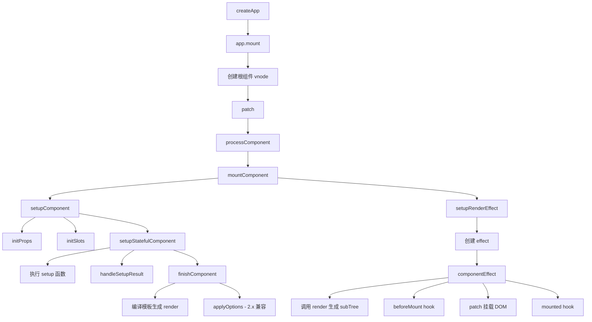
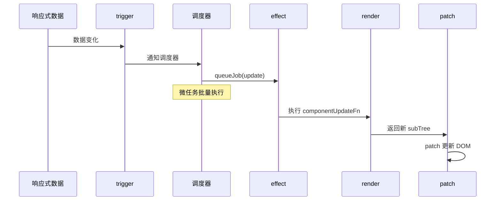

# Vue3 生命周期

## 整体流程



## 生命周期钩子对比

| Vue2 | Vue3 (Options API) | Vue3 (Composition API) |
|------|-------------------|----------------------|
| beforeCreate | beforeCreate | setup() |
| created | created | setup() |
| beforeMount | beforeMount | onBeforeMount |
| mounted | mounted | onMounted |
| beforeUpdate | beforeUpdate | onBeforeUpdate |
| updated | updated | onUpdated |
| beforeDestroy | beforeUnmount | onBeforeUnmount |
| destroyed | unmounted | onUnmounted |
| errorCaptured | errorCaptured | onErrorCaptured |
| - | - | onRenderTracked |
| - | - | onRenderTriggered |

## 组件挂载流程

### createApp

```typescript
export function createApp(rootComponent: any, rootProps: any = null): App {
  const app: App = {
    mount(rootContainer: any) {
      // 1. 创建根组件 vnode
      const vnode = createVNode(rootComponent, rootProps);

      // 2. 调用 patch
      patch(null, vnode, rootContainer);

      return vnode.component!.proxy;
    },
    use(plugin: any) { /* ... */ },
    mixin(mixin: any) { /* ... */ },
    component(name: string, component: any) { /* ... */ },
    directive(name: string, directive: any) { /* ... */ },
    provide(key: any, value: any) { /* ... */ },
    unmount() { /* ... */ },
  };

  return app;
}
```

### mountComponent

```typescript
export function mountComponent(
  initialVNode: VNode,
  container: RendererElement,
  anchor: RendererNode | null,
): void {
  // 1. 创建组件实例
  const instance: ComponentInternalInstance =
    (initialVNode.component = createComponentInstance(initialVNode));

  // 2. 设置组件（props、slots、setup）
  setupComponent(instance);

  // 3. 设置渲染 effect
  setupRenderEffect(instance, initialVNode, container, anchor);
}
```

### setupComponent

```typescript
export function setupComponent(instance: ComponentInternalInstance): void {
  const { props, children } = instance.vnode;

  // 1. 初始化 props
  initProps(instance, props);

  // 2. 初始化 slots
  initSlots(instance, children);

  // 3. 设置有状态组件
  setupStatefulComponent(instance);
}

function setupStatefulComponent(instance: ComponentInternalInstance): void {
  const Component = instance.type;

  // 执行 setup 函数
  const setupResult = callWithErrorHandling(
    Component.setup,
    instance,
    [instance.props, { emit: instance.emit, slots: instance.slots }]
  );

  // 处理 setup 返回值
  handleSetupResult(instance, setupResult);

  // 完成组件设置
  finishComponentSetup(instance);
}
```

### setupRenderEffect

```typescript
export function setupRenderEffect(
  instance: ComponentInternalInstance,
  initialVNode: VNode,
  container: RendererElement,
  anchor: RendererNode | null,
): void {
  // 创建组件级别的 effect
  const componentUpdateFn = () => {
    if (!instance.isMounted) {
      // ===== 挂载阶段 =====
      const { bm, m } = instance;

      // beforeMount hook
      if (bm) invokeHooks(bm);

      // 调用 render 生成 subTree
      const subTree = (instance.subTree = renderComponentRoot(instance));

      // patch 挂载 DOM
      patch(null, subTree, container, anchor);

      initialVNode.el = subTree.el;

      // mounted hook
      if (m) queuePostFlushCb(m);

      instance.isMounted = true;
    } else {
      // ===== 更新阶段 =====
      const { bu, u } = instance;

      // beforeUpdate hook
      if (bu) invokeHooks(bu);

      // 调用 render 生成新 subTree
      const subTree = renderComponentRoot(instance);

      // patch 更新 DOM
      patch(instance.subTree, subTree, container, anchor);

      instance.subTree = subTree;

      // updated hook
      if (u) queuePostFlushCb(u);
    }
  };

  // 创建 effect，scheduler 控制批量更新
  const effect = (instance.effect = new ReactiveEffect(
    componentUpdateFn,
    () => queueJob(update),
    instance.scope
  ));

  const update = (instance.update = () => effect.run());
  update.id = instance.uid;

  // 首次执行
  update();
}
```

## 组件更新流程

当响应式数据变化时，触发组件 effect 重新执行：



```typescript
// 更新时的 effect 执行
const componentUpdateFn = () => {
  // beforeUpdate hook
  if (bu) invokeHooks(bu);

  // 重新 render
  const subTree = renderComponentRoot(instance);

  // patch 对比更新
  patch(instance.subTree, subTree, container, anchor);

  instance.subTree = subTree;

  // updated hook
  if (u) queuePostFlushCb(u);
};
```

## 组件卸载流程

```typescript
export function unmountComponent(instance: ComponentInternalInstance): void {
  const { bum, um } = instance;

  // beforeUnmount hook
  if (bum) invokeHooks(bum);

  // 卸载子树
  unmount(instance.subTree);

  // 卸载 effect
  instance.effect!.stop();

  // unmounted hook
  if (um) queuePostFlushCb(um);
}
```

## Composition API 生命周期注册

```typescript
// 当前组件实例（setup 执行前设置）
let currentInstance: ComponentInternalInstance | null = null;

export function onMounted(fn: () => void): void {
  registerHook('m', fn);
}

export function onUnmounted(fn: () => void): void {
  registerHook('um', fn);
}

function registerHook(lifecycleKey: string, fn: () => void): void {
  const instance = currentInstance;
  if (instance) {
    // 将回调注册到实例上
    const hooks = instance[lifecycleKey] || (instance[lifecycleKey] = []);
    hooks.push(fn);
  }
}
```

## 新增的生命周期钩子

### onRenderTracked

追踪渲染依赖，每次 render 时触发：

```typescript
export function onRenderTracked(fn: (event: DebuggerEvent) => void): void {
  registerHook('rtg', fn);
}
```

### onRenderTriggered

追踪渲染触发原因，响应式数据变化导致重新 render 时触发：

```typescript
export function onRenderTriggered(fn: (event: DebuggerEvent) => void): void {
  registerHook('rt', fn);
}
```

## Vue2 vs Vue3 生命周期对比

| 维度 | Vue2 | Vue3 |
|------|------|------|
| **初始化入口** | `new Vue()` → `_init()` | `createApp()` → `mount()` |
| **setup 阶段** | 无 | setup() 在 beforeCreate 之前执行 |
| **effect 机制** | Watcher | ReactiveEffect |
| **调度器** | 队列 + 微任务 | queueJob + 微任务 |
| **卸载钩子** | beforeDestroy / destroyed | beforeUnmount / unmounted |
| **调试钩子** | 无 | onRenderTracked / onRenderTriggered |
| **错误处理** | errorCaptured | onErrorCaptured |
