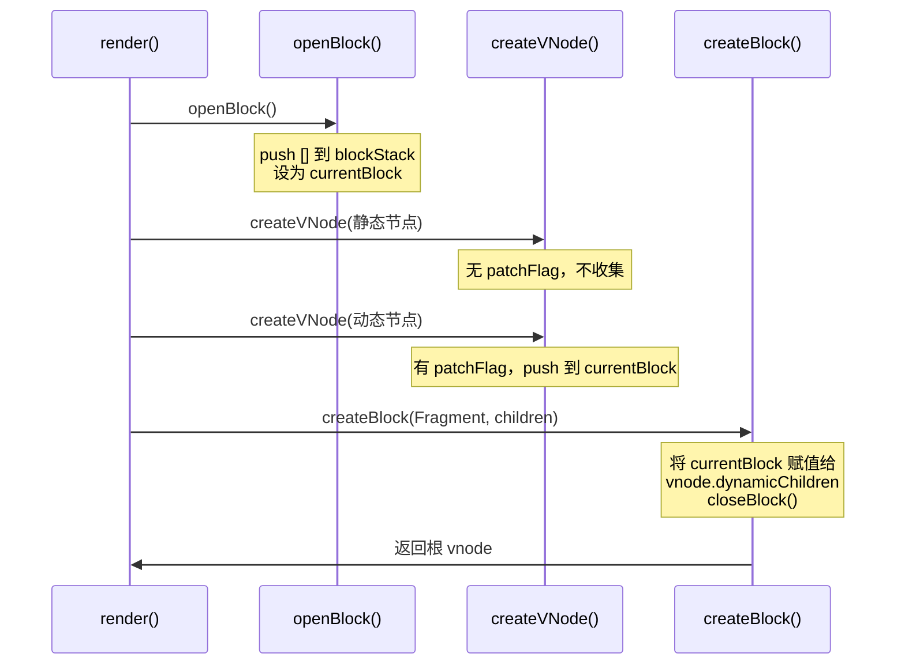

# Vue3 openBlock 机制

`openBlock` 是 Vue3 编译优化的核心机制之一，用于收集动态节点，构建 Block Tree，实现靶向更新。

## 整体流程



## blockStack

`blockStack` 是一个数组结构，用于存储 block（也是数组），整体形成多维数组结构，描述动态 vnode 的父子关系。

```typescript
const blockStack: (VNode[] | null)[] = [];
let currentBlock: (VNode[] | null) = null;
let shouldTrack = 0;  // 是否收集动态节点
let disableTracking = false;  // 是否禁用收集（v-for 场景）
```

## 渲染函数分析

```javascript
export function render(_ctx, _cache, $props, $setup, $data, $options) {
  const _component_Demo = _resolveComponent("Demo")

  return (_openBlock(), _createBlock(_Fragment, null, [
    _createVNode("div", null, "Hello World!"),
    _createVNode("div", {
      onClick: $event => (_ctx.console.log(123))
    }, _toDisplayString(_ctx.hh), 9 /* TEXT, PROPS */, ["onClick"]),
    _createVNode(_component_Demo)
  ], 64 /* STABLE_FRAGMENT */))
}
```

调用顺序：`openBlock` → 解析参数（`createVNode`）→ `createBlock`

## openBlock / closeBlock

```typescript
export function openBlock(disableTracking = false): void {
  blockStack.push(
    currentBlock = disableTracking ? null : []
  );
}

export function closeBlock(): void {
  blockStack.pop();
  currentBlock = blockStack[blockStack.length - 1] || null;
}
```

`openBlock` 将新数组 push 到 `blockStack` 栈中，设为 `currentBlock`。后续 `createVNode` 会将动态节点收集到这个数组中。

## createBlock

```typescript
export function createBlock(
  type: VNodeTypes | ClassComponent,
  props?: Record<string, any> | null,
  children?: any,
  patchFlag?: number,
  dynamicProps?: string[]
): VNode {
  // 1. 创建根节点 vnode
  const vnode = createVNode(
    type,
    props,
    children,
    patchFlag,
    dynamicProps,
    true /* isBlock: 防止 block 节点追踪自身 */
  );

  // 2. 将 currentBlock 赋值给 vnode.dynamicChildren
  vnode.dynamicChildren = currentBlock || (EMPTY_ARR as any);

  // 3. 关闭当前 block
  closeBlock();

  // 4. 将当前 block 作为子节点 push 到父 block
  if (shouldTrack > 0 && currentBlock) {
    currentBlock.push(vnode);
  }

  return vnode;
}
```

关键步骤：
1. 调用 `createVNode` 生成根节点（若无则生成 Fragment）
2. 将 `currentBlock`（已收集的动态节点）赋值给 `vnode.dynamicChildren`
3. 调用 `closeBlock()` 弹出当前 block
4. 将当前 vnode push 到父 block 中（建立父子关系）

## createVNode

```typescript
export function createVNode(
  type: VNodeTypes,
  props?: Record<string, any> | null,
  children?: any,
  patchFlag?: number,
  dynamicProps?: string[] | null,
  isBlockNode = false
): VNode {
  const vnode = {
    type,
    props,
    children,
    patchFlag,
    dynamicProps,
    // ... 其他属性
  };

  // 收集动态节点到 currentBlock
  if (
    shouldTrack > 0 &&
    !isBlockNode &&              // 避免 block 节点追踪自身
    currentBlock &&              // 存在当前 block
    (patchFlag > 0 ||            // 有动态标记
     shapeFlag & ShapeFlags.COMPONENT) &&  // 或组件节点
    patchFlag !== PatchFlags.HYDRATE_EVENTS  // 非纯事件标记
  ) {
    currentBlock.push(vnode);
  }

  return vnode;
}
```

收集条件：
- `shouldTrack > 0`：允许收集
- `!isBlockNode`：不是 block 节点自身（防止循环引用）
- `currentBlock` 存在：在 block 作用域内
- `patchFlag > 0` 或 `COMPONENT`：有动态属性或是组件
- `patchFlag !== HYDRATE_EVENTS`：非纯事件监听（hydration 优化）

## disableTracking 的作用

`v-for` 指令渲染的子节点会完全 diff（通过 key），不需要收集到 block 中：

```javascript
// v-for 场景
export function render(_ctx, _cache, $props, $setup, $data, $options) {
  return (_openBlock(), _createBlock(_Fragment, null, [
    // v-for 列表，disableTracking = true
    (_openBlock(true), _createBlock(_Fragment, null, _renderList(_ctx.items, (item) => {
      return _createVNode("li", { key: item.id }, item.name)
    }), 128 /* KEYED_FRAGMENT */))
  ], 64 /* STABLE_FRAGMENT */))
}
```

`openBlock(true)` 传入 `disableTracking = true`，此时 `currentBlock = null`，`createVNode` 不会收集节点。因为 `v-for` 列表需要完整 diff，靶向更新不适用。

## 总结

`openBlock` 机制的核心目的：

1. **构建 dynamicChildren 数组**：存储当前 block 内的动态节点
2. **靶向更新**：patch 时直接遍历 `dynamicChildren`，跳过静态节点
3. **层级关系**：通过 `blockStack` 维护嵌套 block 的父子关系
4. **v-for 特殊处理**：`disableTracking` 禁用收集，走完整 diff
