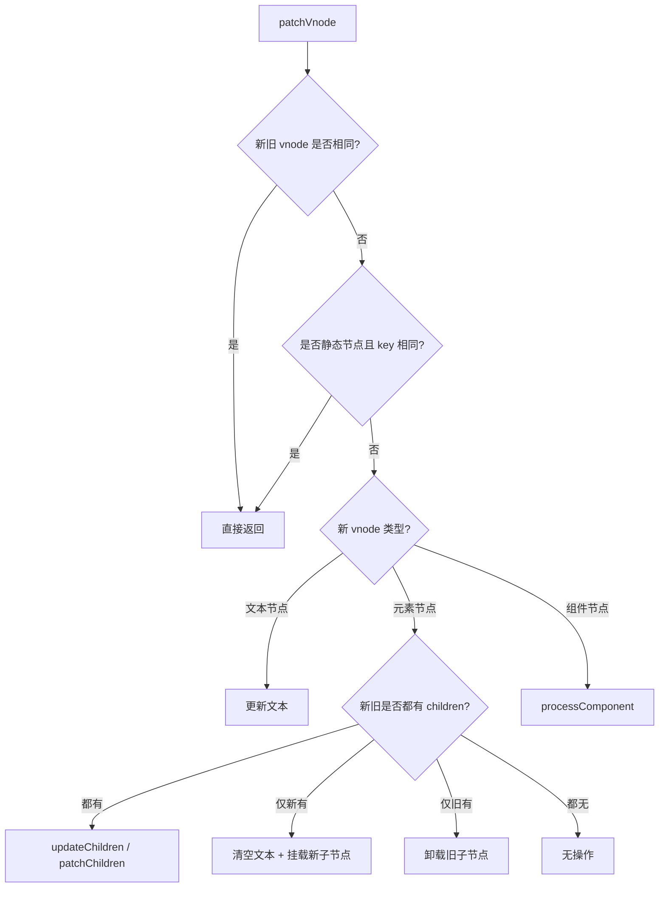
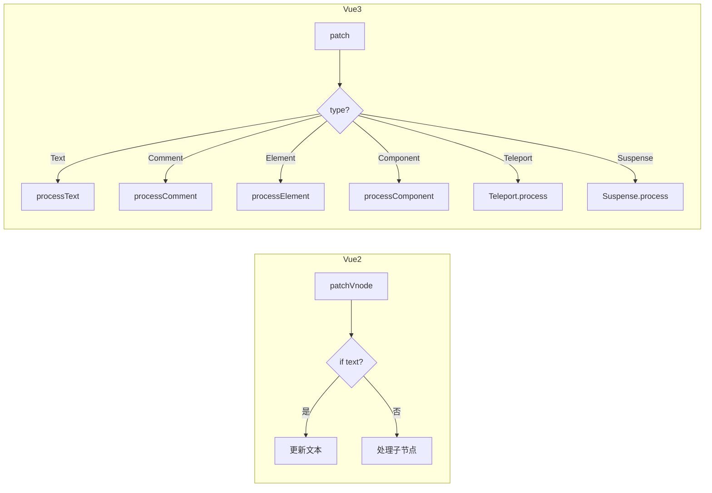

# Vue2 Patch vs Vue3 Patch

## 整体流程对比



## Vue2 patchVnode

### 核心流程

1. 判断新旧 vnode 是否 `===`，相同则直接返回
2. 判断是否都是静态节点且 key 相同，满足则跳过
3. 判断新 vnode 是否为文本节点
   - 是：根据文本是否一致更新文本内容
   - 否：进入子节点处理
4. 新旧都有子节点 → `updateChildren`（diff 算法）
5. 仅新有子节点 → 先清空旧文本，再挂载新子节点
6. 仅旧有子节点 → 卸载旧子节点
7. 旧 vnode 有文本 → 清空文本

### 伪代码实现

```typescript
function patchVnode(oldVnode: VNode, vnode: VNode): void {
  // 1. 完全相同则跳过
  if (oldVnode === vnode) return;

  // 2. 静态节点且 key 相同则跳过
  if (
    oldVnode.isStatic &&
    vnode.isStatic &&
    oldVnode.key === vnode.key
  ) return;

  const el = oldVnode.el!;

  // 3. 新节点是文本节点
  if (vnode.text) {
    if (oldVnode.text !== vnode.text) {
      el.textContent = vnode.text;
    }
    return;
  }

  // 4. 新节点是元素节点，处理子节点
  const oldCh = oldVnode.children;
  const newCh = vnode.children;

  // 4.1 新旧都有子节点 → diff
  if (oldCh && newCh) {
    updateChildren(el, oldCh, newCh);
  }
  // 4.2 仅新有子节点
  else if (newCh) {
    if (oldVnode.text) el.textContent = '';
    addVnodes(el, null, newCh, 0, newCh.length - 1);
  }
  // 4.3 仅旧有子节点
  else if (oldCh) {
    removeVnodes(el, oldCh, 0, oldCh.length - 1);
  }
  // 4.4 旧节点有文本
  else if (oldVnode.text) {
    el.textContent = '';
  }
}
```

## Vue3 patch

### 核心流程

1. 根据 `type` 判断新旧 vnode 是否为同类型节点，不是则卸载旧节点
2. 根据 `type` 区分节点类型：Text、Comment、Static、Fragment、其他
3. 其他类型通过 `shapeFlag` 区分：ELEMENT、COMPONENT、TELEPORT、SUSPENSE
4. 不同类型节点通过不同的 `process*` 函数处理
5. 处理 `ref` 引用

### 节点类型判断

```typescript
const shapeFlag = (type: any, vnode: VNode): number => {
  if (typeof type === 'string') {
    return ShapeFlags.ELEMENT;
  }
  if (isComponent(type)) {
    return ShapeFlags.COMPONENT;
  }
  if (type === Teleport) {
    return ShapeFlags.TELEPORT;
  }
  if (type === Suspense) {
    return ShapeFlags.SUSPENSE;
  }
  return 0;
};
```

### patch 分发逻辑

```typescript
function patch(
  n1: VNode | null,
  n2: VNode,
  container: RendererElement,
): void {
  const { type, shapeFlag } = n2;

  switch (type) {
    case Text:
      processText(n1, n2, container);
      break;
    case Comment:
      processCommentNode(n1, n2, container);
      break;
    default:
      if (shapeFlag & ShapeFlags.ELEMENT) {
        processElement(n1, n2, container);
      } else if (shapeFlag & ShapeFlags.COMPONENT) {
        processComponent(n1, n2, container);
      } else if (shapeFlag & ShapeFlags.TELEPORT) {
        (type as any).process(n1, n2, container);
      } else if (shapeFlag & ShapeFlags.SUSPENSE) {
        (type as any).process(n1, n2, container);
      }
  }

  // 处理 ref
  if (n2.ref != null) {
    setRef(n1?.ref, n2.ref);
  }
}
```

### processElement

```typescript
function processElement(
  n1: VNode | null,
  n2: VNode,
  container: RendererElement,
): void {
  if (n1 === null) {
    // 挂载
    mountElement(n2, container);
  } else {
    // 更新
    patchElement(n1, n2);
  }
}

function patchElement(n1: VNode, n2: VNode): void {
  const el = (n2.el = n1.el);

  // 更新属性
  patchProps(el, n1.props, n2.props);

  // 更新子节点
  patchChildren(n1, n2, el);
}
```

### patchChildren

```typescript
function patchChildren(n1: VNode, n2: VNode, container: RendererElement): void {
  const c1 = n1.children;
  const c2 = n2.children;
  const prevShapeFlag = n1.shapeFlag;
  const shapeFlag = n2.shapeFlag;

  // 新子节点是文本
  if (shapeFlag & ShapeFlags.TEXT_CHILDREN) {
    if (prevShapeFlag & ShapeFlags.ARRAY_CHILDREN) {
      // 卸载旧子节点数组
      unmountChildren(c1 as VNode[]);
    }
    if (c1 !== c2) {
      // 设置新文本
      hostSetText(container, c2 as string);
    }
  }
  // 新子节点是数组
  else if (shapeFlag & ShapeFlags.ARRAY_CHILDREN) {
    if (prevShapeFlag & ShapeFlags.ARRAY_CHILDREN) {
      // 新旧都是数组 → 进入 diff
      if (c1.length > 0 && c2.length > 0) {
        patchKeyedChildren(c1, c2, container);
      } else if (c2.length > 0) {
        // 旧为空，挂载新节点
        mountChildren(c2, container);
      } else {
        // 新为空，卸载旧节点
        unmountChildren(c1 as VNode[]);
      }
    } else {
      // 旧是文本，清空后挂载新子节点
      if (prevShapeFlag & ShapeFlags.TEXT_CHILDREN) {
        hostSetText(container, '');
      }
      mountChildren(c2 as VNode[], container);
    }
  }
  // 新子节点为空
  else {
    if (prevShapeFlag & ShapeFlags.ARRAY_CHILDREN) {
      unmountChildren(c1 as VNode[]);
    } else if (prevShapeFlag & ShapeFlags.TEXT_CHILDREN) {
      hostSetText(container, '');
    }
  }
}
```

## Vue2 vs Vue3 对比

| 维度 | Vue2 | Vue3 |
|------|------|------|
| **节点类型判断** | 通过 `isText`、`isComment` 等分散判断 | 统一通过 `type` + `shapeFlag` 位运算 |
| **patch 入口** | `patchVnode` 一个函数处理所有情况 | `patch` 分发到 `processElement`、`processComponent` 等 |
| **Fragment 支持** | 不支持，组件必须有单一根节点 | 支持 Fragment，组件可多根节点 |
| **Teleport** | 不支持 | 内置 Teleport 组件 |
| **Suspense** | 不支持 | 内置 Suspense 组件 |
| **静态节点优化** | 静态节点跳过 patch | 静态节点 + Block 树，跳过整个子树 |
| **子节点更新** | `updateChildren`（双端 diff） | `patchKeyedChildren`（快速 diff） |
| **卸载逻辑** | 直接操作 DOM | 统一 `unmount`，处理组件生命周期、指令、事件 |
| **ref 处理** | 在 patch 过程中处理 | patch 结束后统一 `setRef` |

## 关键差异

### 1. 节点类型分发

Vue2 的 `patchVnode` 是一个函数处理所有情况，通过 if-else 分支判断节点类型。Vue3 通过 `type` 和 `shapeFlag` 将不同类型的节点分发到不同的处理函数，职责更清晰。



### 2. Fragment 支持

Vue2 组件必须有单一根节点，Vue3 支持 Fragment，允许组件返回多个根节点：

```typescript
// Vue3 Fragment 处理
function processFragment(
  n1: VNode | null,
  n2: VNode,
  container: RendererElement,
): void {
  const newChildren = n2.children as VNode[];
  patchChildren(n1, n2, container);
}
```

### 3. 卸载逻辑

Vue3 的 `unmount` 比 Vue2 更完善：

```typescript
function unmount(vnode: VNode): void {
  const { type, shapeFlag, children } = vnode;

  // 组件：执行卸载生命周期
  if (shapeFlag & ShapeFlags.COMPONENT) {
    unmountComponent(vnode);
  }
  // Fragment：递归卸载子节点
  else if (type === Fragment) {
    unmountChildren(children as VNode[]);
  }
  // 普通元素
  else {
    // 执行自定义指令的卸载钩子
    invokeDirectiveHook(vnode, null, null, 'unmounted');
    // 移除事件监听
    removeEventListener(vnode);
    // 移除 DOM
    hostRemove(vnode.el!);
  }
}
```
