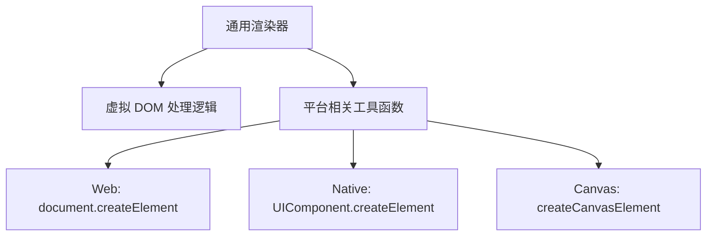
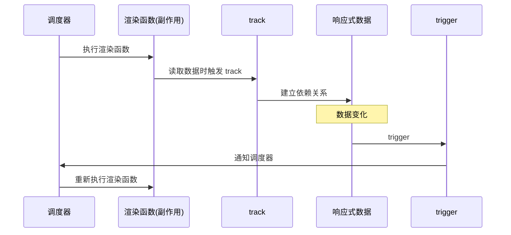
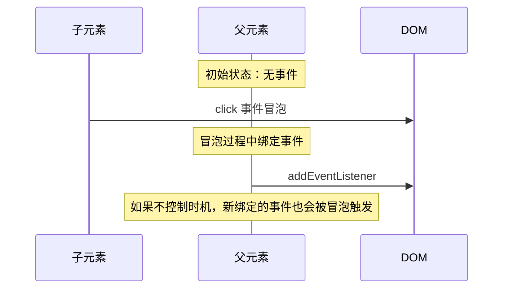
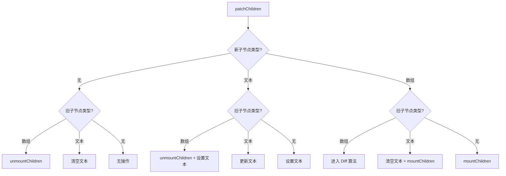

# 渲染器的设计

## 渲染器的定义

渲染器（renderer）的作用是将虚拟 DOM 渲染成特定平台的真实 DOM。通用的渲染器封装统一的虚拟 DOM 处理逻辑，将具体如何渲染成特定平台的真实 DOM 交给具体平台提供的工具函数。



## 渲染器和响应系统的关系

渲染函数作为副作用函数执行。当渲染函数读取响应式数据时，会将渲染副作用函数与数据建立依赖关系。数据变化时重新触发渲染函数。



patch 被放在**副作用函数**中执行，副作用函数被**调度器批量调度**，整个过程是**去重之后放在一个微任务中批量执行**。

## 属性处理：Attributes 与 Properties

### 概念区分

| 概念 | 说明 | 示例 |
|------|------|------|
| **Attributes** | 直接写在 DOM 标签上的属性 | `<div id="d" class="cc">` |
| **Properties** | DOM 对象上的属性 | `document.querySelector('#d').className` |

Attributes 存在与之对应的 Properties 的直接映射关系，但不一定都有映射。Attributes 的实际作用是设置对应 Properties 的**初始值**，可通过 `getAttribute` 获取。

### Vue 的属性处理

```typescript
function patchProps(
  el: RendererElement,
  oldProps: Record<string, any> | null,
  newProps: Record<string, any> | null,
): void {
  // 新增和修改
  if (newProps) {
    for (const key in newProps) {
      const next = newProps[key];
      const prev = oldProps?.[key];
      if (next !== prev) {
        hostPatchProp(el, key, prev, next);
      }
    }
  }

  // 删除
  if (oldProps) {
    for (const key in oldProps) {
      if (!newProps?.[key]) {
        hostPatchProp(el, key, oldProps[key], null);
      }
    }
  }
}
```

Vue 对特殊属性的处理：

1. **布尔类型属性**：`disabled=""` 会被解析为 `disabled: true`
2. **只读属性**：只能通过 `setAttribute` 设置
3. **class**：支持字符串、对象、数组，统一处理后使用 `className` 直接设置（性能最优）
4. **style**：支持字符串、对象，统一处理

```typescript
function patchClass(el: RendererElement, value: string | null): void {
  // 直接使用 className 性能最优
  el.className = value ?? '';
}

function patchStyle(el: RendererElement, style: Record<string, string>): void {
  const current = el.style;
  for (const key in style) {
    current[key] = style[key];
  }
}
```

## 事件处理

Vue 不会对每个事件都执行 `addEventListener` / `removeEventListener`，而是统一用一个**事件管理器**处理。

### 事件管理器

```typescript
interface Invoker {
  value: Function | Function[];
  attached?: number; // 绑定时间戳
}

// 事件管理器结构
// key → fn，fn.value 存储用户回调
const createInvoker = (eventName: string): Invoker => {
  const invoker: Invoker = {
    value: [],
    attached: performance.now(),
  };

  // 实际绑定到 DOM 的函数
  const fn = (e: Event) => {
    // 事件触发时间早于绑定时间，不执行（防止冒泡误触发）
    if (e.timeStamp < invoker.attached!) return;

    const handlers = Array.isArray(invoker.value)
      ? invoker.value
      : [invoker.value];
    handlers.forEach(handler => handler(e));
  };

  return invoker;
};
```

Vue 内部使用**普通对象**（`{}`）而非 Map 来存储事件 invoker。每个 DOM 元素上挂载一个 `_vei`（vue event invokers）属性，结构为 `Record<string, Invoker>`：

```typescript
el._vei = {
  onClick: invokerFn,
  onMouseenter: invokerFn,
};
```

选择普通对象的原因：事件名都是字符串，普通对象的 key 查找性能足够；`{}` 比 `new Map()` 创建成本更低；访问语法更简洁（`el._vei[name]`）。Map 的优势（任意类型 key、size 属性、迭代有序）在事件管理场景下都不需要。

好处：

1. 事件更新时不需要卸载再重新绑定，只需更新 `value` 值
2. 可以控制晚于事件触发时机绑定的回调不被执行

### 事件触发时机问题



给事件管理器一个 `attached` 属性存储绑定时间戳。当事件触发时间早于绑定时间，则不执行回调函数。

```typescript
function patchEvent(
  el: RendererElement,
  name: string,
  next: Function | null,
): void {
  const invokers = el._vei || (el._vei = {});
  const invoker = invokers[name];

  if (next) {
    if (invoker) {
      // 已存在，更新 value 即可
      invoker.value = next;
    } else {
      // 不存在，创建新的 invoker 并绑定
      const newInvoker = createInvoker(name);
      newInvoker.value = next;
      invokers[name] = newInvoker;
      el.addEventListener(name, newInvoker);
    }
  } else if (invoker) {
    // 移除事件
    el.removeEventListener(name, invoker);
    invokers[name] = undefined;
  }
}
```

**`attached` 时间戳的粒度**：`attached` 只在首次创建 invoker 时记录，后续更新同一事件类型的回调时只修改 `value`，`attached` 不变。这是因为 Vue 模板编译器在编译阶段就确定了元素绑定了哪些事件类型，运行时 patch 阶段只会更新已有事件类型的回调，不会新增事件类型。因此 `attached` 始终代表该事件类型**首次绑定到 DOM 的时间**，不会出现"后绑定的回调在绑定前被执行"的问题。
```

## 卸载

卸载不是简单清空 DOM 内容，还需要：

1. 若为组件，正确执行组件卸载的生命周期函数
2. 若存在自定义指令，执行卸载指令的钩子函数
3. 卸载事件监听器（直接清空内容不会卸载事件）

```typescript
function unmount(vnode: VNode): void {
  const { type, shapeFlag, props, children } = vnode;

  // 1. 执行自定义指令卸载钩子
  if (vnode.dirs) {
    invokeDirectiveHook(vnode, null, null, 'unmounted');
  }

  // 2. 组件卸载
  if (shapeFlag & ShapeFlags.COMPONENT) {
    unmountComponent(vnode);
    return;
  }

  // 3. Fragment 递归卸载子节点
  if (type === Fragment) {
    unmountChildren(children as VNode[]);
    return;
  }

  // 4. 移除事件监听
  if (props) {
    for (const key in props) {
      if (isOn(key)) {
        const eventName = key.slice(2).toLowerCase();
        const invoker = vnode.el?._vei?.[key];
        if (invoker) {
          vnode.el!.removeEventListener(eventName, invoker);
        }
      }
    }
  }

  // 5. 移除 DOM
  hostRemove(vnode.el!);
}
```

## 更新子节点

通过给 vnode 设置 `type` 来规范化，使后续处理逻辑更清晰。

新旧子节点无非三种情况：**无**、**文本**、**数组**。



**只有当新旧子节点都是数组的情况比较复杂，逻辑进入 diff**。其他情况处理起来都比较简单。
