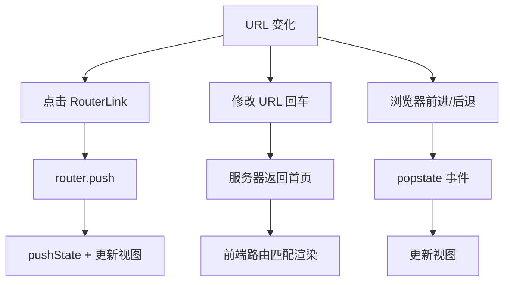
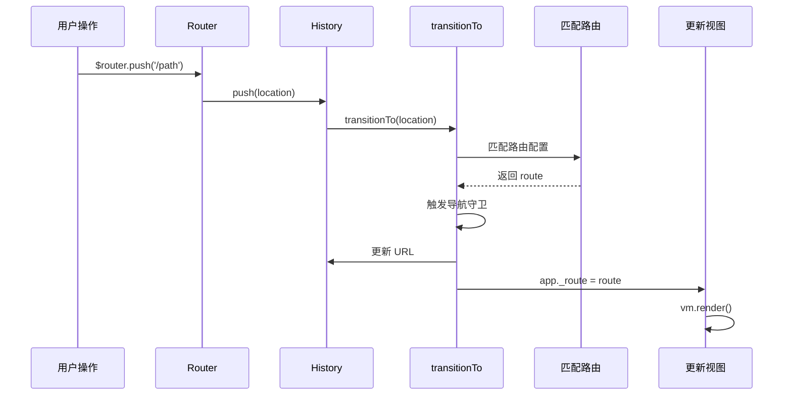

# Vue Router 实现原理

SPA（Single Page Application）通过更新视图容器实现页面切换，前端路由是 SPA 的核心技术。

## 前端路由核心

1. **URL 变化不请求服务器**：前端控制视图更新，不同 URL 对应不同视图
2. **三种实现模式**：Hash、History、Abstract

## 路由模式对比

| 模式 | 原理 | URL 变化 | 服务器请求 | 适用场景 |
|------|------|---------|-----------|---------|
| **Hash** | `location.hash` | `#/path` | 无 | 兼容老浏览器 |
| **History** | `history.pushState` | `/path` | 需服务器配置 | 现代浏览器 |
| **Abstract** | 内存数组模拟 | 无 | 无 | Node.js 环境 |

## Hash 模式

利用 URL 的 hash 部分（`#` 后面）变化不会触发服务器请求的特性。

```typescript
class HashHistory extends History {
  constructor(router: Router, base?: string) {
    super(router, base);
    // 监听 hash 变化
    window.addEventListener('hashchange', () => {
      this.transitionTo(getHash(), route => {
        replaceHash(route.fullPath);
      });
    });
  }

  push(location: RawLocation): void {
    const currentRoute = this.current;
    this.transitionTo(location, route => {
      pushHash(route.fullPath);
    });
  }

  replace(location: RawLocation): void {
    const currentRoute = this.current;
    this.transitionTo(location, route => {
      replaceHash(route.fullPath);
    });
  }
}

function pushHash(path: string): void {
  window.location.hash = path;
}

function replaceHash(path: string): void {
  const href = window.location.href;
  const i = href.indexOf('#');
  const base = i >= 0 ? href.slice(0, i) : href;
  window.location.replace(`${base}#${path}`);
}
```

### 特点

- URL 变化会新增历史记录，后退按钮可用
- 监听 `hashchange` 事件更新视图
- URL 带 `#`，不够美观

## History 模式

利用 HTML5 History API 的 `pushState`、`replaceState` 方法，修改 URL 不触发服务器请求。

```typescript
class HTML5History extends History {
  constructor(router: Router, base?: string) {
    super(router, base);
    // 监听 popstate（前进/后退）
    window.addEventListener('popstate', e => {
      const current = this.current;
      this.transitionTo(getLocation(), route => {
        if (expectScroll) {
          handleScroll(router, route, current, true);
        }
      });
    });
  }

  push(location: RawLocation): void {
    const { current: fromRoute } = this;
    this.transitionTo(location, route => {
      pushState(cleanPath(this.base + route.fullPath));
      handleScroll(router, route, fromRoute, false);
    });
  }

  replace(location: RawLocation): void {
    const { current: fromRoute } = this;
    this.transitionTo(location, route => {
      replaceState(cleanPath(this.base + route.fullPath));
      handleScroll(router, route, fromRoute, false);
    });
  }
}

function pushState(url: string): void {
  window.history.pushState({ key: _key }, '', url);
}

function replaceState(url: string): void {
  window.history.replaceState({ key: _key }, '', url);
}
```

### 三种 URL 变化场景



1. **点击 RouterLink**：调用 `pushState` 修改 URL，更新视图
2. **修改 URL 回车**：服务器返回首页，前端路由匹配渲染
3. **前进/后退按钮**：触发 `popstate` 事件，更新视图

### 服务器配置

History 模式需要服务器配置，将匹配不到的路由返回首页：

```nginx
# Nginx 配置
location / {
  try_files $uri $uri/ /index.html;
}
```

```apache
# Apache 配置
<IfModule mod_rewrite.c>
  RewriteEngine On
  RewriteBase /
  RewriteRule ^index\.html$ - [L]
  RewriteCond %{REQUEST_FILENAME} !-f
  RewriteCond %{REQUEST_FILENAME} !-d
  RewriteRule . /index.html [L]
</IfModule>
```

## Abstract 模式

用数组模拟浏览器 History 栈，用于非浏览器环境（如 Node.js）。

```typescript
class AbstractHistory extends History {
  private stack: Route[] = [];
  private index: number = 0;

  constructor(router: Router, base?: string) {
    super(router, base);
  }

  push(location: RawLocation): void {
    this.transitionTo(location, route => {
      this.stack = this.stack.slice(0, this.index + 1).concat(route);
      this.index++;
    });
  }

  replace(location: RawLocation): void {
    this.transitionTo(location, route => {
      this.stack = this.stack.slice(0, this.index).concat(route);
    });
  }

  go(n: number): void {
    const targetIndex = this.index + n;
    if (targetIndex < 0 || targetIndex >= this.stack.length) return;
    this.index = targetIndex;
    this.transitionTo(this.stack[this.index], route => {
      // 更新视图
    });
  }

  back(): void {
    this.go(-1);
  }

  forward(): void {
    this.go(1);
  }
}
```

## 路由切换核心流程



### transitionTo 核心逻辑

```typescript
transitionTo(location: RawLocation, onComplete?: Function): void {
  const route = this.router.match(location, this.current);
  
  // 导航守卫队列
  const queue: NavigationGuard[] = [].concat(
    this.router.beforeHooks,
    route.matched.flatMap(m => m.beforeEnter),
    this.router.afterHooks
  );

  // 执行守卫队列
  runQueue(queue, (guard, next) => {
    guard(route, this.current, next);
  }, () => {
    // 所有守卫执行完毕
    this.confirmTransition(route, onComplete);
  });
}

confirmTransition(route: Route, onComplete?: Function): void {
  const current = this.current;
  this.current = route;
  
  // 更新 app._route，触发响应式更新
  if (this.router.app) {
    this.router.app._route = route;
  }
  
  onComplete?.(route);
}
```

## Vue Router 4 变化（Vue3 配套）

| 维度 | Vue Router 3 (Vue2) | Vue Router 4 (Vue3) |
|------|---------------------|---------------------|
| **创建方式** | `new Router()` | `createRouter()` |
| **安装方式** | `Vue.use(Router)` | `app.use(router)` |
| **路由模式** | `mode: 'history'` | `createWebHistory()` |
| **响应式** | `this.$route` | `useRoute()` |
| **导航** | `this.$router.push()` | `useRouter().push()` |
| **懒加载** | `() => import()` | 同左 |
| **TypeScript** | 支持不完善 | 原生 TypeScript |

### Vue Router 4 使用示例

```typescript
import { createRouter, createWebHistory } from 'vue-router';

const router = createRouter({
  history: createWebHistory(),
  routes: [
    {
      path: '/',
      component: () => import('./views/Home.vue'),
    },
    {
      path: '/about',
      component: () => import('./views/About.vue'),
    },
  ],
});

export default router;
```

```vue
<template>
  <nav>
    <router-link to="/">Home</router-link>
    <router-link to="/about">About</router-link>
  </nav>
  <router-view />
</template>

<script setup>
import { useRoute, useRouter } from 'vue-router';

const route = useRoute();
const router = useRouter();

// 导航
router.push('/about');
</script>
```

## Hash vs History 详细对比

| 维度 | Hash | History |
|------|------|---------|
| **URL 美观度** | 带 `#`，不美观 | 无 `#`，美观 |
| **服务器请求** | 无 | 需服务器配置 |
| **历史记录** | hash 变化才新增 | `pushState` 相同 URL 也新增 |
| **URL 范围** | 只能修改 `#` 后内容 | 可设置同源任何 URL |
| **兼容性** | 兼容所有浏览器 | 需 IE10+ |
| **SEO** | 不友好 | 相对友好 |
