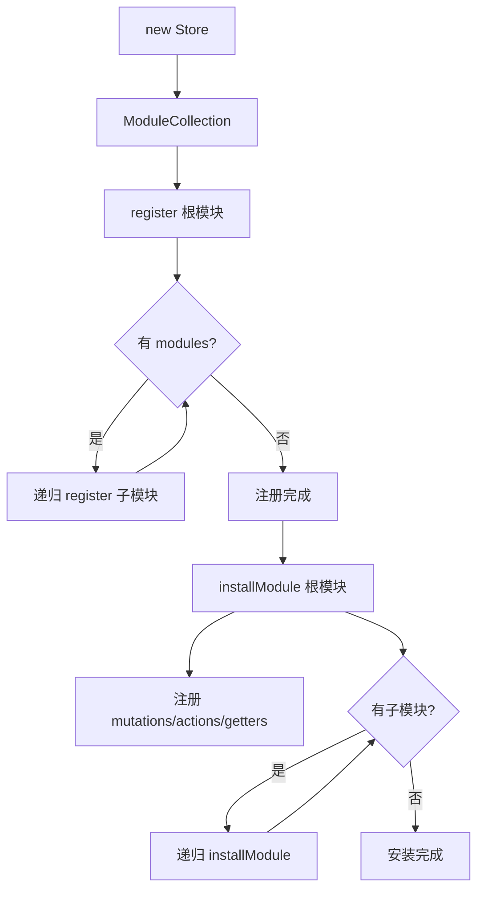
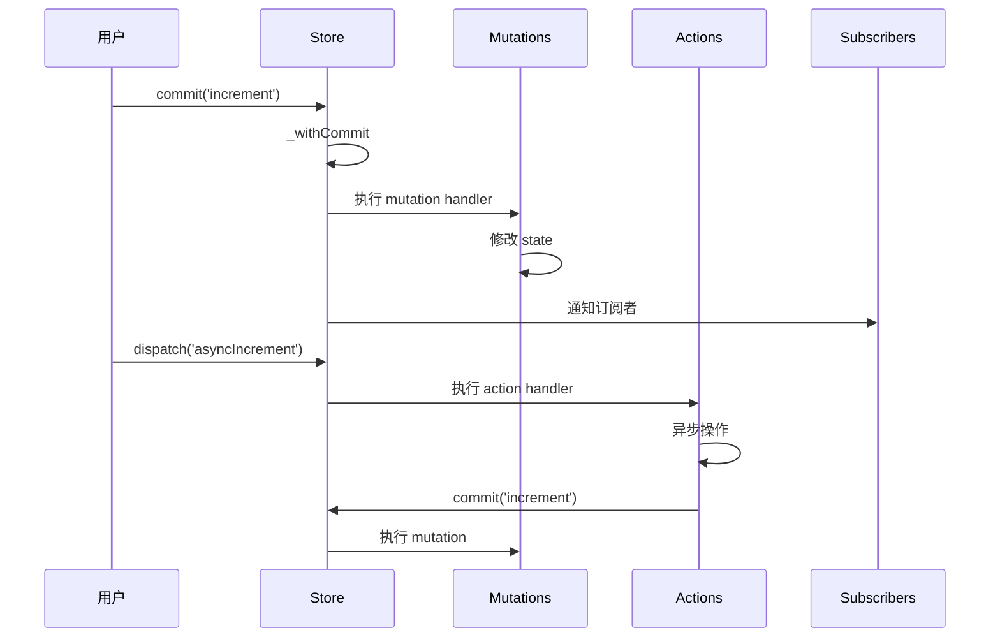

# Vuex 实现原理

Vuex 是 Vue 的集中式状态管理库，通过内部 Vue 实例实现响应式状态管理。

## 核心概念

| 概念 | 作用 | 同步/异步 |
|------|------|----------|
| **state** | 存储状态 | - |
| **getters** | 计算属性，派生状态 | - |
| **mutations** | 同步修改 state | 同步 |
| **actions** | 异步操作，提交 mutations | 异步 |
| **modules** | 模块化拆分 | - |

## 使用示例

```typescript
import Vue from 'vue';
import Vuex from 'vuex';

Vue.use(Vuex);

const store = new Vuex.Store({
  state: {
    count: 0,
  },
  getters: {
    doubleCount: state => state.count * 2,
  },
  mutations: {
    increment(state) {
      state.count++;
    },
  },
  actions: {
    asyncIncrement({ commit }) {
      setTimeout(() => {
        commit('increment');
      }, 1000);
    },
  },
  modules: {
    user: {
      namespaced: true,
      state: { name: 'John' },
      mutations: {
        setName(state, name) {
          state.name = name;
        },
      },
    },
  },
});

new Vue({
  el: '#app',
  store,
});
```

## Store 类实现

```typescript
class Store {
  private _state: any;
  private _mutations: Record<string, Function[]> = {};
  private _actions: Record<string, Function[]> = {};
  private _wrappedGetters: Record<string, Function> = {};
  private _subscribers: Function[] = [];
  private _actionSubscribers: Function[] = [];
  private _vm: Vue;
  private _modules: ModuleCollection;

  constructor(options: StoreOptions) {
    // 1. 安装 Vuex（Vue.use 时调用）
    install(Vue);

    // 2. 收集模块
    this._modules = new ModuleCollection(options);

    // 3. 安装模块
    installModule(this, this._modules.root, []);

    // 4. 初始化 Vue 实例（响应式 state）
    resetStoreVM(this);
  }

  get state() {
    return this._vm._data.$$state;
  }

  commit(type: string, payload?: any) {
    const entry = this._mutations[type];
    this._withCommit(() => {
      entry.forEach(handler => handler(payload));
    });
    // 通知订阅者
    this._subscribers.forEach(sub => sub({ type, payload }, this.state));
  }

  dispatch(type: string, payload?: any) {
    const entry = this._actions[type];
    const result = entry.length > 1
      ? Promise.all(entry.map(handler => handler(payload)))
      : entry[0](payload);

    return Promise.resolve(result);
  }

  subscribe(fn: Function) {
    this._subscribers.push(fn);
    return () => {
      const index = this._subscribers.indexOf(fn);
      if (index > -1) {
        this._subscribers.splice(index, 1);
      }
    };
  }

  private _withCommit(fn: Function) {
    const committing = this._committing;
    this._committing = true;
    fn();
    this._committing = committing;
  }
}
```

## 模块注册流程



### ModuleCollection

```typescript
class ModuleCollection {
  root: Module;

  constructor(options: StoreOptions) {
    this.register([], options, false);
  }

  register(path: string[], rawModule: any, runtime = true): void {
    const newModule = new Module(rawModule, runtime);

    if (path.length === 0) {
      this.root = newModule;
    } else {
      const parent = this.get(path.slice(0, -1));
      parent.addChild(path[path.length - 1], newModule);
    }

    // 递归注册子模块
    if (rawModule.modules) {
      forEachValue(rawModule.modules, (rawChildModule, key) => {
        this.register(path.concat(key), rawChildModule, runtime);
      });
    }
  }

  get(path: string[]): Module {
    return path.reduce((module, key) => module.getChild(key), this.root);
  }
}

class Module {
  _children: Record<string, Module> = {};
  _rawModule: any;
  state: any;

  constructor(rawModule: any, runtime: boolean) {
    this._rawModule = rawModule;
    this.state = rawModule.state || {};
  }

  addChild(key: string, module: Module): void {
    this._children[key] = module;
  }

  getChild(key: string): Module {
    return this._children[key];
  }

  forEachMutation(fn: Function): void {
    if (this._rawModule.mutations) {
      forEachValue(this._rawModule.mutations, (mutation, key) => {
        fn(mutation, key);
      });
    }
  }

  forEachAction(fn: Function): void {
    if (this._rawModule.actions) {
      forEachValue(this._rawModule.actions, (action, key) => {
        fn(action, key);
      });
    }
  }

  forEachGetter(fn: Function): void {
    if (this._rawModule.getters) {
      forEachValue(this._rawModule.getters, (getter, key) => {
        fn(getter, key);
      });
    }
  }

  forEachChild(fn: Function): void {
    forEachValue(this._children, (module, key) => {
      fn(module, key);
    });
  }
}
```

### installModule

```typescript
function installModule(
  store: Store,
  rootState: any,
  path: string[],
  module: Module,
  hot = false
): void {
  const isRoot = !path.length;
  const namespace = store._modules.getNamespace(path);

  // 注册 mutations
  if (module._rawModule.mutations) {
    module.forEachMutation((mutation, key) => {
      const namespacedType = namespace + key;
      registerMutation(store, namespacedType, mutation, local);
    });
  }

  // 注册 actions
  if (module._rawModule.actions) {
    module.forEachAction((action, key) => {
      const namespacedType = namespace + key;
      registerAction(store, namespacedType, action, local);
    });
  }

  // 注册 getters
  if (module._rawModule.getters) {
    module.forEachGetter((getter, key) => {
      const namespacedType = namespace + key;
      registerGetter(store, namespacedType, getter, local);
    });
  }

  // 递归安装子模块
  module.forEachChild((child, key) => {
    installModule(store, rootState, path.concat(key), child, hot);
  });
}

function registerMutation(
  store: Store,
  type: string,
  handler: Function,
  local: any
): void {
  const entry = store._mutations[type] || (store._mutations[type] = []);
  entry.push(function wrappedMutationHandler(payload) {
    handler(local.state, payload);
  });
}

function registerAction(
  store: Store,
  type: string,
  handler: Function,
  local: any
): void {
  const entry = store._actions[type] || (store._actions[type] = []);
  entry.push(function wrappedActionHandler(payload) {
    const res = handler({
      dispatch: local.dispatch,
      commit: local.commit,
      getters: local.getters,
      state: local.state,
      rootGetters: store.getters,
      rootState: store.state,
    }, payload);

    if (!isPromise(res)) {
      res = Promise.resolve(res);
    }
    return res;
  });
}

function registerGetter(
  store: Store,
  type: string,
  rawGetter: Function,
  local: any
): void {
  store._wrappedGetters[type] = function wrappedGetter(store) {
    return rawGetter(
      local.state,
      local.getters,
      store.state,
      store.getters
    );
  };
}
```

## 响应式 State

```typescript
function resetStoreVM(store: Store, hot = false): void {
  const oldVm = store._vm;

  // 包装 getters 为 computed
  const computed: Record<string, Function> = {};
  store._wrappedGetters.forEach((fn, key) => {
    computed[key] = partial(fn, store);
    Object.defineProperty(store.getters, key, {
      get: () => store._vm[key],
      enumerable: true,
    });
  });

  // 创建内部 Vue 实例，实现响应式
  store._vm = new Vue({
    data: {
      $$state: store.state,
    },
    computed,
  });

  // 销毁旧实例
  if (oldVm) {
    if (hot) {
      store._withCommit(() => {
        oldVm._data.$$state = null;
      });
    }
    Vue.nextTick(() => oldVm.$destroy());
  }
}
```

**核心原理**：通过内部 Vue 实例的 `data` 存储 state，利用 Vue 的响应式系统实现状态变化自动更新视图；getters 利用 Vue 的 `computed` 实现缓存和依赖追踪。

## commit 与 dispatch 流程



### commit 实现

```typescript
commit(type: string, payload?: any, options?: Object): void {
  const entry = this._mutations[type];
  if (!entry) {
    console.error(`[vuex] unknown mutation type: ${type}`);
    return;
  }

  this._withCommit(() => {
    entry.forEach(handler => handler(payload));
  });

  // 浅拷贝防止订阅者同步取消订阅导致迭代器失效
  this._subscribers
    .slice()
    .forEach(sub => sub({ type, payload }, this.state));
}
```

### dispatch 实现

```typescript
dispatch(type: string, payload?: any): Promise<any> {
  const entry = this._actions[type];
  if (!entry) {
    console.error(`[vuex] unknown action type: ${type}`);
    return Promise.reject();
  }

  // 通知 action 订阅者（before）
  try {
    this._actionSubscribers
      .slice()
      .filter(sub => sub.before)
      .forEach(sub => sub.before({ type, payload }, this.state));
  } catch (e) {
    console.warn('[vuex] error in before action subscribers:', e);
  }

  // 执行 action
  const result = entry.length > 1
    ? Promise.all(entry.map(handler => handler(payload)))
    : entry[0](payload);

  return Promise.resolve(result).then(res => {
    // 通知 action 订阅者（after）
    try {
      this._actionSubscribers
        .filter(sub => sub.after)
        .forEach(sub => sub.after({ type, payload }, this.state));
    } catch (e) {
      console.warn('[vuex] error in after action subscribers:', e);
    }
    return res;
  }).catch(error => {
    // 通知 action 订阅者（error）
    try {
      this._actionSubscribers
        .filter(sub => sub.error)
        .forEach(sub => sub.error({ type, payload }, this.state, error));
    } catch (e) {
      console.warn('[vuex] error in error action subscribers:', e);
    }
    throw error;
  });
}
```

## Vuex vs Pinia

| 维度 | Vuex 4 | Pinia |
|------|--------|-------|
| **Vue 版本** | Vue2/Vue3 | Vue3 推荐 |
| **TypeScript** | 支持不完善 | 原生 TypeScript |
| **mutations** | 有 | 无（直接修改 state） |
| **actions** | 有 | 有 |
| **getters** | 有 | 有（类似 computed） |
| **modules** | 嵌套结构 | 扁平结构，每个 store 独立 |
| **代码分割** | 复杂 | 天然支持 |
| **Devtools** | 支持 | 支持更好 |
| **体积** | 较大 | 更小（~1KB） |

### Pinia 示例

```typescript
import { defineStore } from 'pinia';

export const useCounterStore = defineStore('counter', {
  state: () => ({
    count: 0,
  }),
  getters: {
    doubleCount: state => state.count * 2,
  },
  actions: {
    increment() {
      this.count++;
    },
    async asyncIncrement() {
      await delay(1000);
      this.increment();
    },
  },
});

// 使用
const counter = useCounterStore();
counter.increment();
console.log(counter.doubleCount);
```

## 总结

Vuex 的核心原理：

1. **模块注册**：`ModuleCollection` 递归收集模块，`installModule` 注册 mutations/actions/getters
2. **响应式 State**：通过内部 Vue 实例的 `data` 实现 state 响应式
3. **Getters 缓存**：利用 Vue 的 `computed` 实现依赖追踪和缓存
4. **Mutations 同步**：`_withCommit` 确保只有 mutation 能修改 state
5. **Actions 异步**：返回 Promise，支持异步操作后提交 mutation
6. **订阅机制**：`subscribe` 和 `subscribeAction` 支持状态变化监听
